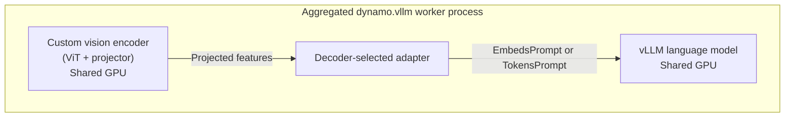
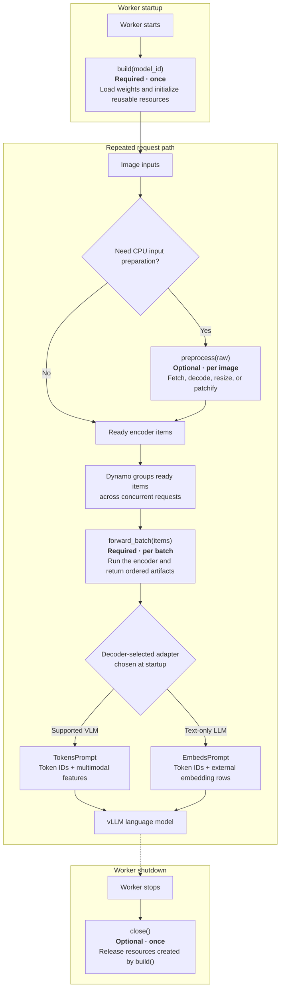

A custom vision encoder lets an aggregated `dynamo.vllm` worker use an author-provided vision tower or projector instead of vLLM's built-in multimodal encoder. Use this path when the decoder can consume external vision features but the encoder is private, experimental, or otherwise unavailable in vLLM.

This is not encoder disaggregation: the encoder and language model run in the same worker process and share a GPU.



## Support Matrix

| Input modality | vLLM | SGLang | TensorRT-LLM |
| --- | --- | --- | --- |
| Image | Yes | Not supported | Not supported |
| Video | Not supported | Not supported | Not supported |
| Audio | Not supported | Not supported | Not supported |

This matrix describes the custom-encoder integration, not the overall multimodal support of each backend. For feature requests, reach out in the `#sig-multimodal` channel on our [community Slack](https://ai-dynamo.slack.com/).

## How It Works

Subclass `dynamo.vllm.multimodal_utils.custom_encoder.VisionEncoderBackend` and implement its lifecycle hooks:

| Hook | When Dynamo calls it | Why implement it |
| --- | --- | --- |
| `build(model_id)` | Once when the worker starts | Load weights, select the device, and initialize reusable encoder resources. Required. |
| `preprocess(raw)` | Optionally, once per image before batching | Move blocking or CPU input work off the request loop and return `Preprocessed(item, cost)`. Override only when needed. |
| `forward_batch(items, target_bucket=None)` | Once for each Dynamo-formed batch | Run the encoder and return one CPU-visible artifact per item, in input order. Required. |
| `close()` | Once when the worker shuts down | Release resources created by `build()`. Override only when cleanup is needed; the default is a no-op. |

Dynamo owns concurrency, batching, and prompt preparation and calls each hook at the appropriate lifecycle stage.



### Batching

Dynamo uses eager batching without a collection timer. Whenever the encoder actor is free, it drains the items that are already waiting, calls `forward_batch()` with them, and repeats. A lone item runs immediately; concurrent requests naturally form larger batches while an earlier forward is running.

| Configuration | Batch behavior |
| --- | --- |
| `max_batch_cost = None` (default) | Dynamo sends the full drained set to one `forward_batch()` call. Per-item `cost` values are ignored. |
| `max_batch_cost = N` | Dynamo greedily splits the drained set in input order so the sum of each batch's item costs does not exceed `N`. |

Without preprocessing, every item has an implicit cost of `1`, so `max_batch_cost = N` acts as a limit of `N` images per physical batch. To assign a different cost, enable `preprocess()` and return `Preprocessed(item, cost=...)`. Use `1` for fixed, bounded inputs or a value proportional to visual patches or tokens for variable-size inputs.

### Preprocessing

Preprocessing is disabled by default. To enable preprocessing, override `preprocess()` and set `preprocess_concurrency > 0`. Use it to fetch, decode, resize, or patchify an image and to calculate its batching cost. Return `Preprocessed(item, cost)`, where `item` is the value that `forward_batch()` should receive.

### Preparing the Engine Prompt

After `forward_batch()` returns ordered artifacts, Dynamo uses the adapter selected from the resolved language model at startup to construct the final vLLM prompt. The prompt type is not selected per request.

| Prompt type | Use when | Encoder output | Adapter behavior |
| --- | --- | --- | --- |
| `TokensPrompt` | The running model is a supported VLM with a native external-multimodal contract. Currently, this path supports Qwen3-VL and Qwen3.5. | One `Qwen3VLImageEncoding(embeddings, grid_thw)` per image | Preserves the model's token IDs and passes projected image features and grid metadata to vLLM, which retains its native multimodal placeholder and position handling. Enable `--enable-mm-embeds`. |
| `EmbedsPrompt` | The running model is a text-only LLM without a native multimodal input contract. | One CPU tensor shaped `(visual_tokens, hidden_size)` per image | Uses `image_token_id` to locate each image placeholder and replace it with the returned embedding rows. vLLM embeds the remaining text-token positions. Enable `--enable-prompt-embeds`. |

`image_token_id` is specific to the `EmbedsPrompt` path and is not part of the universal backend contract. The `TokensPrompt` path does not read it. Unsupported multimodal decoder architectures fail during adapter setup rather than falling back to `EmbedsPrompt`.

## Enable Custom Encoder

From the repository root, launch the included aggregated path:

```bash
bash examples/custom_encoder/launch/agg_qwen3_5_native.sh --gpu 0
```

The launcher runs `Qwen/Qwen3.5-2B` with `Qwen35VisionEncoder`. The encoder demonstrates the lifecycle hooks by loading the Qwen3.5 vision tower, preprocessing images, and returning projected features through the native `TokensPrompt` path. It favors readability over checkpoint-loading speed, caching, CUDA graphs, and production media handling.

Select your backend with a dotted Python class path:

```bash
DYN_MODEL=my-org/my-qwen3.5-model \
DYN_ENCODER_CLASS=my_package.encoders.MyVisionEncoder \
bash examples/custom_encoder/launch/agg_qwen3_5_native.sh --gpu 0
```

The launcher passes `--custom-encoder-class`, `--enable-multimodal`, and the `--enable-mm-embeds` flag required by the native VLM path. For a text-only decoder that uses `EmbedsPrompt`, use `examples/custom_encoder/launch/agg_custom.sh` instead.

The current integration has these restrictions:

- It supports the aggregated vLLM topology only.
- It consumes image URL content and cannot be combined with `--frontend-decoding`.
- It runs on the token-in/token-out path and cannot be combined with `--use-vllm-tokenizer`.
- The custom encoder and language model share GPU memory.

The Qwen3.5 example, reusable Qwen-family base, and semantic test backend are under [`examples/custom_encoder`](https://github.com/ai-dynamo/dynamo/tree/main/examples/custom_encoder).

> [!WARNING]
> The backend owns any media retrieval performed by `preprocess()`. Apply Dynamo's [media URL policy](overview.md), finite network timeouts, response-size limits, and image decode limits rather than fetching arbitrary request URLs directly.
