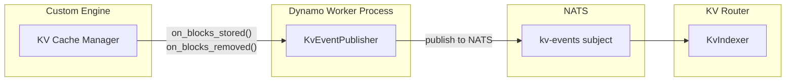
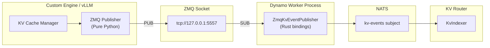

<!--
SPDX-FileCopyrightText: Copyright (c) 2025-2026 NVIDIA CORPORATION & AFFILIATES. All rights reserved.
SPDX-License-Identifier: Apache-2.0
-->

# KV Event Publishing for Custom Engines

This document explains how to implement KV event publishing for custom inference engines, enabling them to participate in Dynamo's KV cache-aware routing.

## Overview

The KV Router relies on real-time events from backend workers to track which KV cache blocks are stored on each worker. When your custom engine allocates or evicts KV cache blocks, it should publish these events so the router can make optimal routing decisions.

There are two main publishing pathways:

1. **Direct NATS publishing** (`KvEventPublisher`) - Publishes events directly to NATS. Simplest approach for custom engines.
2. **ZMQ-based publishing** - For engines with ZMQ event output (like vLLM). Uses a ZMQ publisher in the engine and `ZmqKvEventPublisher` to forward events to NATS.

## Event Types

The KV cache supports three event types:

| Event Type | Description | When to Publish |
|------------|-------------|-----------------|
| `BlockStored` | New blocks added to cache | After KV cache allocation succeeds |
| `BlockRemoved` | Blocks evicted from cache | When blocks are evicted or freed |
| `AllBlocksCleared` | All blocks removed | On cache reset or worker restart |

### Event Structure

Each event contains:
- **`event_id`**: Monotonically increasing identifier per worker
- **`dp_rank`**: Data parallel rank (0 if DP not enabled)
- **`data`**: One of `Stored`, `Removed`, or `Cleared`

For `BlockStored` events:
- **`token_ids`**: List of token IDs for the stored blocks
- **`block_hashes`**: List of **sequence block hashes** from the engine's block manager. These are cumulative hashes that incorporate all tokens from the start of the sequence up to and including the current block (not just the tokens within that block). This enables prefix matching across requests.
- **`num_block_tokens`**: Number of tokens per block (should all equal `kv_block_size`)
- **`parent_hash`**: Hash of the parent block. Required for all blocks except the first block in a sequence (which has no parent).
- **`lora_id`**: LoRA adapter ID (0 if not using LoRA)

For `BlockRemoved` events:
- **`block_hashes`**: List of sequence block hashes being evicted

## Option 1: Direct NATS Publishing (Recommended)

The `KvEventPublisher` class publishes events directly to NATS. This is the simplest approach for custom engines.



**When to use:**
- Building a custom inference engine from scratch
- Your engine doesn't have a ZMQ-based event system
- You want the simplest integration path

### Basic Setup

```python
from dynamo.llm import KvEventPublisher

class CustomEnginePublisher:
    def __init__(self, component, worker_id: int, block_size: int, dp_rank: int = 0):
        self.block_size = block_size
        self.event_id = 0
        self.kv_publisher = KvEventPublisher(
            component=component,
            worker_id=worker_id,
            kv_block_size=block_size,
            dp_rank=dp_rank,
            enable_local_indexer=False,
        )

    def on_blocks_stored(self, token_ids: list[int], block_hashes: list[int],
                         lora_id: int = 0, parent_hash: int | None = None):
        """Call after KV cache blocks are allocated."""
        self.event_id += 1
        num_block_tokens = [self.block_size] * len(block_hashes)
        self.kv_publisher.publish_stored(
            event_id=self.event_id,
            token_ids=token_ids,
            num_block_tokens=num_block_tokens,
            block_hashes=block_hashes,
            lora_id=lora_id,
            parent_hash=parent_hash,
        )

    def on_blocks_removed(self, block_hashes: list[int]):
        """Call when KV cache blocks are evicted."""
        self.event_id += 1
        self.kv_publisher.publish_removed(event_id=self.event_id, block_hashes=block_hashes)
```

### Integration with Your Engine

```python
from dynamo.llm import register_llm

async def main():
    # Register your engine with Dynamo
    component, endpoint = await register_llm(
        model="my-model",
        generator=my_generate_fn,
    )

    # Initialize publisher
    publisher = CustomEnginePublisher(
        component=component,
        worker_id=endpoint.connection_id(),
        block_size=16,  # Match your engine's block size
    )

    # Hook into your engine's cache events
    def on_prefill_complete(request_id, token_ids, blocks):
        block_hashes = [block.hash for block in blocks]
        publisher.on_blocks_stored(token_ids=token_ids, block_hashes=block_hashes)

    def on_cache_eviction(evicted_blocks):
        block_hashes = [block.hash for block in evicted_blocks]
        publisher.on_blocks_removed(block_hashes=block_hashes)
```

## Option 2: ZMQ-based Publishing

For engines that publish events via ZMQ (like vLLM), this option uses two components that work together:

1. **ZMQ Publisher** (in your engine) - Publishes events to a ZMQ socket
2. **ZmqKvEventPublisher** (Dynamo binding) - Subscribes to ZMQ and forwards to NATS



**When to use:**
- Your engine already has a ZMQ-based event system (like vLLM)
- You're integrating with a consolidator (like KVBM)
- You want to decouple event publishing from your engine's main loop

### Part 1: ZMQ Subscriber (Dynamo Bindings)

If your engine already publishes to ZMQ, use `KvEventPublisher` with a `ZmqKvEventPublisherConfig` to subscribe and forward to NATS:

```python
from dynamo.llm import KvEventPublisher, ZmqKvEventPublisherConfig

# Configure the ZMQ subscriber
config = ZmqKvEventPublisherConfig(
    worker_id=endpoint.connection_id(),
    kv_block_size=block_size,
    zmq_endpoint="tcp://127.0.0.1:5557",  # Where your engine publishes
    zmq_topic="",                          # Subscribe to all topics
    enable_local_indexer=False,
)

# Create publisher - it automatically subscribes to ZMQ and forwards to NATS
kv_publisher = KvEventPublisher(
    component=component,
    zmq_config=config,
)
```

### Part 2: ZMQ Publisher (Pure Python)

If your engine needs to publish to ZMQ (e.g., for consolidator integration), implement the ZMQ protocol:

```python
import zmq
import msgpack
import time

class ZmqKvEventPublisher:
    """Pure Python ZMQ publisher for KV events (vLLM-compatible format)."""

    def __init__(self, zmq_endpoint: str, kv_block_size: int, topic: str = ""):
        self.kv_block_size = kv_block_size
        self.topic = topic
        self.ctx = zmq.Context()
        self.socket = self.ctx.socket(zmq.PUB)
        self.socket.bind(zmq_endpoint)
        self.sequence = 0
        self.data_parallel_rank = 0

    def _to_signed_i64(self, value: int | None) -> int | None:
        if value is None:
            return None
        return value - 0x10000000000000000 if value > 0x7FFFFFFFFFFFFFFF else value

    def publish_stored(self, event_id: int, token_ids: list[int], num_block_tokens: list[int],
                       block_hashes: list[int], lora_id: int = 0, parent_hash: int | None = None):
        event = {
            "type": "BlockStored",
            "block_hashes": [self._to_signed_i64(h) for h in block_hashes],
            "parent_block_hash": self._to_signed_i64(parent_hash),
            "token_ids": token_ids,
            "block_size": self.kv_block_size,
            "lora_id": lora_id if lora_id != 0 else None,
        }
        self._publish_event(event)

    def publish_removed(self, event_id: int, block_hashes: list[int]):
        event = {"type": "BlockRemoved", "block_hashes": [self._to_signed_i64(h) for h in block_hashes]}
        self._publish_event(event)

    def publish_all_cleared(self):
        self._publish_event({"type": "AllBlocksCleared"})

    def _publish_event(self, event: dict):
        batch = [time.time(), [event], self.data_parallel_rank]
        payload = msgpack.packb(batch, use_bin_type=True)
        sequence_bytes = self.sequence.to_bytes(8, byteorder="big")
        self.sequence += 1
        self.socket.send_multipart([self.topic.encode(), sequence_bytes, payload])

    def shutdown(self):
        self.socket.close()
        self.ctx.term()
```

### ZMQ Wire Format

The ZMQ message format (compatible with vLLM):

| Frame | Description |
|-------|-------------|
| 1 | Topic (empty string for all topics) |
| 2 | Sequence number (8 bytes, big-endian) |
| 3 | Msgpack payload: `[timestamp, [events], dp_rank]` |

Each event in the payload is a dictionary with `type` field (`BlockStored`, `BlockRemoved`, or `AllBlocksCleared`).

## Best Practices

1. **Event IDs must be monotonically increasing** per worker (use a thread-safe counter)

2. **Block size must match** your engine's actual `kv_block_size`

3. **`parent_hash` is required** for all blocks except the first in a sequence - it links blocks to enable prefix matching

## See Also

- **[Router README](../components/router/README.md)**: Quick start guide for the KV Router
- **[Router Guide](../components/router/router_guide.md)**: Configuration, tuning, and production setup
- **[Router Design](../design_docs/router_design.md)**: Architecture details and event transport modes
