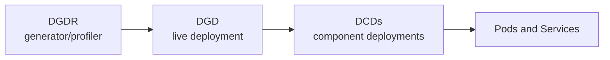

Get a model running on Kubernetes in minutes.

Dynamo's production path is Kubernetes-native: you install the platform with
Helm, submit Dynamo custom resources, and let the operator reconcile inference
graphs into pods, services, routing, model-loading, and scaling resources. The
local and container guides remain useful for development, but Kubernetes is the
canonical path for shared GPU clusters and multi-node serving.

> [!NOTE]
> **Request entry.** This quickstart uses Dynamo-native Frontend routing: the Dynamo Frontend
> receives requests and the integrated Dynamo Router selects workers. Dynamo can also integrate
> Kubernetes-natively with [Gateway API Inference Extension](https://github.com/kubernetes-sigs/gateway-api-inference-extension),
> where Gateway API receives requests and calls the Dynamo EPP for endpoint selection. See the
> [GAIE guide](gateway-api/README.mdx) for the Gateway API path.

## Prerequisites

- Kubernetes cluster (v1.30+) with GPU nodes
- [kubectl](https://kubernetes.io/docs/tasks/tools/#kubectl) (v1.30+)
- [Helm](https://helm.sh/docs/intro/install/) (v3.0+) installed
- [NVIDIA GPU Operator](https://docs.nvidia.com/datacenter/cloud-native/gpu-operator/latest/getting-started.html) installed on the cluster
- HuggingFace token secret on cluster

### HuggingFace token secret

Create a HuggingFace token secret for model downloads. If you don't have a token, see the HuggingFace [token guide](https://huggingface.co/docs/hub/en/security-tokens).

```bash
export HF_TOKEN=<your-hf-token>

kubectl create secret generic hf-token-secret \
  --from-literal=HF_TOKEN="$HF_TOKEN"
```

### GPU Operator quick install

If you don't have the GPU Operator yet:

```bash
helm repo add nvidia https://helm.ngc.nvidia.com/nvidia --force-update
helm repo update nvidia
helm install gpu-operator nvidia/gpu-operator \
  --namespace gpu-operator --create-namespace \
  --wait --timeout=600s
```

> [!TIP]
> If your cluster already provides GPU drivers (e.g., GKE with `gpu-driver-version=latest`, or AKS), add:
> ```bash
> --set driver.enabled=false --set toolkit.enabled=false
> ```

### Detailed installation

The GPU Operator is the only prerequisite for a basic deployment. For additional features like RDMA, Prometheus, or multinode scheduling with Grove/KAI Scheduler, see the [Installation Guide](installation-guide.md).

> [!TIP]
> If your GPU SKU and cloud provider are supported, you can use [AICR](https://github.com/NVIDIA/aicr) for rapid installation of prerequisites and the Dynamo Helm chart.

### Verify cluster is ready

Optionally, verify your cluster is ready:

```bash
./deploy/pre-deployment/pre-deployment-check.sh
```

## Install Dynamo

```bash
export NAMESPACE=dynamo-system
helm install dynamo-platform \
  oci://helm.ngc.nvidia.com/nvidia/ai-dynamo/charts/dynamo-platform \
  --version "1.2.1" \
  --namespace "$NAMESPACE" \
  --create-namespace
```

Wait for the platform pods:

```bash
kubectl get pods -n $NAMESPACE
# Expected: dynamo-operator-*, etcd-*, nats-* pods all Running
```

## Understand Dynamo Deployment Resources

Before applying the first YAML, it helps to know the Kubernetes resources Dynamo
uses. These are Dynamo's native control-plane objects; you describe the
inference graph, and the operator owns the Kubernetes deployments, services, and
component rollout around it:

| Resource or path | What it does | In this quickstart |
|---|---|---|
| `DynamoGraphDeployment` (DGD) | The canonical live deployment. It describes the Dynamo inference graph that serves traffic. | Generated by DGDR in Option A, or applied directly in Option B. |
| `DynamoComponentDeployment` (DCD) | Per-component deployments created by the operator from the DGD, such as frontend and worker components. | Created for you by the operator. |
| `DynamoGraphDeploymentRequest` (DGDR) | A generator/profiler that can produce a DGD from a model, backend, workload, hardware, and optional SLA targets. | Option A uses DGDR so Dynamo can generate the first DGD. |
| Recipes | Tuned `deploy.yaml` manifests that are already DGD specs. | Use these later when a recipe matches your model, backend, and hardware. |



This quickstart uses DGDR because it avoids hand-writing the first DGD. After
DGDR generates and applies the DGD, the DGDR reaches a terminal state, similar
to a Kubernetes Job. The DGD persists and serves your model.

DGDR can also carry supported generated-deployment features such as
`features.planner` for Planner configuration and `features.mocker` for mocker
mode. KV-aware routing is not currently exposed as a DGDR feature field; use a
direct DGD, a tuned recipe, or `overrides.dgd` when you need to set router mode
or other graph-level details explicitly.

For tuned production-style manifests, start from
[Dynamo recipes](https://github.com/ai-dynamo/dynamo/tree/main/recipes). For the
full deployment model, see the [Deployment Overview](model-deployment-guide.md).

## Deploy Your First Model

Save this DGDR to generate and deploy a DGD for `Qwen/Qwen3-0.6B`:

```yaml
# qwen3-quickstart.yaml
apiVersion: nvidia.com/v1beta1
kind: DynamoGraphDeploymentRequest
metadata:
  name: qwen3-quickstart
spec:
  model: Qwen/Qwen3-0.6B
  backend: auto
  image: "nvcr.io/nvidia/ai-dynamo/dynamo-planner:1.2.1"  # dynamo-frontend for Dynamo < 1.1.0
```

The DGDR generates a DGD similar in shape to the following. If you already know
the backend and runtime image you want, you can apply this canonical DGD object
directly instead of using DGDR:

```yaml
# qwen3-dgd.yaml
apiVersion: nvidia.com/v1beta1
kind: DynamoGraphDeployment
metadata:
  name: qwen3-direct
spec:
  components:
    - name: Frontend
      type: frontend
      replicas: 1
      podTemplate:
        spec:
          containers:
            - name: main
              image: nvcr.io/nvidia/ai-dynamo/vllm-runtime:1.2.1
              envFrom:
                - secretRef:
                    name: hf-token-secret
    - name: VllmDecodeWorker
      type: worker
      replicas: 1
      podTemplate:
        spec:
          containers:
            - name: main
              image: nvcr.io/nvidia/ai-dynamo/vllm-runtime:1.2.1
              command:
                - python3
                - -m
                - dynamo.vllm
              args:
                - --model
                - Qwen/Qwen3-0.6B
              envFrom:
                - secretRef:
                    name: hf-token-secret
              resources:
                limits:
                  nvidia.com/gpu: "1"
                requests:
                  ephemeral-storage: 2Gi
              workingDir: /workspace/examples/backends/vllm
```

Apply exactly one of the manifests.

Option A: generate and apply a DGD with DGDR.

```bash
kubectl apply -f qwen3-quickstart.yaml -n $NAMESPACE
```

Option B: apply the DGD directly.

```bash
kubectl apply -f qwen3-dgd.yaml -n $NAMESPACE
```

If you use DGDR, watch it progress from `Pending` to `Profiling` to `Deploying`
to `Deployed`:

```bash
kubectl get dgdr qwen3-quickstart -n $NAMESPACE -w
```

In both paths, the DGD is the live serving resource:

```bash
kubectl get dynamographdeployment -n $NAMESPACE
kubectl get dynamocomponentdeployment -n $NAMESPACE
```

> [!NOTE]
> Dynamo supports vLLM, TensorRT-LLM, and SGLang backends. Setting `backend: auto` lets the profiler choose the best one for your model and hardware. See the [vLLM backend guide](../backends/vllm/README.md) for a backend guide example.


## Send a Request

Once the DGD is ready, it is serving the model:

```bash
# Find and port-forward the frontend
FRONTEND_SVC=$(kubectl get svc -n $NAMESPACE -o name | grep frontend | head -1)
kubectl port-forward "$FRONTEND_SVC" 8000:8000 -n $NAMESPACE &

# Send a request
curl -s http://localhost:8000/v1/chat/completions \
  -H "Content-Type: application/json" \
  -d '{
    "model": "Qwen/Qwen3-0.6B",
    "messages": [{"role": "user", "content": "What is NVIDIA Dynamo?"}],
    "max_tokens": 200
  }' | python3 -m json.tool
```

## Cleanup

```bash
kubectl delete dgdr qwen3-quickstart -n $NAMESPACE --ignore-not-found
kubectl delete dynamographdeployment qwen3-quickstart qwen3-direct \
  -n $NAMESPACE --ignore-not-found
```

## Next Steps

- **[Installation Guide](installation-guide.md)** — Cloud provider setup, GPU Operator details, optional components (Grove, RDMA, model caching, Prometheus)
- **[Deployment Overview](model-deployment-guide.md)** — DGD, DCD, DGDR, recipes, strategy selection, and common pitfalls
- **[DGDR Reference](dgdr.md)** — Spec reference, lifecycle phases, monitoring commands, and generated DGD behavior
- **[Creating Deployments](deployment/create-deployment.md)** — Hand-craft a DGD spec for full control
