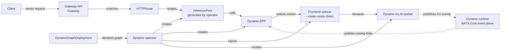

This quickstart deploys a Dynamo operator-managed serving graph behind Gateway API. The `Gateway`
receives requests, GAIE calls the Dynamo EPP for endpoint selection, and the selected worker's
Frontend sidecar forwards the request in direct mode.

## What This Deploys



## Prerequisites

- Kubernetes cluster with GPU nodes.
- `kubectl`, Helm, and `jq`.
- Access to `nvcr.io/nvidia/ai-dynamo` images for the Dynamo release you use.
- Hugging Face access to `Qwen/Qwen3-0.6B`.
- Shared RWX storage for the recipe's `model-cache` PVC.

Set the common variables:

```bash
export DYNAMO_VERSION=1.2.1
export NAMESPACE=gaie-dynamo
export DYNAMO_SYSTEM_NAMESPACE=dynamo-system
export AGW_NAMESPACE=agentgateway-system
export ISTIO_NAMESPACE=istio-system

kubectl create namespace "$NAMESPACE" --dry-run=client -o yaml | kubectl apply -f -
```

Clone the Dynamo source tree that contains the recipe manifests used below:

```bash
git clone https://github.com/ai-dynamo/dynamo.git
cd dynamo
```

## Install Dynamo Platform

Install the Dynamo platform and operator with the [Installation Guide](../installation-guide.md).
Use the same Dynamo release line for the platform chart, EPP image, and runtime images.

After installation, verify that the Helm release exists in the platform namespace:

```bash
helm status dynamo-platform --namespace "$DYNAMO_SYSTEM_NAMESPACE"
```

## Create Model Credentials

Create model credentials if the model requires them. This is a Dynamo model-serving prerequisite,
not a GAIE-specific resource. The general Kubernetes quickstart explains the
[Hugging Face token secret](../README.md#huggingface-token-secret) pattern.

```bash
export HF_TOKEN='your-hf-token'

kubectl create secret generic hf-token-secret \
  -n "$NAMESPACE" \
  --from-literal=HF_TOKEN="$HF_TOKEN"
```

## Install Gateway API and GAIE CRDs

Install the Gateway API layer explicitly. If your platform team already installed Gateway API, GAIE,
and a compatible Gateway implementation, skip to [Create the Gateway](#create-the-gateway).

```bash
kubectl apply --server-side --force-conflicts \
  -f https://github.com/kubernetes-sigs/gateway-api/releases/download/v1.5.1/standard-install.yaml

kubectl apply \
  -f https://github.com/kubernetes-sigs/gateway-api-inference-extension/releases/download/v1.2.1/manifests.yaml
```

## Create the Gateway

Choose the Gateway implementation for this namespace.

<Tabs>
  <Tab title="agentgateway" language="bash">
    ```bash
    helm upgrade -i --create-namespace --namespace "$AGW_NAMESPACE" --version v1.0.0 \
      agentgateway-crds oci://cr.agentgateway.dev/charts/agentgateway-crds

    helm upgrade -i --namespace "$AGW_NAMESPACE" --version v1.0.0 \
      agentgateway oci://cr.agentgateway.dev/charts/agentgateway \
      --set inferenceExtension.enabled=true \
      --wait

    kubectl get gatewayclass agentgateway
    ```

    Create the `AgentgatewayParameters` resource in the model namespace. The parameters resource
    excludes Istio sidecar injection from `agentgateway-proxy` pods when the namespace has
    `istio-injection=enabled`.

    ```bash
    kubectl apply --server-side -n "$NAMESPACE" -f - <<'YAML'
    apiVersion: agentgateway.dev/v1alpha1
    kind: AgentgatewayParameters
    metadata:
      name: inference-gateway-params
    spec:
      deployment:
        spec:
          template:
            metadata:
              annotations:
                sidecar.istio.io/inject: "false"
    YAML
    ```

    Create the `Gateway` that uses those parameters.

    ```bash
    kubectl apply -n "$NAMESPACE" -f - <<'YAML'
    apiVersion: gateway.networking.k8s.io/v1
    kind: Gateway
    metadata:
      name: inference-gateway
    spec:
      gatewayClassName: agentgateway
      infrastructure:
        parametersRef:
          group: agentgateway.dev
          kind: AgentgatewayParameters
          name: inference-gateway-params
      listeners:
        - name: http
          port: 80
          protocol: HTTP
    YAML
    ```

    Wait for the gateway controller to program the gateway.

    ```bash
    kubectl wait gateway/inference-gateway -n "$NAMESPACE" \
      --for=condition=Programmed --timeout=180s
    ```
  </Tab>
  <Tab title="Istio" language="bash">
    ```bash
    export ISTIO_VERSION=1.29.2

    if ! command -v istioctl >/dev/null 2>&1; then
      curl -fsSL https://istio.io/downloadIstio | ISTIO_VERSION="$ISTIO_VERSION" sh -
      export PATH="$PWD/istio-$ISTIO_VERSION/bin:$PATH"
    fi

    istioctl install -y \
      --set values.global.istioNamespace="$ISTIO_NAMESPACE" \
      --set values.pilot.env.ENABLE_GATEWAY_API_INFERENCE_EXTENSION=true

    kubectl wait --for=condition=Available --timeout=180s \
      -n "$ISTIO_NAMESPACE" deployment/istiod

    helm upgrade -i dynamo-platform \
      oci://helm.ngc.nvidia.com/nvidia/ai-dynamo/charts/dynamo-platform \
      --version "$DYNAMO_VERSION" \
      --namespace "$DYNAMO_SYSTEM_NAMESPACE" \
      --reuse-values \
      --set dynamo.serviceMesh.enabled=true \
      --set dynamo.serviceMesh.provider=istio \
      --wait

    kubectl apply -n "$NAMESPACE" -f - <<'YAML'
    apiVersion: gateway.networking.k8s.io/v1
    kind: Gateway
    metadata:
      name: inference-gateway
    spec:
      gatewayClassName: istio
      listeners:
        - name: http
          port: 80
          protocol: HTTP
    YAML

    kubectl wait gateway/inference-gateway -n "$NAMESPACE" \
      --for=condition=Programmed --timeout=180s

    kubectl get gatewayclass istio
    ```
  </Tab>
</Tabs>

Keeping the `Gateway` and `HTTPRoute` in the same namespace avoids a cross-namespace
`parentRefs[].namespace` field in the route.

## Prepare the Model Cache

The Qwen recipe mounts a shared `model-cache` PVC. Edit
`recipes/qwen3-0.6b/model-cache/model-cache.yaml` first and set `storageClassName` to a RWX storage
class available in your cluster. For the general pattern, see [Model Caching](../model-caching.md).

```bash
kubectl apply -n "$NAMESPACE" -f recipes/qwen3-0.6b/model-cache/

kubectl wait --for=condition=Complete job/model-download \
  -n "$NAMESPACE" --timeout=3600s
```

## Deploy the Serving Graph

Deploy the Qwen 0.6B aggregated recipe and its route:

```bash
kubectl apply -n "$NAMESPACE" \
  -f recipes/qwen3-0.6b/vllm/agg/gaie/deploy.yaml

kubectl apply -n "$NAMESPACE" \
  -f recipes/qwen3-0.6b/vllm/agg/gaie/httproute.yaml
```

Wait for the operator-created resources:

```bash
export ROUTE_MODEL=Qwen/Qwen3-0.6B

kubectl wait -n "$NAMESPACE" dynamographdeployment/qwen3-0-6b-agg \
  --for=condition=Ready --timeout=1800s

kubectl get inferencepool qwen3-0-6b-agg-pool -n "$NAMESPACE"
kubectl get httproute qwen3-0-6b-agg -n "$NAMESPACE"
```

## Verify End-to-End

Use one access mode to set `GATEWAY_URL`, then send a request through the Gateway and EPP. Keep
`ROUTE_MODEL` set to the model name from the route manifest you applied.

<Tabs>
  <Tab title="Port-forward" language="bash">
    ```bash
    export GATEWAY_SERVICE=$(kubectl get svc -n "$NAMESPACE" \
      -l gateway.networking.k8s.io/gateway-name=inference-gateway \
      -o jsonpath='{.items[0].metadata.name}')

    kubectl -n "$NAMESPACE" port-forward "svc/$GATEWAY_SERVICE" 8000:80
    ```

    In another terminal:

    ```bash
    export GATEWAY_URL=http://localhost:8000
    ```
  </Tab>
  <Tab title="LoadBalancer or tunnel" language="bash">
    ```bash
    export GATEWAY_HOST=$(kubectl get gateway inference-gateway -n "$NAMESPACE" \
      -o jsonpath='{.status.addresses[0].value}')
    export GATEWAY_URL=http://$GATEWAY_HOST
    ```
  </Tab>
</Tabs>

<CodeBlocks>
```bash title="List models"
curl --max-time 20 -sS "$GATEWAY_URL/v1/models" \
  -H "X-Gateway-Model-Name: $ROUTE_MODEL" | jq .
```

```bash title="Send a chat request"
curl --max-time 180 -sS "$GATEWAY_URL/v1/chat/completions" \
  -H "X-Gateway-Model-Name: $ROUTE_MODEL" \
  -H "content-type: application/json" \
  -d '{
    "model": "'"$ROUTE_MODEL"'",
    "messages": [{"role": "user", "content": "Explain KV cache aware routing in one sentence."}],
    "max_tokens": 96
  }' | jq .
```
</CodeBlocks>

Finish by checking that the EPP path handled the request. A successful smoke test should show the EPP
receiving endpoint-picker traffic and selecting a worker near the time of your request; that proves
the request flowed through Gateway API and the Dynamo EPP before it reached the Frontend sidecar.

```bash
kubectl logs -n "$NAMESPACE" -l nvidia.com/dynamo-component-type=epp --tail=200
```

If the log output is quiet, run the chat request again while tailing the EPP logs in another
terminal.

## Troubleshooting

<Tabs>
  <Tab title="agentgateway" language="bash">
    ```bash
    kubectl describe gateway inference-gateway -n "$NAMESPACE"
    kubectl get pods -n "$AGW_NAMESPACE"
    kubectl logs -n "$AGW_NAMESPACE" deployment/agentgateway --tail=50
    kubectl get gatewayclass agentgateway
    kubectl get inferencepool -n "$NAMESPACE"
    kubectl describe httproute -n "$NAMESPACE"
    ```

    If requests return HTTP 500 and the namespace has `istio-injection=enabled`, verify the
    `agentgateway-proxy` pod does not have an `istio-proxy` sidecar:

    ```bash
    kubectl get pods -n "$NAMESPACE" \
      -l gateway.networking.k8s.io/gateway-name=inference-gateway \
      -o jsonpath='{.items[*].spec.containers[*].name}'
    ```

    See [GAIE Reference](./reference.mdx#agentgateway-and-istio-injection) for the sidecar
    injection contract.
  </Tab>
  <Tab title="Istio" language="bash">
    ```bash
    kubectl describe gateway inference-gateway -n "$NAMESPACE"
    kubectl get pods -n "$ISTIO_NAMESPACE"
    kubectl logs -n "$ISTIO_NAMESPACE" deployment/istiod --tail=50
    kubectl get gatewayclass istio
    kubectl get inferencepool -n "$NAMESPACE"
    kubectl describe httproute -n "$NAMESPACE"
    ```

    Confirm Istio was installed with `ENABLE_GATEWAY_API_INFERENCE_EXTENSION=true`, and confirm the
    EPP service has a `DestinationRule` when Istio sidecars enforce TLS policy for gateway-to-EPP
    traffic.

    See [GAIE Reference](./reference.mdx#service-mesh-integration) for the generated
    `DestinationRule` behavior.
  </Tab>
</Tabs>

If model pods restart while loading, inspect the pod events. When events show startup probe failures
and the model load time is expected, increase `startupProbe.failureThreshold` on the affected DGD
component. This is general Kubernetes probe tuning, not a GAIE-specific setting.

## Clean Up

If this namespace is only for the quickstart, delete it:

```bash
kubectl delete namespace "$NAMESPACE"
```
