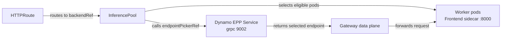
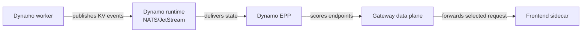

Use this reference after the [GAIE Quickstart](./quickstart.mdx) when you need to inspect generated
resources, tune routing behavior, or adapt the Gateway API path to a cluster policy.

This page is user-facing runtime reference. It does not cover building custom EPP images, local
development loops, minikube-specific setup, or full uninstall procedures.

## Resource Contract

Operator-managed GAIE connects Gateway API resources to the Dynamo serving graph through an
operator-generated `InferencePool`.



| Resource | Contract |
|---|---|
| `Gateway` | Owns listeners, addresses, and Gateway implementation behavior. |
| `HTTPRoute` | Attaches traffic to the `Gateway` through `spec.parentRefs` and points `rules[].backendRefs` at the `InferencePool`. |
| `InferencePool` | Defines the eligible backend pod set and the EPP endpoint the gateway calls before forwarding. |
| EPP `Service` | Exposes the Dynamo EPP on gRPC port `9002`. |
| Frontend sidecar | Receives the selected request on the pod's `http` port and runs with `--router-mode direct`. |

The Dynamo operator creates the `InferencePool` for a `DynamoGraphDeployment` that contains an EPP
component. The pool name is `<dgd-name>-pool`, it lives in the DGD namespace, and its
`endpointPickerRef` points to the generated EPP `Service`.

The generated selector matches worker pods by Dynamo labels:

```yaml
spec:
  selector:
    matchLabels:
      nvidia.com/dynamo-component-class: worker
      nvidia.com/dynamo-namespace: <dynamo-namespace>
  endpointPickerRef:
    kind: Service
    name: <dgd-name>-epp
    port:
      number: 9002
  targetPorts:
    - number: 8000
```

Do not hand-edit the generated `InferencePool` unless you also keep its selector aligned with the
operator's worker-pod labels. If the pool selector and Dynamo discovery disagree, the EPP can select
a worker that the gateway data plane refuses to forward to.

For the upstream Gateway API model, see the
[HTTP routing guide](https://gateway-api.sigs.k8s.io/guides/user-guides/http-routing/) and
[cross-namespace routing guide](https://gateway-api.sigs.k8s.io/guides/user-guides/multiple-ns/).

## Request Contract

With GAIE, worker selection happens in the EPP before the request reaches the worker sidecar. The
sidecar must run in direct mode so it honors the EPP decision instead of routing again.

```yaml
frontendSidecar: sidecar-frontend
podTemplate:
  spec:
    containers:
      - name: sidecar-frontend
        args:
          - -m
          - dynamo.frontend
          - --router-mode
          - direct
```

The EPP sends routing decisions to the selected sidecar through request headers.

| Header | Meaning |
|---|---|
| `x-dynamo-worker-instance-id` | Decode or aggregated worker selected for the request. |
| `x-dynamo-dp-rank` | Data-parallel rank for the selected decode or aggregated worker. |
| `x-dynamo-routing-mode` | `aggregated` or `disaggregated`. |
| `x-dynamo-prefill-instance-id` | Prefill worker selected for disaggregated requests. |
| `x-dynamo-prefill-dp-rank` | Data-parallel rank for the selected prefill worker, when present. |

For body-bearing OpenAI requests, the EPP also tokenizes the request and injects token data into the
request body so the sidecar can avoid repeating the same tokenization work.

## Routing Modes

The same Dynamo router logic can run behind the Dynamo-native Frontend entry path or inside the
GAIE EPP. In the Gateway API path, the EPP owns endpoint selection and the worker sidecar owns
request forwarding.

| Mode | EPP input | When to use |
|---|---|---|
| KV cache aware routing | Worker KV cache events plus local request bookkeeping. | Use when workers publish KV events and cache locality should influence endpoint selection. |
| Approximate routing | Tokenized requests, request lifecycle, and local predicted state. | Use when KV events are unavailable, disabled, or not supported by the selected deployment shape. |

In the operator-managed GAIE path, KV events reach the EPP through the Dynamo event plane using
NATS/JetStream. vLLM can also publish KV events through ZMQ in other integration shapes; the
operator-managed `DynamoGraphDeployment` path does not use ZMQ for the EPP.



To use KV cache aware routing:

1. Enable worker prefix caching and KV event publishing for your backend.
2. Keep EPP KV events enabled.
3. Keep the worker KV block size aligned with the EPP block size.

Backend examples:

| Backend | Worker setting |
|---|---|
| vLLM | Pass `--enable-prefix-caching` and `--kv-events-config '{"enable_kv_cache_events":true}'`. |
| SGLang | Pass the backend's supported `--kv-events-config`. |
| TensorRT-LLM | Pass `--publish-events-and-metrics`. |

Set `DYN_KV_CACHE_BLOCK_SIZE` on the EPP only when discovery does not already provide the backend's
block size. It must match the workers' `--block-size`. A mismatch changes the block hashes used for
prefix overlap and produces incorrect routing scores.

To use approximate routing, disable worker KV events and set the EPP to predicted local state:

```yaml
env:
  - name: DYN_USE_KV_EVENTS
    value: "false"
  - name: DYN_ROUTER_KV_OVERLAP_SCORE_CREDIT
    value: "0"
```

## Router Tuning

Set these values on the EPP component unless the deployment manifest says otherwise.

| Setting | Default | Effect |
|---|---:|---|
| `DYN_ENFORCE_DISAGG` | `false` | When `true`, fail requests if prefill routing is unavailable. When `false`, fall back to aggregated routing until prefill workers appear. |
| `DYN_ROUTER_KV_OVERLAP_SCORE_CREDIT` | `1.0` | Controls device-local prefix-overlap credit. Higher values prefer workers with cached prompt prefixes. |
| `DYN_ROUTER_KV_OVERLAP_SCORE_CREDIT_DECAY` | `0.0` | Reduces prefix-overlap credit as active prefill load rises above the least-loaded eligible worker. |
| `DYN_ROUTER_PREFILL_LOAD_SCALE` | `1.0` | Scales prompt-side prefill load after cache-hit credits are applied. |
| `DYN_ROUTER_TEMPERATURE` | `0.0` | `0.0` selects deterministically. Higher values allow more worker exploration through softmax sampling. |
| `DYN_ROUTER_REPLICA_SYNC` | `false` | Publishes and subscribes router state across router replicas. |
| `DYN_ROUTER_TRACK_ACTIVE_BLOCKS` | `true` | Tracks active decode blocks for load balancing. |
| `DYN_ROUTER_TRACK_OUTPUT_BLOCKS` | `false` | Predicts output blocks during generation and decays them by progress toward expected output length. |
| `DYN_ROUTER_TRACK_PREFILL_TOKENS` | `true` | Includes active prompt-side prefill tokens in load accounting. |
| `DYN_ROUTER_PREDICTED_TTL_SECS` | unset | Enables predicted entries in the local indexer for this TTL when KV events are enabled. |
| `DYN_ADMISSION_CONTROL` | `none` | Set to `token-capacity` to skip workers that exceed active decode or prefill thresholds. |
| `DYN_ACTIVE_DECODE_BLOCKS_THRESHOLD` | unset | Decode worker is busy above this active-block fraction. Setting a numeric value enables token-capacity admission. |
| `DYN_ACTIVE_PREFILL_TOKENS_THRESHOLD` | unset | Worker is busy above this absolute active-prefill-token count. |
| `DYN_ACTIVE_PREFILL_TOKENS_THRESHOLD_FRAC` | unset | Worker is busy above this fraction of `max_num_batched_tokens`. |

For the broader router configuration surface, see
[Router Configuration](../../components/router/router-configuration.md).

## Service Mesh Integration

The EPP serves gRPC on port `9002`. When an Istio sidecar mediates traffic from the gateway proxy to
the EPP service, configure mesh TLS explicitly so the proxy connects to the EPP's serving mode.

Enable operator-managed Istio `DestinationRule` generation when installing or upgrading the Dynamo
platform chart:

```bash
helm upgrade -i dynamo-platform \
  oci://helm.ngc.nvidia.com/nvidia/ai-dynamo/charts/dynamo-platform \
  --version "$DYNAMO_VERSION" \
  --namespace "$DYNAMO_SYSTEM_NAMESPACE" \
  --reuse-values \
  --set dynamo.serviceMesh.enabled=true \
  --set dynamo.serviceMesh.provider=istio
```

The platform values are:

| Value | Default | Meaning |
|---|---|---|
| `dynamo.serviceMesh.enabled` | `false` | Generate service-mesh resources for EPP services. |
| `dynamo.serviceMesh.provider` | `istio` | Mesh provider. Only Istio is supported. |
| `dynamo.serviceMesh.istio.tlsMode` | `SIMPLE` | TLS mode for generated `DestinationRule` resources. |
| `dynamo.serviceMesh.istio.insecureSkipVerify` | `true` | Skip server certificate verification for the EPP's self-signed certificate. |
| `dynamo.serviceMesh.istio.clientCertificate` | `""` | Client certificate path for `MUTUAL` TLS mode. |
| `dynamo.serviceMesh.istio.privateKey` | `""` | Client private key path for `MUTUAL` TLS mode. |
| `dynamo.serviceMesh.istio.caCertificates` | `""` | CA certificate path for `MUTUAL` TLS mode. |

When enabled and Istio CRDs are installed, the operator creates a `DestinationRule` for each EPP
service:

```yaml
apiVersion: networking.istio.io/v1beta1
kind: DestinationRule
metadata:
  name: <epp-service-name>
spec:
  host: <epp-service-name>.<namespace>.svc.cluster.local
  trafficPolicy:
    tls:
      mode: SIMPLE
      insecureSkipVerify: true
```

If you install without the Dynamo operator Helm chart or leave `dynamo.serviceMesh.enabled=false`,
create an equivalent `DestinationRule` for each EPP service used through Istio.

## agentgateway and Istio Injection

When namespace-level Istio injection is enabled, the `agentgateway-proxy` pod can receive an Istio
sidecar. That sidecar can intercept the ext_proc gRPC connection from agentgateway to the EPP and
cause HTTP 500 responses from the gateway.

Use a per-Gateway `AgentgatewayParameters` resource in the same namespace as the `Gateway`:

```yaml
apiVersion: agentgateway.dev/v1alpha1
kind: AgentgatewayParameters
metadata:
  name: inference-gateway-params
spec:
  deployment:
    spec:
      template:
        metadata:
          annotations:
            sidecar.istio.io/inject: "false"
```

Reference that parameters resource from the `Gateway`:

```yaml
apiVersion: gateway.networking.k8s.io/v1
kind: Gateway
metadata:
  name: inference-gateway
spec:
  gatewayClassName: agentgateway
  infrastructure:
    parametersRef:
      group: agentgateway.dev
      kind: AgentgatewayParameters
      name: inference-gateway-params
  listeners:
    - name: http
      port: 80
      protocol: HTTP
```

Verify that the proxy pod does not contain `istio-proxy`:

```bash
kubectl get pods -n "$NAMESPACE" \
  -l gateway.networking.k8s.io/gateway-name=inference-gateway \
  -o jsonpath='{.items[*].spec.containers[*].name}{"\n"}'
```

> [!WARNING]
> Patch the default `AgentgatewayParameters` resource in `agentgateway-system` only as a
> cluster-wide policy decision. Gateways without `spec.infrastructure.parametersRef` inherit that
> default.

## Developer References

Image build commands belong with the component source, not in this user reference. Use this source
location when developing or replacing the standard EPP image:

- [Go EPP source](https://github.com/ai-dynamo/dynamo/tree/main/deploy/inference-gateway/epp)
