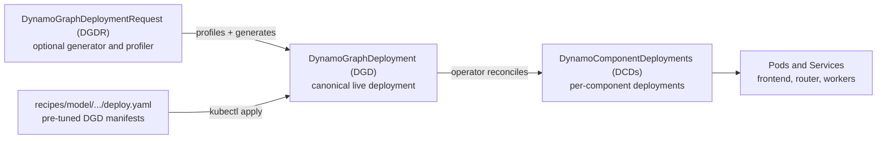

Dynamo's canonical Kubernetes deployment is a
[`DynamoGraphDeployment`](api-reference.md#dynamographdeployment) (DGD). A DGD
describes the inference graph you want to run. The Dynamo operator reconciles
that graph into one or more
[`DynamoComponentDeployment`](api-reference.md#dynamocomponentdeployment) (DCD)
resources, which run the frontend, router, prefill workers, decode workers, and
other graph components.

This is the Kubernetes-native control path for Dynamo: you author or generate
Dynamo resources, and the operator translates them into Kubernetes workloads,
services, routing metadata, model-loading resources, and status conditions. For
local development or incremental adoption, you can still run the same frontend,
router, and worker components outside Kubernetes.

You can create a DGD directly from a known-good manifest, or you can use a
[`DynamoGraphDeploymentRequest`](dgdr.md) (DGDR) to profile your model and
generate a DGD for you.

Most users only need three ideas before they deploy:

- **Recipes are the fastest path** when one matches your model, backend,
  hardware, and serving pattern. They are already DGD manifests.
- **DGDR is the guided path** when you want Dynamo to profile and generate a
  DGD from model/SLA intent.
- **DGD is the object that serves traffic**. DGDR can create it, but the DGD is
  what persists after profiling completes.

You do not need to author DCDs directly for normal deployments.

## Start Here: Resource Model



| Resource or path | What it is | Use it when | Learn more |
|---|---|---|---|
| `DynamoGraphDeployment` (DGD) | The canonical live deployment for a Dynamo inference graph. | You have a known-good configuration or tuned YAML. | [Creating Deployments](deployment/create-deployment.md), [DGD API](api-reference.md#dynamographdeployment) |
| `DynamoComponentDeployment` (DCD) | The per-component deployment objects created from a DGD. | Usually not authored directly; inspect them to debug frontend/router/worker rollout. | [DCD API](api-reference.md#dynamocomponentdeployment) |
| `DynamoGraphDeploymentRequest` (DGDR) | A deploy-by-intent request that profiles your model/hardware and generates a DGD. | You want Dynamo to size the deployment, choose parallelism, configure supported generated-deployment features such as Planner, or produce DGD YAML. | [DGDR Reference](dgdr.md) |
| Recipes | Curated `deploy.yaml` manifests that are already DGD specs. | A recipe matches your model, backend, hardware, and serving mode. | [Dynamo recipes](https://github.com/ai-dynamo/dynamo/tree/main/recipes) |
| `DynamoModel` | Model and adapter lifecycle management layered onto an existing DGD or DCD. | You need declarative model operations such as LoRA adapter loading. | [Managing Models with DynamoModel](deployment/dynamomodel-guide.md) |

## Choose Your Path

Start with the row that matches your situation. The sections later in this page
are reference material; you can read them as needed instead of going linearly.

| Situation | Do this first | Then read |
|---|---|---|
| A recipe matches your model/backend/hardware | Apply the recipe's model cache resources, then apply its `deploy.yaml`. | [Deploy a Tuned DGD from Recipes](#deploy-a-tuned-dgd-from-recipes) |
| You want Dynamo to generate the deployment | Create a DGDR. Use `autoApply: true` to let the operator create the DGD, or `autoApply: false` to inspect the generated DGD YAML first. | [Use DGDR to Generate a DGD](#use-dgdr-to-generate-a-dgd) |
| You already know the exact topology | Author or edit a DGD directly, then apply it with `kubectl`. | [Creating Deployments](deployment/create-deployment.md) |
| You are preparing for production | Add model caching, choose backend/search strategy, and validate networking/planner needs. | [Production Details](#production-details) |

## Deploy a Tuned DGD from Recipes

If a [recipe](https://github.com/ai-dynamo/dynamo/tree/main/recipes) matches
your target model, backend, GPU type, and serving mode, start there. Recipes are
curated `DynamoGraphDeployment` manifests with model-cache setup and, for many
recipes, benchmark jobs.

The common recipe flow is:

```bash
cd recipes

# Update the recipe storageClassName first, then create model cache resources.
kubectl apply -f <model>/model-cache/ -n ${NAMESPACE}
kubectl wait --for=condition=Complete job/model-download \
  -n ${NAMESPACE} --timeout=6000s

# Deploy a tuned DGD.
kubectl apply -f <model>/<backend>/<mode>/deploy.yaml -n ${NAMESPACE}
```

Follow the README in the specific recipe directory for model-specific images,
GPU requirements, cache setup, and request examples.

## Use DGDR to Generate a DGD

A DGDR is Dynamo's deploy-by-intent path. Instead of hand-crafting a deployment
spec with parallelism settings, replica counts, and resource limits, you
describe what you want to run (model, backend, workload, SLA targets) and DGDR
generates a DGD:

1. **Spec** — You submit a DGDR with your model, workload expectations, and
   optional SLA targets.
2. **Hardware Discovery** — The operator discovers your cluster's GPU hardware
   (SKU, VRAM, count per node) via DCGM or node labels.
3. **Profiling** — The profiler analyzes your model against the discovered
   hardware, using either rapid simulation or thorough real-GPU benchmarking.
4. **DGD Generation** — The profiler produces an optimized
   `DynamoGraphDeployment` (DGD) spec with the best parallelization strategy,
   replica counts, and resource configuration.
5. **Review** (when `autoApply: false`) — The generated DGD is stored in
   `.status.profilingResults.selectedConfig` for you to inspect and optionally
   modify before deploying.
6. **Deploy** — With `autoApply: true`, the operator creates the DGD. With
   `autoApply: false`, you apply the generated DGD yourself.
7. **Planner** (optional) — If enabled, the Planner monitors live traffic and
   adjusts replica counts at runtime to meet your SLA targets.

DGDR currently supports generated-deployment feature configuration for Planner
(`features.planner`) and mocker mode (`features.mocker`). The DGDR API does not
currently expose `features.kvRouter`; configure explicit router mode in a DGD,
a tuned recipe, or a generated DGD override when you need KV-aware routing
details.

```text
┌──────┐    ┌───────────┐    ┌──────────┐    ┌─────────────┐    ┌────────┐    ┌─────────┐
│ Spec │───▶│ Hardware  │───▶│ Profiler │───▶│ Generated   │───▶│ Deploy │───▶│ Planner │
│      │    │ Discovery │    │          │    │ DGD         │    │        │    │ (opt.)  │
└──────┘    └───────────┘    └──────────┘    └─────────────┘    └────────┘    └─────────┘
                                                   │
                                          autoApply: false?
                                             ▼ Review
```

For the DGDR spec reference, field descriptions, and lifecycle phases, see the
[DGDR Reference](dgdr.md).

## DGDR Detail: Choose a Search Strategy

The `searchStrategy` field controls how the profiler explores configurations.
Your choice depends on how much time you can invest and how close to optimal
you need.

### Rapid (Default)

```yaml
searchStrategy: rapid
```

Uses AIC-backed DynoSim-style performance modeling to search deployment
configurations without running real inference. Completes in ~30 seconds with no
GPU resources consumed during profiling.

**Use rapid when:**
- Getting started or iterating quickly
- Running in CI/CD pipelines
- Your GPU SKU is in the [AIC support matrix](#aic-support-matrix)

**Limitations:**
- Fallback to a naive memory-fit config only applies after DGDR accepts
  `hardware.gpuSku`. Fallback sizing depends on AIC system metadata and does
  not add support for additional GPU SKUs; unsupported model/GPU/backend
  combinations can fall back but may be suboptimal.
- Simulated results may differ from real-hardware performance for unusual
  configurations.

### Thorough

```yaml
searchStrategy: thorough
backend: vllm  # must specify a concrete backend
```

Enumerates candidate parallelization configs, deploys each on real GPUs, and
benchmarks with AIPerf. Takes 2–4 hours.

**Use thorough when:**
- Tuning for production and you need the most optimal configuration
- You want measured rather than simulated performance data

**Constraints:**
- **Disaggregated mode only** — thorough does not run aggregated configurations.
- **`backend: auto` is not supported** — you must specify `vllm`, `sglang`, or
  `trtllm`. The DGDR will be rejected if you use `auto` with `thorough`.
- **Still requires AIC generator support** — thorough measures candidates on
  real GPUs, but uses AIC to enumerate candidates and generate the final DGD.
- **Requires GPU resources** — the profiler deploys real inference engines on
  your cluster during profiling.

## DGDR Detail: AIC Support Matrix

The rapid strategy relies on AIC system metadata and performance models. Check
the [AIC support matrix](https://ai-dynamo.github.io/aiconfigurator/support-matrix/)
for the latest support. Measured profiling still needs AIC system and generator
support to enumerate and render candidates; rapid also needs performance support
for the exact model/GPU/backend combination.

### GPU SKUs

| Supported (rapid) | Not supported by rapid |
|---|---|
| H100 SXM | V100 (SXM/PCIe) |
| H100 PCIe | T4 |
| H200 SXM | MI200, MI300 |
| A100 SXM |  |
| A100 PCIe |  |
| A30 |  |
| B200 SXM |  |
| GB200 SXM |  |
| L40S |  |
| L4 |  |

> [!NOTE]
> Some rapid-mode SKUs use AIC estimate-only data until measured profiles are
> available. Use `searchStrategy: thorough` for measured profiling only when
> DGDR accepts the SKU and AIC has system and generator support for it.

When specifying GPU SKUs manually, use lowercase underscore format (e.g.,
`h100_sxm`, not `H100-SXM5-80GB`). See the
[DGDR Reference — SKU Format](dgdr.md#sku-format) for the full list.

### Backends

All three backends are supported for both rapid and thorough:

| Backend | Dense Models | MoE Models |
|---------|-------------|------------|
| vLLM | ✅ | 🚧 Work in progress |
| SGLang | ✅ | ✅ |
| TensorRT-LLM | ✅ | 🚧 Work in progress |

**If you are deploying a Mixture-of-Experts (MoE) model** (e.g., DeepSeek-R1,
Qwen3-MoE), use **SGLang** as the backend for full support. vLLM and TRT-LLM
have partial MoE support that is still under development.

### Parallelization Strategies

The profiler selects different parallelization strategies depending on the
model architecture:

| Model Architecture | Prefill | Decode |
|---|---|---|
| MLA+MoE (DeepSeek-V3, DeepSeek-R1) | TEP, DEP | TEP, DEP |
| GQA+MoE (Qwen3-MoE) | TP, TEP, DEP | TP, TEP, DEP |
| Dense models (Llama, Qwen, etc.) | TP | TP |

## Production Details

After the basic deployment path is clear, use this checklist to decide which
production topics apply:

| Concern | Why it matters | Section |
|---|---|---|
| Model startup is slow or the model is gated | Avoid repeated downloads and pass `HF_TOKEN` cleanly. | [Model Caching](#production-detail-model-caching) |
| Traffic changes over time | Planner can scale prefill/decode replicas at runtime. | [Planner](#production-detail-planner) |
| The model spans nodes or uses disaggregated serving | Grove/LWS and RDMA affect scheduling and KV transfer. | [Multinode and RDMA](#production-detail-multinode-and-rdma) |
| You need a specific inference engine | Backend choice affects MoE support, thorough profiling, and distributed behavior. | [Backend Selection](#production-detail-backend-selection) |

## Production Detail: Model Caching

**Set up model caching before deploying if any of these apply:**

- Your model is large (>70B parameters) — downloading hundreds of GB per pod
  takes hours
- You are scaling to many replicas — each pod downloads the full model
  independently, and HuggingFace will rate-limit concurrent downloads
- You want fast pod startup on scaling events

### How It Works with DGDR

Add a `modelCache` section to your DGDR spec that points to a pre-populated PVC:

```yaml
spec:
  model: meta-llama/Llama-3.1-70B-Instruct
  modelCache:
    pvcName: model-cache
    pvcMountPath: /home/dynamo/.cache/huggingface
    pvcModelPath: hub/models--meta-llama--Llama-3.1-70B-Instruct/snapshots/<commit-hash>
```

The operator mounts this PVC at `pvcMountPath` read-only into the profiling job
and passes it through to the generated DGD, so both profiling and serving use
the cached weights.

`pvcModelPath` must be the HuggingFace snapshot path inside the PVC —
`hub/models--<org>--<model>/snapshots/<commit-hash>`. This follows the layout
that `huggingface-cli download` creates when `HF_HOME` is set to the mount
point. Replace `<org>--<model>` by substituting `/` with `--` in the model ID,
and replace `<commit-hash>` with the actual snapshot revision. See
[Model Caching](model-caching.md#find-the-snapshot-path) for how to look up the
hash after downloading.

### Setup

1. Create a `ReadWriteMany` PVC — see the
   [Installation Guide — Shared Storage](installation-guide.md#shared-storage-for-model-caching)
   for provider-specific options (EFS, Azure Lustre, GKE Filestore).
2. Run a one-time download Job to populate the PVC.
3. Reference the PVC in your DGDR's `modelCache` field.

See [Model Caching](model-caching.md) for the full walkthrough with YAML
examples.

### Private and Gated Models

For models that require authentication (e.g., gated HuggingFace models), create
a Kubernetes Secret named `hf-token-secret` with a `HF_TOKEN` key:

```bash
kubectl create secret generic hf-token-secret \
  --from-literal=HF_TOKEN=<your-token> \
  -n $NAMESPACE
```

The profiler and deployed pods will automatically use this token.

## Production Detail: Planner

The Planner provides **runtime autoscaling** for disaggregated deployments. It
adjusts prefill and decode replica counts to meet your SLA targets as traffic
fluctuates.

```yaml
spec:
  features:
    planner:
      enabled: true
  sla:
    ttft: 500    # Target time to first token (ms)
    itl: 50      # Target inter-token latency (ms)
```

### Planner Scaling Modes

| Mode | Description | Prometheus Required? |
|---|---|---|
| `throughput` (default) | Static queue-depth and KV-cache thresholds; scales based on saturation | No |
| `latency` | Same as throughput with more aggressive thresholds | No |
| `sla` | Rust engine perf shim targeting specific TTFT/ITL values; uses native AIC when available, optional bootstrap data, and live FPM tuning | Yes |

### Prometheus Requirement

The `sla` optimization target reads live TTFT/ITL metrics from Prometheus. If
you want SLA-driven autoscaling, install Prometheus before creating the DGDR.
See the [Installation Guide — Prometheus](installation-guide.md#kube-prometheus-stack)
for setup instructions.

The `throughput` and `latency` modes use internal queue-depth signals and work
**without Prometheus**.

See the [Planner Guide](../components/planner/planner-guide.md) for advanced
configuration and scaling behavior details.

## Production Detail: Multinode and RDMA

Models that require more GPUs than a single node provides (e.g., DeepSeek-R1 on
8-GPU nodes) need multinode orchestration.

### Grove and KAI Scheduler

**Grove** is required for multinode DGDR deployments. It provides gang
scheduling (all pods in a group start together or not at all), coordinated
scaling, and network topology-aware placement. The operator will return an error
if you attempt a multinode deployment without Grove or LeaderWorkerSet (LWS)
installed.

**KAI Scheduler** is optional but recommended alongside Grove for GPU-aware
scheduling and topology optimization.

See the [Installation Guide — Grove + KAI Scheduler](installation-guide.md#grove--kai-scheduler)
for setup instructions and the compatibility matrix.

### High-Speed Networking (RDMA)

Disaggregated serving transfers KV cache data between prefill and decode workers.
Understanding the networking stack helps you diagnose performance issues:

| Layer | What it is |
|---|---|
| **NIXL** | Dynamo's KV cache transfer library. Moves data between prefill and decode pods. |
| **UCX / libfabric** | Low-level communication frameworks that NIXL uses underneath. |
| **RDMA** | Remote Direct Memory Access — the general technique for moving data between machines without involving the CPU. |
| **InfiniBand** | High-speed RDMA networking standard. Common on-prem and on Azure (AKS). |
| **RoCE** | RDMA over Converged Ethernet — RDMA on standard Ethernet hardware. |
| **EFA** | AWS Elastic Fabric Adapter — AWS's RDMA-capable networking for EKS. |
| **GPUDirect RDMA** | Allows data to go directly between a GPU and a network adapter, bypassing CPU memory entirely. |
| **NCCL** | NVIDIA Collective Communications Library — handles intra-model parallelism (TP/PP) communication _within_ a pod. Separate from NIXL. |

When RDMA is missing or not active, NIXL can fall back to TCP. That makes KV
cache movement the likely bottleneck and can produce very high TTFT or low
throughput even when the model workers appear healthy.

**Enable RDMA if:**
- You are running multinode disaggregated deployments
- You need low-latency KV cache transfer between workers

See the [Installation Guide — Network Operator / RDMA](installation-guide.md#network-operator--rdma)
for provider-specific setup instructions, and the
[Disaggregated Communication Guide](disagg-communication-guide.md) for transport
details and performance expectations.

### MoE Models and Multinode Sweep Limits

The profiler sweeps MoE models across up to **4 nodes** (dense models: 1 node
max per engine during sweep). If your MoE model requires more than 4 nodes of
GPUs, the profiler will select the best config within that range and you may
need to adjust replica counts manually.

## Production Detail: Backend Selection

The `backend` field controls which inference engine is used. The default
(`auto`) lets the profiler pick the best backend, but you should specify a
backend explicitly in these cases:

| Scenario | Recommended Backend |
|---|---|
| MoE models (DeepSeek-R1, Qwen3-MoE) | `sglang` (full MoE support) |
| Using `searchStrategy: thorough` | Any except `auto` (required) |
| TensorRT-LLM compilation caching | `trtllm` (add a compilation cache PVC) |
| Need load-based planner scaling (FPM) | `vllm` (any config) or `trtllm` (non-attention-DP only). SGLang FPM is wired in Dynamo but the upstream module is not in the 1.2.1 runtime image. |

> [!WARNING]
> TensorRT-LLM does not support Python 3.11. If your environment uses
> Python 3.11, use `vllm` or `sglang` instead.

### Multinode Backend Behavior

Each backend handles multinode inference differently:

- **vLLM**: Uses PyTorch multiprocessing (mp) backend with distributed initialization flags for multi-node TP/PP. Each node runs its own vLLM process with synchronized training initialization.
- **SGLang**: Uses `--dist-init-addr`, `--nnodes`, `--node-rank` flags for distributed setup.
- **TRT-LLM**: MPI-based. The operator auto-generates SSH keypairs; the leader runs `mpirun`.

## Troubleshooting

### OOM During Profiling or Serving

- **Cause**: The model doesn't fit in GPU memory with the selected TP size.
- **Fix**: Ensure `hardware.totalGpus` is large enough for your model. The
  profiler calculates minimum TP from model size and VRAM, but edge cases
  (large context lengths, KV cache overhead) may require more GPUs than the
  minimum.

### GPU Auto-Detection Cap

The operator caps auto-detected GPU count at **32**. If your cluster has more
GPUs and you want the profiler to use them, set `hardware.totalGpus` explicitly:

```yaml
spec:
  hardware:
    totalGpus: 64
```

### Profiling Job Fails to Schedule

GPU nodes often have taints. Add tolerations via the `overrides` field:

```yaml
spec:
  overrides:
    profilingJob:
      template:
        spec:
          containers: []    # required placeholder
          tolerations:
            - key: nvidia.com/gpu
              operator: Exists
              effect: NoSchedule
```

### DGDR Spec Is Immutable

Once the DGDR enters the `Profiling` phase, the spec cannot be changed. If you
need to adjust settings, delete the DGDR and recreate it:

```bash
kubectl delete dgdr my-model -n $NAMESPACE
kubectl apply -f updated-dgdr.yaml -n $NAMESPACE
```

### DGD Persists After DGDR Deletion

Deleting a DGDR does **not** delete the DGD it created. This is intentional —
the DGD continues serving traffic independently. To clean up fully:

```bash
kubectl delete dgdr my-model -n $NAMESPACE
kubectl delete dgd my-model-dgd -n $NAMESPACE
```

## Example Workflows

### Small Dense Model (Quick Start)

A small model on a single node with rapid profiling — the simplest case:

```yaml
apiVersion: nvidia.com/v1beta1
kind: DynamoGraphDeploymentRequest
metadata:
  name: qwen-small
spec:
  model: Qwen/Qwen3-0.6B
```

### Large Dense Model with SLA Targets

A 70B model with model caching, SLA targets, and the planner enabled:

```yaml
apiVersion: nvidia.com/v1beta1
kind: DynamoGraphDeploymentRequest
metadata:
  name: llama-70b
spec:
  model: meta-llama/Llama-3.1-70B-Instruct
  backend: vllm
  searchStrategy: rapid
  autoApply: false
  modelCache:
    pvcName: model-cache
    pvcMountPath: /home/dynamo/.cache/huggingface
    pvcModelPath: hub/models--meta-llama--Llama-3.1-70B-Instruct/snapshots/<commit-hash>
  sla:
    ttft: 500
    itl: 50
  workload:
    isl: 4000
    osl: 1000
    requestRate: 10
  features:
    planner:
      enabled: true
```

### MoE Model (DeepSeek-R1)

A large MoE model requiring multinode, SGLang backend, and thorough profiling:

```yaml
apiVersion: nvidia.com/v1beta1
kind: DynamoGraphDeploymentRequest
metadata:
  name: deepseek-r1
spec:
  model: deepseek-ai/DeepSeek-R1
  backend: sglang
  searchStrategy: thorough
  autoApply: false
  modelCache:
    pvcName: model-cache
    pvcMountPath: /home/dynamo/.cache/huggingface
    pvcModelPath: hub/models--deepseek-ai--DeepSeek-R1/snapshots/<commit-hash>
  sla:
    ttft: 2000
    itl: 100
  hardware:
    totalGpus: 32
  features:
    planner:
      enabled: true
  overrides:
    profilingJob:
      template:
        spec:
          containers: []
          tolerations:
            - key: nvidia.com/gpu
              operator: Exists
              effect: NoSchedule
```

**Prerequisites for this deployment:**
- [Grove and KAI Scheduler](installation-guide.md#grove--kai-scheduler) installed
- [RDMA](installation-guide.md#network-operator--rdma) configured for efficient KV cache transfer
- Model [cached on a shared PVC](installation-guide.md#shared-storage-for-model-caching)
- [Prometheus](installation-guide.md#kube-prometheus-stack) installed (for SLA-driven planner scaling)

## Further Reading

- [DGDR Reference](dgdr.md) — Spec reference, lifecycle phases, monitoring commands
- [DGDR Examples](../components/profiler/profiler-examples.md) — Ready-to-use YAML for various scenarios
- [Profiler Guide](../components/profiler/profiler-guide.md) — Profiling algorithms, picking modes, gate checks
- [Planner Guide](../components/planner/planner-guide.md) — Scaling modes, PlannerConfig reference
- [Model Caching](model-caching.md) — PVC setup, ModelExpress, and ModelStreamer
- [Creating Deployments](deployment/create-deployment.md) — Manual DGD spec for hand-crafted configs
- [Multinode Deployments](deployment/multinode-deployment.md) — Grove, LWS, and multinode details
- [Disaggregated Communication](disagg-communication-guide.md) — NIXL, RDMA, and networking
