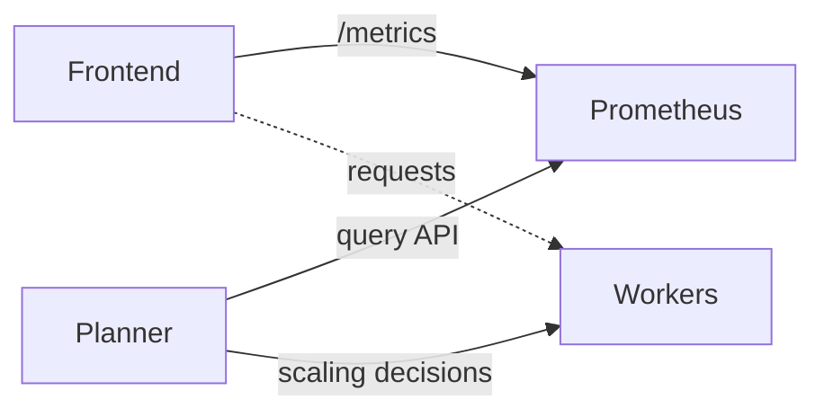

# SLA Planner Deployment Guide

Quick deployment guide for the disaggregated planner with automatic scaling.

> [!NOTE]
> For high-level architecture and concepts, see [SLA-based Planner](/docs/architecture/sla_planner.md).

## Architecture Overview

**Components:**
- **Frontend**: Serves requests and exposes `/metrics`
- **Prometheus**: Scrapes frontend metrics every 5s (by default, can be updated in the podmonitor manifest)
- **Planner**: Queries Prometheus and adjusts worker scaling every adjustment interval
- **Workers**: prefill and backend workers handle inference

The adjustment interval can be defined in the planner manifest as an argument. The default interval value can be found in this [file](/components/planner/src/dynamo/planner/defaults.py).



## Prerequisites
- Kubernetes cluster with GPU nodes
- [Pre-Deployment Profiling](/docs/benchmarks/pre_deployment_profiling.md) completed and its results saved to `dynamo-pvc` PVC.
- Prefill and decode worker uses the best parallelization mapping suggested by the pre-deployment profiling script.
- [kube-prometheus-stack](/docs/kubernetes/metrics.md) installed and running. By default, the prometheus server is not deployed in the `monitoring` namespace. If it is deployed to a different namespace, set `dynamo-operator.dynamo.metrics.prometheusEndpoint="http://prometheus-kube-prometheus-prometheus.<namespace>.svc.cluster.local:9090"`.

> [!NOTE]
> **Important**: The profiling that occurs before Planner deployment requires additional Kubernetes manifests (ServiceAccount, Role, RoleBinding, PVC) that are not included in standard Dynamo deployments. Apply these manifests in the same namespace as `$NAMESPACE`. For a complete setup, start with the [Quick Start guide](/deploy/utils/README.md#quick-start), which provides a fully encapsulated deployment including all required manifests.
```bash
export NAMESPACE=your-namespace
```

## 1. Deploy the System

We use vllm as the backend engine in this guide. SLA planner also supports SGLang and TensorRT-LLM. Checkout `disagg_planner.yaml` in their example deployment folders for more details. The deployment is the same for all backends.

```bash
# Apply the disaggregated planner deployment
kubectl apply -f components/backends/vllm/deploy/disagg_planner.yaml -n $NAMESPACE # for vllm

kubectl apply -f components/backends/sglang/deploy/disagg_planner.yaml -n $NAMESPACE # for sglang

kubectl apply -f components/backends/trtllm/deploy/disagg_planner.yaml -n $NAMESPACE # for trtllm

# Check deployment status
kubectl get pods -n $NAMESPACE
```

Expected pods (all should be `1/1 Running`):
```
# For vLLM:
vllm-disagg-planner-frontend-*            1/1 Running
vllm-disagg-planner-planner-*             1/1 Running
vllm-disagg-planner-backend-*             1/1 Running
vllm-disagg-planner-prefill-*             1/1 Running
```

## 2. Test the System

```bash
# Port forward to frontend
kubectl port-forward -n $NAMESPACE deployment/vllm-disagg-planner-frontend 8000:8000

# Send a request
curl -N http://localhost:8000/v1/chat/completions \
  -H "Content-Type: application/json" \
  -d '{
    "model": "Qwen/Qwen3-0.6B",
    "messages": [
    {
        "role": "user",
        "content": "In the heart of Eldoria, an ancient land of boundless magic and mysterious creatures, lies the long-forgotten city of Aeloria. Once a beacon of knowledge and power, Aeloria was buried beneath the shifting sands of time, lost to the world for centuries. You are an intrepid explorer, known for your unparalleled curiosity and courage, who has stumbled upon an ancient map hinting at ests that Aeloria holds a secret so profound that it has the potential to reshape the very fabric of reality. Your journey will take you through treacherous deserts, enchanted forests, and across perilous mountain ranges. Your Task: Character Background: Develop a detailed background for your character. Describe their motivations for seeking out Aeloria, their skills and weaknesses, and any personal connections to the ancient city or its legends. Are they driven by a quest for knowledge, a search for lost familt clue is hidden."
    }
    ],
    "stream":true,
    "max_tokens": 30
  }'
```

## 3. Monitor Scaling

```bash
# Check planner logs for scaling decisions
kubectl logs -n $NAMESPACE deployment/vllm-disagg-planner-planner --tail=10

# Expected successful output (after streaming requests):

# New adjustment interval started!
# Observed num_req: X.XXX isl: X.XXX osl: X.XXX
# Observed ttft: X.XXXs itl: X.XXXs
# Number of prefill workers: 1, number of decode workers: 1
```

### Metrics Requirements
- **Basic metrics** (request count): Available with any request type
- **Latency metrics** (TTFT/ITL): Available for both streaming and non-streaming requests
- **Scaling decisions**: Require sufficient request volume

## 4. Troubleshooting

**Connection Issues:**
```bash
# Verify Prometheus is accessible
kubectl port-forward svc/prometheus-kube-prometheus-prometheus -n monitoring 9090:9090
curl "http://localhost:9090/api/v1/query?query=up"
```

**Missing Metrics:**
```bash
# Check frontend metrics
kubectl port-forward -n $NAMESPACE deployment/vllm-disagg-planner-frontend 8000:8000
curl http://localhost:8000/metrics | grep nv_llm_http_service
```

**Worker Issues:**
- Large models can take 10+ minutes to initialize
- Check worker logs: `kubectl logs -n $NAMESPACE deployment/vllm-disagg-planner-backend`
- Ensure GPU resources are available for workers

**Unknown Field subComponentType:**

If you encounter the following error when attempting to apply the deployment:
```bash
Error from server (BadRequest): error when creating "components/backends/vllm/deploy/disagg.yaml": DynamoGraphDeployment in version "v1alpha1" cannot be handled as a DynamoGraphDeployment: strict decoding error: unknown field "spec.services.DecodeWorker.subComponentType", unknown field "spec.services.PrefillWorker.subComponentType"
```
This is because the `subComponentType` field has only been added in newer versions of the DynamoGraphDeployment CRD (> 0.5.0). You can upgrade the CRD version by following the instructions [here](/docs/kubernetes/installation_guide.md).
