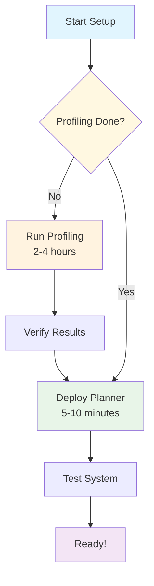

# SLA Planner Quick Start Guide

Complete workflow to deploy SLA-based autoscaling for Dynamo deployments. This guide consolidates all necessary steps into a clear, sequential process.

> [!IMPORTANT]
> **Prerequisites**: This guide assumes you have a Kubernetes cluster with GPU nodes and have completed the [Dynamo Platform installation](/docs/kubernetes/installation_guide.md).

## Overview

The SLA Planner automatically scales prefill and decode workers to meet your TTFT (Time To First Token) and ITL (Inter-Token Latency) targets.

The deployment process consists of two mandatory phases:

1. **Pre-Deployment Profiling** (2-4 hours) - Generates performance data
2. **SLA Planner Deployment** (5-10 minutes) - Enables autoscaling

> [!TIP]
> **Fast Profiling with AI Configurator**: For TensorRT-LLM users, we provide AI Configurator (AIC) that can complete profiling in 20-30 seconds using performance simulation instead of real deployments. Support for vLLM and SGLang coming soon. See [AI Configurator section](/docs/benchmarks/pre_deployment_profiling.md#running-the-profiling-script-with-aiconfigurator) in the Profiling Guide.



## Prerequisites

Before deploying the SLA planner, ensure:
- **Dynamo platform installed** (see [Installation Guide](/docs/kubernetes/installation_guide.md))
- **[kube-prometheus-stack](/docs/kubernetes/metrics.md) installed and running.** By default, the prometheus server is not deployed in the `monitoring` namespace. If it is deployed to a different namespace, set `dynamo-operator.dynamo.metrics.prometheusEndpoint="http://prometheus-kube-prometheus-prometheus.<namespace>.svc.cluster.local:9090"`.
- **Benchmarking resources setup** (see [Kubernetes utilities for Dynamo Benchmarking and Profiling](../../deploy/utils/README.md)) The script will create a `dynamo-pvc` with `ReadWriteMany` access, if your cluster's default storageClassName does not allow `ReadWriteMany`, you need to specify a different storageClassName in `pvc.yaml`.

## Pre-Deployment Profiling

Deploying planner starts with running pre-deployment profiling.

> [!WARNING]
> **MANDATORY**: Pre-deployment profiling must be completed before deploying SLA planner. This process analyzes your model's performance characteristics to determine optimal tensor parallelism configurations and scaling parameters.

### Step 1.1: Set Up Profiling Environment

Set up your Kubernetes namespace for profiling (one-time per namespace). If your namespace is already set up, skip this step.

```bash
export NAMESPACE=your-namespace
```

**Prerequisites**: Ensure all dependencies are installed:
```bash
pip install -r deploy/utils/requirements.txt
```

### Step 1.2: Inject Your Configuration

Use the injector utility to place your DGD manifest into the PVC:

```bash
# Use default disagg.yaml config
python3 -m deploy.utils.inject_manifest --namespace $NAMESPACE --src components/backends/vllm/deploy/disagg.yaml --dest /data/configs/disagg.yaml

# Or use a custom disagg config file
python3 -m deploy.utils.inject_manifest --namespace $NAMESPACE --src my-custom-disagg.yaml --dest /data/configs/disagg.yaml
```

> **Note**: All paths must start with `/data/` for security reasons.

### Step 1.3: Configure SLA Targets

For dense models, edit `$DYNAMO_HOME/benchmarks/profiler/deploy/profile_sla_job.yaml`:

```yaml
spec:
  template:
    spec:
      containers:
        - name: profile-sla
          args:
            - --isl
            - "3000" # average ISL is 3000 tokens
            - --osl
            - "150" # average OSL is 150 tokens
            - --ttft
            - "200" # target TTFT is 200ms
            - --itl
            - "20" # target ITL is 20ms
            - --backend
            - <vllm/sglang>
            - --deploy-after-profile
```

For MoE models, edit `$DYNAMO_HOME/benchmarks/profiler/deploy/profile_sla_moe_job.yaml` instead.

To automatically deploy the optimized DGD with planner after profiling, add `--deploy-after-profile` to the profiling job. It will deploy the DGD with the engine of the optimized parallelization mapping found for the SLA targets.

### Step 1.4: Run Profiling

Set the container image and config path:

```bash
export DOCKER_IMAGE=nvcr.io/nvidia/ai-dynamo/vllm-runtime:my-tag
export DGD_CONFIG_FILE=/data/configs/disagg.yaml
```

Run profiling:

```bash
# for dense models
envsubst < benchmarks/profiler/deploy/profile_sla_job.yaml | kubectl apply -f -

# for MoE models
envsubst < benchmarks/profiler/deploy/profile_sla_moe_job.yaml | kubectl apply -f -

# using aiconfigurator instead of real sweeping (see below for more details)
envsubst < benchmarks/profiler/deploy/profile_sla_aic_job.yaml | kubectl apply -f -
```

### Step 1.5: Monitor Profiling Progress

```bash
kubectl get jobs -n $NAMESPACE
kubectl logs job/profile-sla -n $NAMESPACE
```

> [!NOTE]
> **Time Investment**: This profiling process is comprehensive and typically takes **2-4 hours** to complete. The script systematically tests multiple tensor parallelism configurations and load conditions to find optimal performance settings.

### Step 1.6: Download Profiling Results (Optional)

If you want to view the profiling results and performance plots:

```bash
# Download to directory
python3 -m deploy.utils.download_pvc_results --namespace $NAMESPACE --output-dir ./results --folder /data/profiling_results
```

For detailed information about the output structure, performance plots, and how to analyze the results, see the [Viewing Profiling Results](/docs/benchmarks/pre_deployment_profiling.md#viewing-profiling-results) section in the Profiling Guide.

**Verify Success**: Look for terminal output like:
```
Suggested prefill TP:4 (TTFT 48.37 ms, throughput 15505.23 tokens/s/GPU)
Suggested decode TP:4 (ITL 4.83 ms, throughput 51.22 tokens/s/GPU)
...
Final DGD config with planner: {...}
Deploying the optimized DGD with planner...
```

### Step 1.7: Wait for Deployment to be Ready

```bash
kubectl get pods -n $NAMESPACE
```

**Expected pods** (all should be `1/1 Running`):
```
vllm-disagg-planner-frontend-*            1/1 Running
vllm-disagg-planner-planner-*             1/1 Running
vllm-disagg-planner-backend-*             1/1 Running
vllm-disagg-planner-prefill-*             1/1 Running
```

### Step 1.8: Test the System

```bash
# Port forward to frontend
kubectl port-forward -n $NAMESPACE deployment/vllm-disagg-planner-frontend 8000:8000

# Send a request
curl -N http://localhost:8000/v1/chat/completions \
  -H "Content-Type: application/json" \
  -d '{
    "model": "Qwen/Qwen3-0.6B",
    "messages": [
    {
        "role": "user",
        "content": "Hello, how are you?"
    }
    ],
    "stream":true,
    "max_tokens": 30
  }'
```

### Step 1.9: Monitor Scaling

```bash
# Check planner logs for scaling decisions
kubectl logs -n $NAMESPACE deployment/vllm-disagg-planner-planner --tail=10
```

**Expected successful output** (after streaming requests):
```
New adjustment interval started!
Observed num_req: X.XXX isl: X.XXX osl: X.XXX
Observed ttft: X.XXXs itl: X.XXXs
Number of prefill workers: 1, number of decode workers: 1
```

## Production Readiness

### Monitoring Metrics

- **Basic metrics** (request count): Available with any request type
- **Latency metrics** (TTFT/ITL): Available for both streaming and non-streaming requests
- **Scaling decisions**: Require sufficient request volume

### Troubleshooting

**Connection Issues:**
```bash
# Verify Prometheus is accessible
kubectl port-forward svc/prometheus-kube-prometheus-prometheus -n monitoring 9090:9090
curl "http://localhost:9090/api/v1/query?query=up"
```

**Missing Metrics:**
```bash
# Check frontend metrics
kubectl port-forward -n $NAMESPACE deployment/vllm-disagg-planner-frontend 8000:8000
curl http://localhost:8000/metrics | grep nv_llm_http_service
```

**Worker Issues:**
- Large models can take 10+ minutes to initialize
- Check worker logs: `kubectl logs -n $NAMESPACE deployment/vllm-disagg-planner-backend`
- Ensure GPU resources are available for workers

**Unknown Field subComponentType:**

If you encounter the following error when applying the deployment:
```bash
Error from server (BadRequest): error when creating "components/backends/vllm/deploy/disagg.yaml": DynamoGraphDeployment in version "v1alpha1" cannot be handled as a DynamoGraphDeployment: strict decoding error: unknown field "spec.services.DecodeWorker.subComponentType", unknown field "spec.services.PrefillWorker.subComponentType"
```
This is because the `subComponentType` field has only been added in newer versions of the DynamoGraphDeployment CRD (> 0.5.0). You can upgrade the CRD version by following the instructions [here](/docs/kubernetes/installation_guide.md).

## Next Steps

- **Architecture Details**: See [SLA-based Planner Architecture](/docs/architecture/sla_planner.md) for technical details
- **Performance Tuning**: See [Pre-Deployment Profiling Guide](/docs/benchmarks/pre_deployment_profiling.md) for advanced profiling options
- **Load Testing**: See [SLA Planner Load Test](/tests/planner/README.md) for comprehensive testing tools

## Quick Reference

| Phase | Duration | Purpose | Status Check |
|-------|----------|---------|--------------|
| Profiling | 2-4 hours | Generate performance data | `kubectl logs job/profile-sla` |
| Deployment | 5-10 minutes | Enable autoscaling | `kubectl get pods` |
| Testing | 5 minutes | Verify functionality | `kubectl logs deployment/planner` |

---

> [!TIP]
> **Need Help?** If you encounter issues, check the [troubleshooting section](#troubleshooting) or refer to the detailed guides linked in [Next Steps](#next-steps).