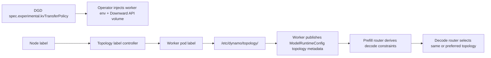

Topology-aware KV transfer lets a disaggregated Dynamo deployment route decode requests toward workers that share the selected prefill worker's topology domain, such as zone or rack. This reduces slow cross-domain KV-cache transfers when prefill and decode workers exchange KV data over NIXL.

Use this feature when:

- Your deployment uses separate prefill and decode workers.
- Your cluster exposes useful node labels, such as `topology.kubernetes.io/zone` or a rack/block label.
- Same-domain KV transfer is required for correctness or strongly preferred for latency and bandwidth.

This page covers the Kubernetes operator path. For router and runtime behavior, see [Router Topology-Aware KV Transfer](../components/router/topology-aware-kv-transfer.md).
For RDMA/NIXL transport setup, see [Disagg Communication](disagg-communication-guide.md).

## How It Works



The operator configures worker pods from `spec.experimental.kvTransferPolicy`:

- Adds a `nvidia.com/topology-label-key` annotation to worker pods.
- Runs a topology-label controller that copies the configured node label onto the worker pod after scheduling.
- Projects that pod label into `/etc/dynamo/topology/<domain>` with a Downward API volume.
- Injects worker environment variables that tell the backend runtime which topology domain and enforcement policy to publish.

The frontend does not read this policy from its own environment. Workers publish the topology metadata in their `ModelRuntimeConfig`; the router reads it from runtime discovery.

## Prerequisites

| Requirement | Details |
|-------------|---------|
| Disaggregated serving | Separate prefill and decode worker services. |
| KV router | The frontend should use `DYN_ROUTER_MODE=kv`. |
| Node topology labels | Every node that can host a worker must carry the configured `labelKey`. |
| Dynamo operator | The operator must include topology-label controller and node-read RBAC. |
| KV transfer transport | RDMA, EFA, or another NIXL-compatible transport should already be configured for production disaggregated deployments. |

Confirm that the label you plan to use exists on worker nodes:

```bash
kubectl get nodes -L topology.kubernetes.io/zone
```

## Required Same-Domain Routing

`enforcement: required` constrains decode worker selection to workers whose topology value matches the selected prefill worker for the configured domain. If no decode worker satisfies the generated constraint, the router fails the request instead of silently crossing the domain.

```yaml
apiVersion: nvidia.com/v1beta1
kind: DynamoGraphDeployment
metadata:
  name: qwen3-disagg-zone
spec:
  experimental:
    kvTransferPolicy:
      labelKey: topology.kubernetes.io/zone
      domain: zone
      enforcement: required
  components:
  - name: Frontend
    type: frontend
    replicas: 1
    podTemplate:
      spec:
        containers:
        - name: main
          image: nvcr.io/nvidia/ai-dynamo/vllm-runtime:1.2.0
          env:
          - name: DYN_ROUTER_MODE
            value: kv
  - name: VllmPrefillWorker
    type: worker
    replicas: 2
    podTemplate:
      spec:
        containers:
        - name: main
          image: nvcr.io/nvidia/ai-dynamo/vllm-runtime:1.2.0
          command: ["python3", "-m", "dynamo.vllm"]
          args: ["--model", "Qwen/Qwen3-0.6B", "--disaggregation-mode", "prefill"]
          envFrom:
          - secretRef:
              name: hf-token-secret
          resources:
            limits:
              nvidia.com/gpu: "1"
  - name: VllmDecodeWorker
    type: worker
    replicas: 2
    podTemplate:
      spec:
        containers:
        - name: main
          image: nvcr.io/nvidia/ai-dynamo/vllm-runtime:1.2.0
          command: ["python3", "-m", "dynamo.vllm"]
          args: ["--model", "Qwen/Qwen3-0.6B", "--disaggregation-mode", "decode"]
          envFrom:
          - secretRef:
              name: hf-token-secret
          resources:
            limits:
              nvidia.com/gpu: "1"
```

`enforcement` defaults to `required` when omitted.

> [!IMPORTANT]
> `required` is a decode-routing constraint, not a capacity planner. The `DynamoGraphDeployment` author or cluster administrator must ensure that every topology domain that can receive prefill workers also has sufficient same-domain decode capacity. If a domain has prefill workers but no matching decode workers, or too little decode capacity, the router cannot spill to another domain without violating the policy.

### Capacity Planning Across Domains

Plan prefill and decode capacity per topology domain before enabling `enforcement: required`. For example, assume:

- Two availability zones: `az-1` and `az-2`.
- The target fleet is 60 prefill workers and 120 decode workers.
- The fleet should be split evenly across the two zones.
- The target prefill-to-decode ratio is 1:2 in each zone.

That means each zone should run 30 prefill workers and 60 decode workers:

| Zone | Prefill workers | Decode workers | Ratio |
|------|-----------------|----------------|-------|
| `az-1` | 30 | 60 | 1:2 |
| `az-2` | 30 | 60 | 1:2 |

In a `DynamoGraphDeployment`, express this as separate prefill and decode components per zone. Pin each component to its zone and set `kvTransferPolicy.enforcement` to `required` so the router refuses cross-zone decode selection. The DGD author or cluster administrator must ensure each zone has enough schedulable capacity for its pinned replicas. Worker command and args are omitted here; configure each worker for prefill or decode mode as in the base disaggregated serving manifest:

```yaml
apiVersion: nvidia.com/v1beta1
kind: DynamoGraphDeployment
metadata:
  name: qwen3-disagg-zone-capacity
spec:
  experimental:
    kvTransferPolicy:
      labelKey: topology.kubernetes.io/zone
      domain: zone
      enforcement: required
  components:
  - name: Frontend
    type: frontend
    replicas: 1
    podTemplate:
      spec:
        containers:
        - name: main
          image: nvcr.io/nvidia/ai-dynamo/vllm-runtime:1.2.0
          env:
          - name: DYN_ROUTER_MODE
            value: kv
  - name: VllmPrefillWorkerAz1
    type: worker
    replicas: 30
    podTemplate:
      spec:
        affinity:
          nodeAffinity:
            requiredDuringSchedulingIgnoredDuringExecution:
              nodeSelectorTerms:
              - matchExpressions:
                - key: topology.kubernetes.io/zone
                  operator: In
                  values: ["az-1"]
        containers:
        - name: main
          image: nvcr.io/nvidia/ai-dynamo/vllm-runtime:1.2.0
          envFrom:
          - secretRef:
              name: hf-token-secret
  - name: VllmDecodeWorkerAz1
    type: worker
    replicas: 60
    podTemplate:
      spec:
        affinity:
          nodeAffinity:
            requiredDuringSchedulingIgnoredDuringExecution:
              nodeSelectorTerms:
              - matchExpressions:
                - key: topology.kubernetes.io/zone
                  operator: In
                  values: ["az-1"]
        containers:
        - name: main
          image: nvcr.io/nvidia/ai-dynamo/vllm-runtime:1.2.0
          envFrom:
          - secretRef:
              name: hf-token-secret
  - name: VllmPrefillWorkerAz2
    type: worker
    replicas: 30
    podTemplate:
      spec:
        affinity:
          nodeAffinity:
            requiredDuringSchedulingIgnoredDuringExecution:
              nodeSelectorTerms:
              - matchExpressions:
                - key: topology.kubernetes.io/zone
                  operator: In
                  values: ["az-2"]
        containers:
        - name: main
          image: nvcr.io/nvidia/ai-dynamo/vllm-runtime:1.2.0
          envFrom:
          - secretRef:
              name: hf-token-secret
  - name: VllmDecodeWorkerAz2
    type: worker
    replicas: 60
    podTemplate:
      spec:
        affinity:
          nodeAffinity:
            requiredDuringSchedulingIgnoredDuringExecution:
              nodeSelectorTerms:
              - matchExpressions:
                - key: topology.kubernetes.io/zone
                  operator: In
                  values: ["az-2"]
        containers:
        - name: main
          image: nvcr.io/nvidia/ai-dynamo/vllm-runtime:1.2.0
          envFrom:
          - secretRef:
              name: hf-token-secret
```

## Preferred Same-Domain Routing

`enforcement: preferred` keeps all decode workers eligible but biases worker selection toward the same topology domain.

```yaml
spec:
  experimental:
    kvTransferPolicy:
      labelKey: topology.kubernetes.io/zone
      domain: zone
      enforcement: preferred
      preferredWeight: 0.85
```

`preferredWeight` is required with `enforcement: preferred`. It must be between `0` and `1`. A higher value creates a stronger same-domain preference, but it is not a probability and does not guarantee same-domain selection.

## Field Reference

| Field | Required | Description |
|-------|----------|-------------|
| `labelKey` | Yes | Kubernetes node label key to copy onto worker pods, for example `topology.kubernetes.io/zone`. |
| `domain` | Yes | Logical topology domain name published by workers, for example `zone` or `rack`. Must match `^[a-z0-9]([a-z0-9-]*[a-z0-9])?$`. |
| `enforcement` | No | `required` or `preferred`. Defaults to `required`. |
| `preferredWeight` | Only with `preferred` | Bias weight from `0` to `1`; only valid with `enforcement: preferred`. |

The runtime uses `domain`, not the Kubernetes label key, when creating routing constraints. For example, `labelKey: topology.kubernetes.io/zone` and `domain: zone` produce worker topology metadata like:

```json
{
  "topology_domains": {
    "zone": "us-east-1a"
  },
  "kv_transfer_domain": "zone",
  "kv_transfer_enforcement": "required"
}
```

## Verify the Deployment

After the DGD creates worker pods, verify the operator pipeline from node label to runtime topology file.

```bash
export NAMESPACE=<namespace>
export POD=<worker-pod>

kubectl get pod "$POD" -n "$NAMESPACE" \
  -o jsonpath='{.metadata.annotations.nvidia\.com/topology-label-key}{"\n"}'

kubectl get pod "$POD" -n "$NAMESPACE" \
  -o jsonpath='{.metadata.labels.topology\.kubernetes\.io/zone}{"\n"}'

kubectl exec "$POD" -n "$NAMESPACE" -- \
  sh -c 'find /etc/dynamo/topology -maxdepth 1 -type f -print -exec cat {} \;'
```

Expected results:

- The annotation value is the configured `labelKey`.
- The worker pod has the copied topology label.
- `/etc/dynamo/topology/<domain>` exists and contains the topology value.

Worker logs should include topology config during startup:

```bash
kubectl logs "$POD" -n "$NAMESPACE" | grep -i "Topology config"
```

## Troubleshooting

### Pod Has No Copied Topology Label

Check whether the node has the configured label:

```bash
NODE=$(kubectl get pod "$POD" -n "$NAMESPACE" -o jsonpath='{.spec.nodeName}')
kubectl get node "$NODE" -o jsonpath='{.metadata.labels.topology\.kubernetes\.io/zone}{"\n"}'
```

If the label is missing, the topology-label controller emits a warning event with reason `TopologyLabelMissing` and leaves topology metadata unavailable for that worker.

```bash
kubectl get events -n "$NAMESPACE" \
  --field-selector involvedObject.name="$POD",reason=TopologyLabelMissing
```

### Worker Exits While Waiting for Topology

When topology is enabled, the worker waits for the transfer-domain file to appear and contain data. If it stays empty, check:

- `spec.experimental.kvTransferPolicy.domain` matches the projected file name.
- `spec.experimental.kvTransferPolicy.labelKey` exists on the worker's node.
- The worker pod has the `nvidia.com/topology-label-key` annotation.
- The topology-label controller is running and has node `get` RBAC.

### Required Policy Fails Requests

With `enforcement: required`, decode routing fails if no decode worker has the same generated topology taint as the selected prefill worker. Verify both prefill and decode workers publish the same `domain`, and that each domain where prefill workers can be selected has enough matching decode workers for the expected p/d ratio.

Use `preferred` while validating a heterogeneous rollout if cross-domain routing is acceptable during partial capacity.

## Relationship to Topology Aware Scheduling

[Topology Aware Scheduling](topology-aware-scheduling.md) controls where Kubernetes places pods. Topology-aware KV transfer controls how Dynamo routes between already-running prefill and decode workers.

Use them together when possible:

- Topology Aware Scheduling keeps workers placed inside useful topology boundaries.
- Topology-aware KV transfer prevents the router from choosing a decode worker outside the selected prefill worker's transfer domain.
