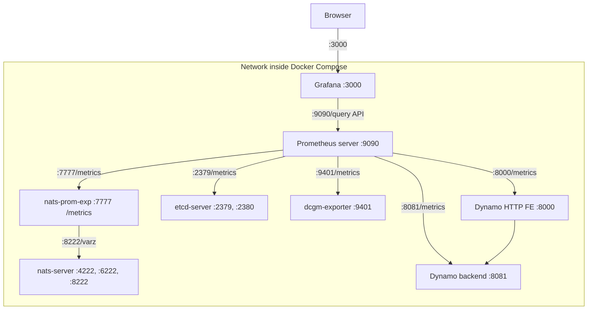

<!--
SPDX-FileCopyrightText: Copyright (c) 2025-2026 NVIDIA CORPORATION & AFFILIATES. All rights reserved.
SPDX-License-Identifier: Apache-2.0
-->

# Dynamo Observability

## Getting Started Quickly

This is an example to get started quickly on a single machine.

### Prerequisites

Install these on your machine:

- [Docker](https://docs.docker.com/get-docker/)
- [Docker Compose](https://docs.docker.com/compose/install/)

### Starting the Observability Stack

Dynamo provides a Docker Compose-based observability stack that includes Prometheus, Grafana, Tempo, and various exporters for metrics, tracing, and visualization.

From the Dynamo root directory:

```bash
# Start infrastructure (NATS, etcd)
docker compose -f deploy/docker-compose.yml up -d

# Start observability stack (Prometheus, Grafana, Tempo, DCGM GPU exporter, NATS exporter)
docker compose -f deploy/docker-observability.yml up -d
```

For detailed setup instructions and configuration, see [Prometheus + Grafana Setup](prometheus-grafana.md).

## Observability Documentations

| Guide | Description | Environment Variables to Control |
|-------|-------------|----------------------------------|
| [Metrics](metrics.md) | Available metrics reference | `DYN_SYSTEM_PORT`† |
| [Operator Metrics (Kubernetes)](../kubernetes/observability/operator-metrics.md) | Operator controller and webhook metrics for Kubernetes | N/A (configured via Helm) |
| [Health Checks](health-checks.md) | Component health monitoring and readiness probes | `DYN_SYSTEM_PORT`†, `DYN_SYSTEM_STARTING_HEALTH_STATUS`, `DYN_SYSTEM_HEALTH_PATH`, `DYN_SYSTEM_LIVE_PATH`, `DYN_SYSTEM_USE_ENDPOINT_HEALTH_STATUS` |
| [Tracing](tracing.md) | Distributed tracing with OpenTelemetry and Tempo | `DYN_LOGGING_JSONL`†, `OTEL_EXPORT_ENABLED`†, `OTEL_EXPORTER_OTLP_TRACES_ENDPOINT`†, `OTEL_SERVICE_NAME`† |
| [Logging](logging.md) | Structured logging configuration | `DYN_LOGGING_JSONL`†, `DYN_LOG`, `DYN_LOG_USE_LOCAL_TZ`, `DYN_LOGGING_CONFIG_PATH`, `OTEL_SERVICE_NAME`†, `OTEL_EXPORT_ENABLED`†, `OTEL_EXPORTER_OTLP_TRACES_ENDPOINT`† |

**Variables marked with † are shared across multiple observability systems.**

## Developer Guides

| Guide | Description | Environment Variables to Control |
|-------|-------------|----------------------------------|
| [Metrics Developer Guide](metrics-developer-guide.md) | Creating custom metrics in Rust and Python | `DYN_SYSTEM_PORT`† |

## Kubernetes

For Kubernetes-specific setup and configuration, see [docs/kubernetes/observability/](../kubernetes/observability/).

**Operator Metrics**: The Dynamo Operator running in Kubernetes exposes its own set of metrics for monitoring controller reconciliation, webhook validation, and resource inventory. See the [Operator Metrics Guide](../kubernetes/observability/operator-metrics.md).

---

## Topology

This provides:
- **Prometheus** on `http://localhost:9090` - metrics collection and querying
- **Grafana** on `http://localhost:3000` - visualization dashboards (username: `dynamo`, password: `dynamo`)
- **Tempo** on `http://localhost:3200` - distributed tracing backend
- **DCGM Exporter** on `http://localhost:9401/metrics` - GPU metrics
- **NATS Exporter** on `http://localhost:7777/metrics` - NATS messaging metrics

### Service Relationship Diagram


The dcgm-exporter service in the Docker Compose network is configured to use port 9401 instead of the default port 9400. This adjustment is made to avoid port conflicts with other dcgm-exporter instances that may be running simultaneously. Such a configuration is typical in distributed systems like SLURM.

### Configuration Files

The following configuration files are located in the `deploy/observability/` directory:
- [docker-compose.yml](../../deploy/docker-compose.yml): Defines NATS and etcd services
- [docker-observability.yml](../../deploy/docker-observability.yml): Defines Prometheus, Grafana, Tempo, and exporters
- [prometheus.yml](../../deploy/observability/prometheus.yml): Contains Prometheus scraping configuration
- [grafana-datasources.yml](../../deploy/observability/grafana-datasources.yml): Contains Grafana datasource configuration
- [grafana_dashboards/dashboard-providers.yml](../../deploy/observability/grafana_dashboards/dashboard-providers.yml): Contains Grafana dashboard provider configuration
- [grafana_dashboards/dynamo.json](../../deploy/observability/grafana_dashboards/dynamo.json): A general Dynamo Dashboard for both SW and HW metrics
- [grafana_dashboards/dcgm-metrics.json](../../deploy/observability/grafana_dashboards/dcgm-metrics.json): Contains Grafana dashboard configuration for DCGM GPU metrics
- [grafana_dashboards/kvbm.json](../../deploy/observability/grafana_dashboards/kvbm.json): Contains Grafana dashboard configuration for KVBM metrics

```{toctree}
:hidden:

Prometheus + Grafana Setup <prometheus-grafana>
Metrics <metrics>
Metrics Developer Guide <metrics-developer-guide>
Health Checks <health-checks>
Tracing <tracing>
Logging <logging>
```

