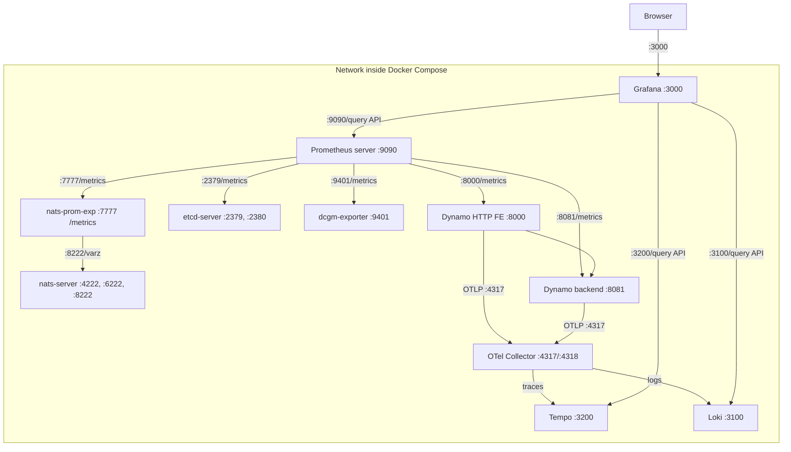

## Required environment variables

Set these on every Dynamo process (frontend, router, workers) for metrics, traces, and logs to flow:

| Variable | Purpose | Required |
|---|---|---|
| `DYN_SYSTEM_PORT=8081` | Unified system port (metrics + health). | Yes for metrics. |
| `OTEL_EXPORT_ENABLED=true` | Enable OpenTelemetry export. **Without this, traces and logs never leave the process** — Loki and Tempo will show nothing even if they are healthy. | Yes for traces/logs. |
| `OTEL_EXPORTER_OTLP_TRACES_ENDPOINT` | OTLP gRPC endpoint for traces (e.g. `http://tempo:4317`). Must be a gRPC listener — Dynamo's exporter does not speak OTLP/HTTP, even though the OTel Collector also listens on `:4318`. | Yes for traces. |
| `OTEL_EXPORTER_OTLP_LOGS_ENDPOINT` | OTLP gRPC endpoint for logs (e.g. `http://loki-otlp:4317`). Same gRPC-only constraint as the traces endpoint above. | Yes for logs. |
| `DYN_LOGGING_JSONL=true` | Structured JSON log output (recommended for Loki). | Optional. |

Source of truth: [`lib/runtime/src/logging.rs`](https://github.com/ai-dynamo/dynamo/blob/main/lib/runtime/src/logging.rs) `setup_logging()`.

Passing `--enable-metrics` on an individual backend only exposes metrics *per backend*. The unified frontend metrics surface (scraped by Prometheus) requires `DYN_SYSTEM_PORT` to be set on the frontend process as well — setting it on workers alone is not enough.

Prometheus metric families in Dynamo are registered lazily: each label set is created the first time it fires, so a freshly-started process shows empty metric families until the first relevant request. This is expected — an idle cluster does not mean scraping is broken.

## Getting Started Quickly

This is an example to get started quickly on a single machine.

### Prerequisites

Install these on your machine:

- [Docker](https://docs.docker.com/get-docker/)
- [Docker Compose](https://docs.docker.com/compose/install/)

### Starting the Observability Stack

Dynamo provides a Docker Compose-based observability stack that includes Prometheus, Grafana, Tempo, Loki, an OpenTelemetry Collector, and various exporters for metrics, tracing, logging, and visualization.

From the Dynamo root directory:

```bash
# Start infrastructure (NATS, etcd)
docker compose -f dev/docker-compose.yml up -d

# Start observability stack (Prometheus, Grafana, Tempo, DCGM GPU exporter, NATS exporter)
docker compose -f dev/docker-observability.yml up -d
```

For detailed setup instructions and configuration, see [Prometheus + Grafana Setup](prometheus-grafana.md).

## Observability Documentation

| Guide | Description | Environment Variables to Control |
|-------|-------------|----------------------------------|
| [Metrics](metrics.md) | Available metrics reference | `DYN_SYSTEM_PORT`† |
| [Operator Metrics (Kubernetes)](../kubernetes/observability/operator-metrics.md) | Operator controller and webhook metrics for Kubernetes | N/A (configured via Helm) |
| [Health Checks](health-checks.md) | Component health monitoring and readiness probes | `DYN_SYSTEM_PORT`†, `DYN_SYSTEM_STARTING_HEALTH_STATUS`, `DYN_SYSTEM_HEALTH_PATH`, `DYN_SYSTEM_LIVE_PATH`, `DYN_SYSTEM_USE_ENDPOINT_HEALTH_STATUS` |
| [Tracing](tracing.md) | Distributed tracing with OpenTelemetry and Tempo | `DYN_LOGGING_JSONL`†, `OTEL_EXPORT_ENABLED`†, `OTEL_EXPORTER_OTLP_TRACES_ENDPOINT`†, `OTEL_SERVICE_NAME`† |
| [Logging](logging.md) | Structured logging and OTLP log export to Loki | `DYN_LOGGING_JSONL`†, `DYN_LOG`, `DYN_LOG_USE_LOCAL_TZ`, `DYN_LOGGING_CONFIG_PATH`, `OTEL_SERVICE_NAME`†, `OTEL_EXPORT_ENABLED`†, `OTEL_EXPORTER_OTLP_TRACES_ENDPOINT`†, `OTEL_EXPORTER_OTLP_LOGS_ENDPOINT`† |

**Variables marked with † are shared across multiple observability systems.**

## Developer Guides

| Guide | Description | Environment Variables to Control |
|-------|-------------|----------------------------------|
| [Metrics Developer Guide](metrics-developer-guide.md) | Creating custom metrics in Rust and Python | `DYN_SYSTEM_PORT`† |
| [Local Resource Monitor](local-resource-monitor.md) | Per-process VRAM / PCIe / CPU exporter for engine-startup profiling (200 ms scrape, profile-gated) | N/A (host-side script) |

## Kubernetes

For Kubernetes-specific setup and configuration, see [docs/kubernetes/observability/](../kubernetes/observability/metrics.md).

**Operator Metrics**: The Dynamo Operator running in Kubernetes exposes its own set of metrics for monitoring controller reconciliation, webhook validation, and resource inventory. See the [Operator Metrics Guide](../kubernetes/observability/operator-metrics.md).

---

## Topology

This provides:
- **Prometheus** on `http://localhost:9090` - metrics collection and querying
- **Grafana** on `http://localhost:3000` - visualization dashboards (username: `dynamo`, password: `dynamo`)
- **Tempo** on `http://localhost:3200` - distributed tracing backend
- **Loki** on `http://localhost:3100` - log aggregation backend
- **OpenTelemetry Collector** on `http://localhost:4317` (gRPC) / `http://localhost:4318` (HTTP) - receives OTLP signals and routes traces to Tempo and logs to Loki
- **DCGM Exporter** on `http://localhost:9401/metrics` - GPU metrics
- **NATS Exporter** on `http://localhost:7777/metrics` - NATS messaging metrics

### Service Relationship Diagram

```mermaid
graph TD
    BROWSER[Browser] -->|:3000| GRAFANA[Grafana :3000]
    subgraph DockerComposeNetwork [Network inside Docker Compose]
        NATS_PROM_EXP[nats-prom-exp :7777 /metrics] -->|:8222/varz| NATS_SERVER[nats-server :4222, :6222, :8222]
        PROMETHEUS[Prometheus server :9090] -->|:2379/metrics| ETCD_SERVER[etcd-server :2379, :2380]
        PROMETHEUS -->|:9401/metrics| DCGM_EXPORTER[dcgm-exporter :9401]
        PROMETHEUS -->|:7777/metrics| NATS_PROM_EXP
        PROMETHEUS -->|:8000/metrics| DYNAMOFE[Dynamo HTTP FE :8000]
        PROMETHEUS -->|:8081/metrics| DYNAMOBACKEND[Dynamo backend :8081]
        DYNAMOFE --> DYNAMOBACKEND
        DYNAMOFE -->|OTLP :4317| OTEL_COLLECTOR[OTel Collector :4317/:4318]
        DYNAMOBACKEND -->|OTLP :4317| OTEL_COLLECTOR
        OTEL_COLLECTOR -->|traces| TEMPO[Tempo :3200]
        OTEL_COLLECTOR -->|logs| LOKI[Loki :3100]
        GRAFANA -->|:9090/query API| PROMETHEUS
        GRAFANA -->|:3200/query API| TEMPO
        GRAFANA -->|:3100/query API| LOKI
    end
```

The dcgm-exporter service in the Docker Compose network is configured to use port 9401 instead of the default port 9400. This adjustment is made to avoid port conflicts with other dcgm-exporter instances that may be running simultaneously. Such a configuration is typical in distributed systems like SLURM.

### Configuration Files

The following configuration files are located in the `dev/observability/` directory:
- [docker-compose.yml](../../dev/docker-compose.yml): Defines NATS and etcd services
- [docker-observability.yml](../../dev/docker-observability.yml): Defines Prometheus, Grafana, Tempo, and exporters
- [prometheus.yml](../../dev/observability/prometheus.yml): Contains Prometheus scraping configuration
- [grafana-datasources.yml](../../dev/observability/grafana-datasources.yml): Contains Grafana datasource configuration
- [otel-collector.yaml](../../dev/observability/otel-collector.yaml): OpenTelemetry Collector configuration (routes traces to Tempo, logs to Loki)
- [loki.yaml](../../dev/observability/loki.yaml): Loki log aggregation configuration
- [loki-datasource.yml](../../dev/observability/loki-datasource.yml): Grafana Loki datasource with trace ID linking to Tempo
- [grafana_dashboards/dashboard-providers.yml](../../dev/observability/grafana_dashboards/dashboard-providers.yml): Contains Grafana dashboard provider configuration
- [grafana_dashboards/dynamo.json](../../dev/observability/grafana_dashboards/dynamo.json): A general Dynamo Dashboard for both SW and HW metrics
- [grafana_dashboards/dcgm-metrics.json](../../dev/observability/grafana_dashboards/dcgm-metrics.json): Contains Grafana dashboard configuration for DCGM GPU metrics
- [grafana_dashboards/kvbm.json](../../dev/observability/grafana_dashboards/kvbm.json): Contains Grafana dashboard configuration for KVBM metrics
