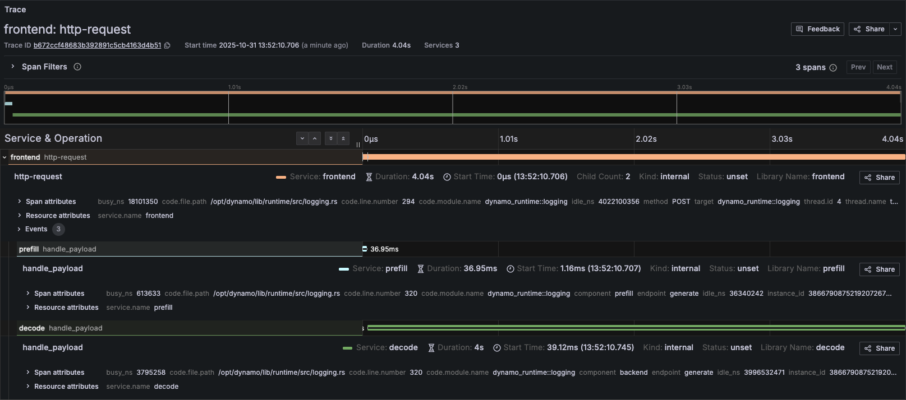

<!--
SPDX-FileCopyrightText: Copyright (c) 2025-2026 NVIDIA CORPORATION & AFFILIATES. All rights reserved.
SPDX-License-Identifier: Apache-2.0
-->

# Dynamo Logging

## Overview

Dynamo provides structured logging in both text as well as JSONL. When
JSONL is enabled, logs support `trace_id` and `span_id` fields for
distributed tracing. Span creation and exit events can be optionally
enabled via the `DYN_LOGGING_SPAN_EVENTS` environment variable.

## Environment Variables

| Variable | Description | Default | Example |
|----------|-------------|---------|---------|
| `DYN_LOGGING_JSONL` | Enable JSONL logging format | `false` | `true` |
| `DYN_LOGGING_SPAN_EVENTS` | Enable span entry/close event logging (`SPAN_FIRST_ENTRY`, `SPAN_CLOSED` messages) | `false` | `true` |
| `DYN_LOG` | Log levels per target `<default_level>,<module_path>=<level>,<module_path>=<level>` | `info` | `DYN_LOG=info,dynamo_runtime::system_status_server:trace` |
| `DYN_LOG_USE_LOCAL_TZ` | Use local timezone for timestamps (default is UTC) | `false` | `true` |
| `DYN_LOGGING_CONFIG_PATH` | Path to custom TOML logging configuration | none | `/path/to/config.toml` |
| `OTEL_SERVICE_NAME` | Service name for trace and span information | `dynamo` | `dynamo-frontend` |
| `OTEL_EXPORT_ENABLED` | Enable OTLP trace exporting | `false` | `true` |
| `OTEL_EXPORTER_OTLP_TRACES_ENDPOINT` | OTLP exporter endpoint | `http://localhost:4317` | `http://tempo:4317` |

## Getting Started Quickly

### Start Observability Stack

For collecting and visualizing logs with Grafana Loki (Kubernetes), or viewing trace context in logs alongside Grafana Tempo, start the observability stack. See [Observability Getting Started](README.md#getting-started-quickly) for instructions.

### Enable Structured Logging

Enable structured JSONL logging:

```bash
export DYN_LOGGING_JSONL=true
export DYN_LOG=debug

# Start your Dynamo components (default port 8000, override with --http-port or DYN_HTTP_PORT env var)
python -m dynamo.frontend &
python -m dynamo.vllm --model Qwen/Qwen3-0.6B --enforce-eager &
```

Logs will be written to stderr in JSONL format with trace context.

## Available Logging Levels

| **Logging Levels (Least to Most Verbose)** | **Description**                                                                 |
|-------------------------------------------|---------------------------------------------------------------------------------|
| **ERROR**                                 | Critical errors (e.g., unrecoverable failures, resource exhaustion)              |
| **WARN**                                  | Unexpected or degraded situations (e.g., retries, recoverable errors)           |
| **INFO**                                  | Operational information (e.g., startup/shutdown, major events)                 |
| **DEBUG**                                 | General debugging information (e.g., variable values, flow control)            |
| **TRACE**                                 | Very low-level, detailed information (e.g., internal algorithm steps)           |

## Example Readable Format

Environment Setting:

```
export DYN_LOG="info,dynamo_runtime::system_status_server:trace"
export DYN_LOGGING_JSONL="false"
```

Resulting Log format:

```
2025-09-02T15:50:01.770028Z  INFO main.init: VllmWorker for Qwen/Qwen3-0.6B has been initialized
2025-09-02T15:50:01.770195Z  INFO main.init: Reading Events from tcp://127.0.0.1:21555
2025-09-02T15:50:01.770265Z  INFO main.init: Getting engine runtime configuration metadata from vLLM engine...
2025-09-02T15:50:01.770316Z  INFO main.get_engine_cache_info: Cache config values: {'num_gpu_blocks': 24064}
2025-09-02T15:50:01.770358Z  INFO main.get_engine_cache_info: Scheduler config values: {'max_num_seqs': 256, 'max_num_batched_tokens': 2048}
```

## Example JSONL Format

Environment Setting:

```
export DYN_LOG="info,dynamo_runtime::system_status_server:trace"
export DYN_LOGGING_JSONL="true"
```

Resulting Log format:

```
{"time":"2025-09-02T15:53:31.943377Z","level":"INFO","target":"log","message":"VllmWorker for Qwen/Qwen3-0.6B has been initialized","log.file":"/opt/dynamo/venv/lib/python3.12/site-packages/dynamo/vllm/main.py","log.line":191,"log.target":"main.init"}
{"time":"2025-09-02T15:53:31.943550Z","level":"INFO","target":"log","message":"Reading Events from tcp://127.0.0.1:26771","log.file":"/opt/dynamo/venv/lib/python3.12/site-packages/dynamo/vllm/main.py","log.line":212,"log.target":"main.init"}
{"time":"2025-09-02T15:53:31.943636Z","level":"INFO","target":"log","message":"Getting engine runtime configuration metadata from vLLM engine...","log.file":"/opt/dynamo/venv/lib/python3.12/site-packages/dynamo/vllm/main.py","log.line":220,"log.target":"main.init"}
{"time":"2025-09-02T15:53:31.943701Z","level":"INFO","target":"log","message":"Cache config values: {'num_gpu_blocks': 24064}","log.file":"/opt/dynamo/venv/lib/python3.12/site-packages/dynamo/vllm/main.py","log.line":267,"log.target":"main.get_engine_cache_info"}
{"time":"2025-09-02T15:53:31.943747Z","level":"INFO","target":"log","message":"Scheduler config values: {'max_num_seqs': 256, 'max_num_batched_tokens': 2048}","log.file":"/opt/dynamo/venv/lib/python3.12/site-packages/dynamo/vllm/main.py","log.line":268,"log.target":"main.get_engine_cache_info"}
```

## Logging of Trace and Span IDs

When `DYN_LOGGING_JSONL` is enabled, all logs include `trace_id` and `span_id` fields, and spans are automatically created for requests. This is useful for short debugging sessions where you want to examine trace context in logs without setting up a full tracing backend and for correlating log messages with traces.

The trace and span information uses the OpenTelemetry format and libraries, which means the IDs are compatible with OpenTelemetry-based tracing backends like Tempo or Jaeger if you later choose to enable trace export.

**Note:** This section has overlap with [Distributed Tracing with Tempo](tracing.md). For trace visualization in Grafana Tempo and persistent trace analysis, see [Distributed Tracing with Tempo](tracing.md).

### Configuration for Logging

To see trace information in logs:

```bash
export DYN_LOGGING_JSONL=true
export DYN_LOG=debug  # Set to debug to see detailed trace logs

# Start your Dynamo components (e.g., frontend and worker) (default port 8000, override with --http-port or DYN_HTTP_PORT env var)
python -m dynamo.frontend &
python -m dynamo.vllm --model Qwen/Qwen3-0.6B --enforce-eager &
```

This enables JSONL logging with `trace_id` and `span_id` fields. Traces appear in logs but are not exported to any backend.

### Example Request

Send a request to generate logs with trace context:

```bash
curl -H 'Content-Type: application/json' \
-H 'x-request-id: test-trace-001' \
-d '{
  "model": "Qwen/Qwen3-0.6B",
  "max_completion_tokens": 100,
  "messages": [
    {"role": "user", "content": "What is the capital of France?"}
  ]
}' \
http://localhost:8000/v1/chat/completions
```

Check the logs (stderr) for JSONL output containing `trace_id`, `span_id`, and `x_request_id` fields.

## Trace and Span Information in Logs

This section shows how trace and span information appears in JSONL logs. These logs can be used to understand request flows even without a trace visualization backend.

### Example Disaggregated Trace in Grafana

When viewing the corresponding trace in Grafana, you should be able to see something like the following:



### Trace Overview

| Attribute | Value |
|-----------|-------|
| **Trace ID** | b672ccf48683b392891c5cb4163d4b51 |
| **Start Time** | 2025-10-31 13:52:10.706 |
| **Duration** | 4.04s |
| **Request** | `POST /v1/chat/completions` |

### Root Span (Frontend): `http-request`

| Attribute | Value |
|-----------|-------|
| **Service** | frontend |
| **Span ID** | 5c20cc08e6afb2b7 |
| **Duration** | 4.04s |
| **Start Time** | 13:52:10.706 |
| **Status** | unset |
| **Method** | POST |
| **URI** | `/v1/chat/completions` |
| **HTTP Version** | HTTP/1.1 |
| **Parent ID** | (none) |
| **Child Count** | 2 |
| **Busy Time** | 18,101,350 ns (18.10ms) |
| **Idle Time** | 4,022,100,356 ns (4.02s) |

### Child Span (Prefill): `handle_payload`

| Attribute | Value |
|-----------|-------|
| **Service** | prefill |
| **Duration** | 39.65ms |
| **Start Time** | 13:52:10.707 |
| **Status** | unset |
| **Component** | prefill |
| **Endpoint** | generate |
| **Namespace** | vllm-disagg |
| **Instance ID** | 3866790875219207267 |
| **Trace ID** | b672ccf48683b392891c5cb4163d4b51 |
| **Parent ID** | 5c20cc08e6afb2b7 |
| **Busy Time** | 613,633 ns (0.61ms) |
| **Idle Time** | 36,340,242 ns (36.34ms) |

### Child Span (Decode): `handle_payload`

| Attribute | Value |
|-----------|-------|
| **Service** | decode |
| **Duration** | 4s |
| **Start Time** | 13:52:10.745 |
| **Status** | unset |
| **Component** | backend |
| **Endpoint** | generate |
| **Namespace** | vllm-disagg |
| **Instance ID** | 3866790875219207263 |
| **Trace ID** | b672ccf48683b392891c5cb4163d4b51 |
| **Parent ID** | 5c20cc08e6afb2b7 |
| **Busy Time** | 3,795,258 ns (3.79ms) |
| **Idle Time** | 3,996,532,471 ns (3.99s) |

### Frontend Logs with Trace Context

The following shows the JSONL logs from the frontend service for the same request. Note the `trace_id` field (`b672ccf48683b392891c5cb4163d4b51`) that correlates all logs for this request, and the `span_id` field that identifies individual operations:

```
{"time":"2025-10-31T20:52:07.707164Z","level":"INFO","file":"/opt/dynamo/lib/runtime/src/logging.rs","line":806,"target":"dynamo_runtime::logging","message":"OTLP export enabled","endpoint":"http://tempo.tm.svc.cluster.local:4317","service":"frontend"}
{"time":"2025-10-31T20:52:10.707164Z","level":"DEBUG","file":"/opt/dynamo/lib/runtime/src/pipeline/network/tcp/server.rs","line":230,"target":"dynamo_runtime::pipeline::network::tcp::server","message":"Registering new TcpStream on 10.0.4.65:41959","method":"POST","span_id":"5c20cc08e6afb2b7","span_name":"http-request","trace_id":"b672ccf48683b392891c5cb4163d4b51","uri":"/v1/chat/completions","version":"HTTP/1.1"}
{"time":"2025-10-31T20:52:10.745264Z","level":"DEBUG","file":"/opt/dynamo/lib/llm/src/kv_router/prefill_router.rs","line":232,"target":"dynamo_llm::kv_router::prefill_router","message":"Prefill succeeded, using disaggregated params for decode","method":"POST","span_id":"5c20cc08e6afb2b7","span_name":"http-request","trace_id":"b672ccf48683b392891c5cb4163d4b51","uri":"/v1/chat/completions","version":"HTTP/1.1"}
{"time":"2025-10-31T20:52:10.745545Z","level":"DEBUG","file":"/opt/dynamo/lib/runtime/src/pipeline/network/tcp/server.rs","line":230,"target":"dynamo_runtime::pipeline::network::tcp::server","message":"Registering new TcpStream on 10.0.4.65:41959","method":"POST","span_id":"5c20cc08e6afb2b7","span_name":"http-request","trace_id":"b672ccf48683b392891c5cb4163d4b51","uri":"/v1/chat/completions","version":"HTTP/1.1"}
```

## Custom Request IDs in Logs

You can provide a custom request ID using the `x-request-id` header. This ID will be attached to all spans and logs for that request, making it easier to correlate traces with application-level request tracking.

### Example Request with Custom Request ID

```sh
curl -X POST http://localhost:8000/v1/chat/completions \
  -H 'Content-Type: application/json' \
  -H 'x-request-id: 8372eac7-5f43-4d76-beca-0a94cfb311d0' \
  -d '{
    "model": "Qwen/Qwen3-0.6B",
    "messages": [
      {
        "role": "user",
        "content": "Explain why Roger Federer is considered one of the greatest tennis players of all time"
      }
    ],
    "stream": false,
    "max_tokens": 1000
  }'
```

All spans and logs for this request will include the `x_request_id` attribute with value `8372eac7-5f43-4d76-beca-0a94cfb311d0`.

### Frontend Logs with Custom Request ID

Notice how the `x_request_id` field appears in all log entries, alongside the `trace_id` (`80196f3e3a6fdf06d23bb9ada3788518`) and `span_id`:

```
{"time":"2025-10-31T21:06:45.397194Z","level":"DEBUG","file":"/opt/dynamo/lib/runtime/src/pipeline/network/tcp/server.rs","line":230,"target":"dynamo_runtime::pipeline::network::tcp::server","message":"Registering new TcpStream on 10.0.4.65:41959","method":"POST","span_id":"f7e487a9d2a6bf38","span_name":"http-request","trace_id":"80196f3e3a6fdf06d23bb9ada3788518","uri":"/v1/chat/completions","version":"HTTP/1.1","x_request_id":"8372eac7-5f43-4d76-beca-0a94cfb311d0"}
{"time":"2025-10-31T21:06:45.418584Z","level":"DEBUG","file":"/opt/dynamo/lib/llm/src/kv_router/prefill_router.rs","line":232,"target":"dynamo_llm::kv_router::prefill_router","message":"Prefill succeeded, using disaggregated params for decode","method":"POST","span_id":"f7e487a9d2a6bf38","span_name":"http-request","trace_id":"80196f3e3a6fdf06d23bb9ada3788518","uri":"/v1/chat/completions","version":"HTTP/1.1","x_request_id":"8372eac7-5f43-4d76-beca-0a94cfb311d0"}
{"time":"2025-10-31T21:06:45.418854Z","level":"DEBUG","file":"/opt/dynamo/lib/runtime/src/pipeline/network/tcp/server.rs","line":230,"target":"dynamo_runtime::pipeline::network::tcp::server","message":"Registering new TcpStream on 10.0.4.65:41959","method":"POST","span_id":"f7e487a9d2a6bf38","span_name":"http-request","trace_id":"80196f3e3a6fdf06d23bb9ada3788518","uri":"/v1/chat/completions","version":"HTTP/1.1","x_request_id":"8372eac7-5f43-4d76-beca-0a94cfb311d0"}
```


## Related Documentation

- [Distributed Runtime Architecture](../design_docs/distributed_runtime.md)
- [Dynamo Architecture Overview](../design_docs/architecture.md)
- [Backend Guide](../development/backend-guide.md)
- [Log Aggregation in Kubernetes](../kubernetes/observability/logging.md)
