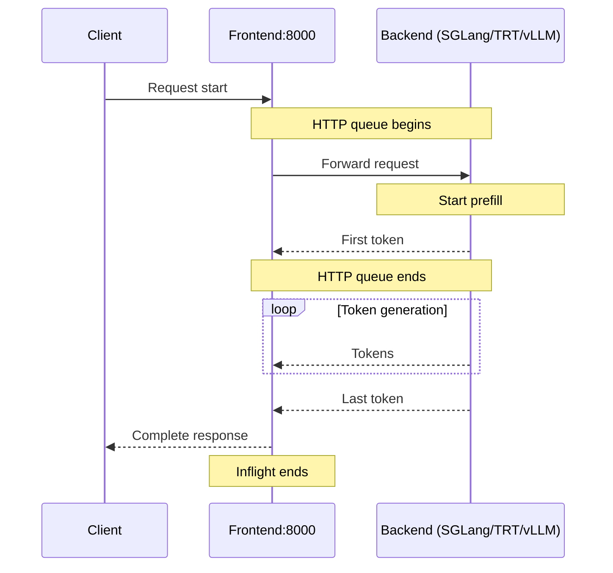

## Overview

Dynamo provides built-in metrics capabilities through the Dynamo metrics API, which is automatically available whenever you use the `DistributedRuntime` framework. This document serves as a reference for all available metrics in Dynamo.

**For visualization setup instructions**, see the [Prometheus and Grafana Setup Guide](prometheus-grafana.md).

**For creating custom metrics**, see the [Metrics Developer Guide](metrics-developer-guide.md).

## Environment Variables

| Variable | Description | Default | Example |
|----------|-------------|---------|---------|
| `DYN_SYSTEM_PORT` | Backend component metrics/health port | `-1` (disabled) | `8081` |
| `DYN_HTTP_PORT` | Frontend HTTP port (also configurable via `--http-port` flag) | `8000` | `8000` |
| `NIXL_TELEMETRY_ENABLE` | Enable NIXL telemetry (see [NIXL Telemetry Metrics](#nixl-telemetry-metrics)). Options: `y`, `n` | `n` (disabled) | `y` |

## Getting Started Quickly

This is a single machine example.

### Start Observability Stack

For visualizing metrics with Prometheus and Grafana, start the observability stack. See [Observability Getting Started](README.md#getting-started-quickly) for instructions.


### Launch Dynamo Components

Launch a frontend and vLLM backend to test metrics:

```bash
# Start frontend (default port 8000, override with --http-port or DYN_HTTP_PORT env var)
$ python -m dynamo.frontend

# Enable backend worker's system metrics on port 8081
$ DYN_SYSTEM_PORT=8081 python -m dynamo.vllm --model Qwen/Qwen3-0.6B  \
   --enforce-eager --no-enable-prefix-caching --max-num-seqs 3
```

Wait for the vLLM worker to start, then send requests and check metrics:

```bash
# Send a request
curl -H 'Content-Type: application/json' \
-d '{
  "model": "Qwen/Qwen3-0.6B",
  "max_completion_tokens": 100,
  "messages": [{"role": "user", "content": "Hello"}]
}' \
http://localhost:8000/v1/chat/completions

# Check metrics from the backend worker
curl -s localhost:8081/metrics | grep dynamo_component
```

## Exposed Metrics

Dynamo exposes metrics in Prometheus Exposition Format text at the `/metrics` HTTP endpoint. All Dynamo-generated metrics use the `dynamo_*` prefix and include labels (`dynamo_namespace`, `dynamo_component`, `dynamo_endpoint`) to identify the source component.

**Example Prometheus Exposition Format text:**

```
# HELP dynamo_component_requests_total Total requests processed
# TYPE dynamo_component_requests_total counter
dynamo_component_requests_total{dynamo_namespace="default",dynamo_component="backend",dynamo_endpoint="generate"} 42

# HELP dynamo_component_request_duration_seconds Request processing time
# TYPE dynamo_component_request_duration_seconds histogram
dynamo_component_request_duration_seconds_bucket{dynamo_namespace="default",dynamo_component="backend",dynamo_endpoint="generate",le="0.005"} 10
dynamo_component_request_duration_seconds_bucket{dynamo_namespace="default",dynamo_component="backend",dynamo_endpoint="generate",le="0.01"} 15
dynamo_component_request_duration_seconds_bucket{dynamo_namespace="default",dynamo_component="backend",dynamo_endpoint="generate",le="+Inf"} 42
dynamo_component_request_duration_seconds_sum{dynamo_namespace="default",dynamo_component="backend",dynamo_endpoint="generate"} 2.5
dynamo_component_request_duration_seconds_count{dynamo_namespace="default",dynamo_component="backend",dynamo_endpoint="generate"} 42
```

### Metric Categories

Dynamo exposes several categories of metrics:

- **Frontend Metrics** (`dynamo_frontend_*`) - Request handling, token processing, and latency measurements
- **Component Metrics** (`dynamo_component_*`) - Request counts, processing times, byte transfers, and system uptime
- **Specialized Component Metrics** (e.g., `dynamo_preprocessor_*`) - Component-specific metrics
- **Engine Metrics** (Pass-through) - Backend engines expose their own metrics: [vLLM](../backends/vllm/vllm-observability.md) (`vllm:*`), [SGLang](../backends/sglang/sglang-observability.md) (`sglang:*`), [TensorRT-LLM](../backends/trtllm/trtllm-observability.md) (`trtllm_*`)

## Runtime Hierarchy

The Dynamo metrics API is available on `DistributedRuntime`, `Namespace`, `Component`, and `Endpoint`, providing a hierarchical approach to metric collection that matches Dynamo's distributed architecture:

- `DistributedRuntime`: Global metrics across the entire runtime
- `Namespace`: Metrics scoped to a specific dynamo_namespace
- `Component`: Metrics for a specific dynamo_component within a namespace
- `Endpoint`: Metrics for individual dynamo_endpoint within a component

This hierarchical structure allows you to create metrics at the appropriate level of granularity for your monitoring needs.

## Available Metrics

**Note:** Labeled metrics (`HistogramVec`, `CounterVec`, `GaugeVec`) register a metric *family*, not individual time series. A series for a given label combination only appears at `/metrics` after the first `with_label_values(...)` call for that combination — i.e., after the first matching request is served. For example, `dynamo_frontend_request_duration_seconds{model="Qwen/Qwen3-0.6B"}` will not appear on a freshly-started frontend until a request for that model is handled. This is expected Prometheus client behavior, not a missing metric.

### Backend Component Metrics

**Backend workers** (`python -m dynamo.vllm`, `python -m dynamo.sglang`, etc.) expose `dynamo_component_*` metrics on the system status port (configurable via `DYN_SYSTEM_PORT`, disabled by default). In Kubernetes the operator typically sets `DYN_SYSTEM_PORT=9090`; for local development you must set it explicitly (e.g. `DYN_SYSTEM_PORT=8081`).

The core Dynamo backend system exposes metrics at the `/metrics` endpoint with the `dynamo_component_*` prefix for all components that use the `DistributedRuntime` framework:

- `dynamo_component_inflight_requests`: Requests currently being processed (gauge)
- `dynamo_component_request_bytes_total`: Total bytes received in requests (counter)
- `dynamo_component_request_duration_seconds`: Request processing time (histogram)
- `dynamo_component_requests_total`: Total requests processed (counter)
- `dynamo_component_errors_total`: Total errors encountered while handling a request (counter, labeled with `error_type`). See [Component Error Types](#component-error-types).
- `dynamo_component_response_bytes_total`: Total bytes sent in responses (counter)
- `dynamo_component_uptime_seconds`: DistributedRuntime uptime (gauge). Automatically updated before each Prometheus scrape on both the frontend (`/metrics` on port 8000) and the system status server (`/metrics` on `DYN_SYSTEM_PORT` when set).

**Access backend component metrics:**
```bash
# Set DYN_SYSTEM_PORT to enable the system status server
DYN_SYSTEM_PORT=8081 python -m dynamo.vllm --model <model>
curl http://localhost:8081/metrics
```

#### Component Labels

Backend `dynamo_component_*` series carry two groups of labels: the ones the Dynamo runtime emits, and the ones Prometheus/Kubernetes attach during scraping.

**Auto-injected by the Dynamo runtime** (added by `create_metric()` in `lib/runtime/src/metrics.rs` for every metric registered through the namespace/component/endpoint hierarchy):

| Label | Description | Example |
|-------|-------------|---------|
| `dynamo_namespace` | The Dynamo runtime namespace — the logical scope shared by every component (router / prefill / decode / encode) in one deployment. **Not** the K8s namespace. | `dynamo_cloud_vllm_v1_disagg_router_071de157` |
| `dynamo_component` | Service role: see [Component Names](#component-names) below. | `backend`, `prefill`, `router` |
| `dynamo_endpoint` | The RPC within that component: see [Endpoint Names](#endpoint-names) below. | `generate`, `clear_kv_blocks`, `worker_kv_indexer_query_dp0` |
| `worker_id` | Hex-encoded discovery instance ID of the endpoint, providing a stable per-worker identity that does not depend on Kubernetes. Injected only when the endpoint hierarchy has a connection ID. | `1a2b3c4d` |

**Added at registration time by backend code** (passed via `metrics_labels=` when the worker calls `serve_endpoint()` — not auto-injected, so presence depends on the backend):

| Label | Description | Example |
|-------|-------------|---------|
| `model` | The model being served (OpenAI-style label). Added by vLLM, SGLang, and TRT-LLM workers on inference endpoints; absent on internal endpoints like `worker_kv_indexer_query_dp{N}`. | `Qwen/Qwen3-0.6B` |
| `model_name` | Same model identifier under a second label name, retained for engine-native and dashboard back-compat. Added by vLLM and TRT-LLM workers; **not** added by SGLang. | `Qwen/Qwen3-0.6B` |

**Added by the metric itself**:

| Label | Description | Example |
|-------|-------------|---------|
| `error_type` | Only on `dynamo_component_errors_total` — the failure category. See [Component Error Types](#component-error-types). | `generate`, `publish_response` |

**Injected by Prometheus / Kubernetes (added by the scraper, not in the metric itself):**

| Label | Description | Example |
|-------|-------------|---------|
| `instance` | Scrape target as `<podIP>:<metricsPort>`. | `192.168.133.236:9090` |
| `pod` | Kubernetes pod name; the per-replica disambiguator. | `vllm-v1-disagg-router-vllmdecodeworker-...` |
| `container` | Container name inside the pod (usually `main`). | `main` |
| `namespace` | Kubernetes namespace the pod runs in. **Not** the same as `dynamo_namespace`. | `dynamo-cloud` |
| `job` | Prometheus scrape-job name, `<k8s-namespace>/<service-name>`. | `dynamo-cloud/dynamo-worker` |
| `endpoint` | Named port on the K8s `Service` that Prometheus scraped. **Not** the same as `dynamo_endpoint`. | `system` |

> **Watch out for these collisions:**
> - `dynamo_namespace` (Dynamo deployment scope) vs. `namespace` (K8s namespace).
> - `dynamo_endpoint` (Dynamo RPC) vs. `endpoint` (K8s Service port name).

#### Component Names

Values you will see in the `dynamo_component` label on `dynamo_component_*` series. The HTTP frontend (`python -m dynamo.frontend`) is **not** in this list — it exposes its own `dynamo_frontend_*` metric family, not `dynamo_component_*`.

| Value | Meaning |
|-------|---------|
| `router` | The standalone KV router (`python -m dynamo.router`). |
| `Planner` | The planner component (`python -m dynamo.planner`). Note the capital `P`. |
| `prefill` | The prefill worker in disaggregated serving (all backends). |
| `backend` | The decode worker in disaggregated serving for vLLM, SGLang, and the mocker, **and** the combined worker for vLLM in aggregated mode. |
| `tensorrt_llm` | The decode worker in disaggregated serving for TRT-LLM. |
| `tensorrt_llm_encode` | The encode worker for TRT-LLM. |
| `encode` | The encode worker for vLLM. |
| `diffusion` | The diffusion worker for TRT-LLM. |

Internal subsystems (e.g. `kvbm` from the block manager, `sequences` from the KV router) also create components and may appear in `dynamo_component_*` series. The default for vLLM/SGLang can be overridden by passing `--endpoint dyn://<ns>.<component>.<endpoint>` on the worker command line.

> The name `backend` for the decode worker is historical. The runtime has a TODO to introduce a `decode` constant and migrate to it (see `lib/runtime/src/metrics/prometheus_names.rs::component_names`).

#### Endpoint Names

Values you will see in the `dynamo_endpoint` label on backend workers:

| Value | Meaning |
|-------|---------|
| `generate` | Main inference RPC; one increment per request received. On a prefill worker this counts prefill-stage `generate` calls (one per request the router routes through); on a decode worker this counts decode-stage `generate` calls. |
| `clear_kv_blocks` | Admin RPC to flush the worker's KV cache. Registered on both prefill and decode workers. |
| `worker_kv_indexer_query_dp{N}` | KV-router queries to the worker's local KV indexer about its cached prefix blocks. One endpoint per data-parallel rank (`_dp0`, `_dp1`, …). Appears on the worker that owns the prefix caches the router consults — in disaggregated serving that is the prefill worker. |

#### Component Error Types

The `dynamo_component_errors_total` counter is labeled with `error_type`, identifying which stage of request handling failed:

| `error_type` | Stage | Meaning |
|--------------|-------|---------|
| `deserialization` | Ingress | Could not parse the incoming request payload. |
| `invalid_message` | Ingress | Wire-format violation in the incoming message. |
| `response_stream` | Pre-generate | The worker received the request but could not open the response stream back to the frontend (transport problem before `generate` was called). |
| `generate` | Engine | The engine's `generate()` itself returned an error. This is the counter that reflects engine/inference failures. |
| `publish_response` | Streaming | The engine produced response chunks but the worker could not push one of them back to the frontend (write failed mid-stream). **Also fires on client cancellation** — the frontend disconnecting before the stream finishes — so this counter can be inflated by user-aborted requests. |
| `publish_final` | Teardown | All response chunks were sent, but the worker could not deliver the final stream-complete marker. The connection died right at the end. |

### Specialized Component Metrics

Some components expose additional metrics specific to their functionality:

- `dynamo_preprocessor_*`: Metrics specific to preprocessor components

### Frontend Metrics

**Important:** The frontend and backend workers are separate components that expose metrics on different ports. See [Backend Component Metrics](#backend-component-metrics) for backend metrics.

The Dynamo HTTP Frontend (`python -m dynamo.frontend`) exposes `dynamo_frontend_*` metrics on port 8000 by default (configurable via `--http-port` or `DYN_HTTP_PORT`) at the `/metrics` endpoint. Most metrics include `model` labels containing the model name:

- `dynamo_frontend_active_requests`: Number of requests currently being handled by the frontend, from HTTP handler entry until the response stream completes (gauge). This is the top-level in-flight count with no stage breakdown.
- `dynamo_frontend_stage_requests`: Number of requests currently in a given frontend pipeline stage (gauge, labels: `stage`, `phase`). See [Stage and phase labels](#stage-and-phase-labels) below.
- `dynamo_frontend_inflight_requests`: Inflight requests (gauge). **Deprecated** — kept for backward compatibility; prefer `dynamo_frontend_active_requests`, which has identical semantics with a clearer name.
- `dynamo_frontend_queued_requests`: Number of requests in HTTP processing queue (gauge). **Deprecated** — kept for backward compatibility; the "waiting for first token" window is now the sum of `dynamo_frontend_stage_requests` across the `preprocess`, `route`, and `dispatch` stages.
- `dynamo_frontend_disconnected_clients`: Number of disconnected clients (gauge)
- `dynamo_frontend_input_sequence_tokens`: Input sequence length (histogram)
- `dynamo_frontend_cached_tokens`: Number of cached tokens (prefix cache hits) per request (histogram)
- `dynamo_frontend_inter_token_latency_seconds`: Inter-token latency (histogram)
- `dynamo_frontend_output_sequence_tokens`: Output sequence length (histogram)
- `dynamo_frontend_output_tokens_total`: Total number of output tokens generated (counter)
- `dynamo_frontend_request_duration_seconds`: LLM request duration (histogram)
- `dynamo_frontend_requests_total`: Total LLM requests (counter)
- `dynamo_frontend_time_to_first_token_seconds`: Time to first token (histogram)
- `dynamo_frontend_model_migration_total`: Total number of request migrations due to worker unavailability (counter, labels: `model`, `migration_type`)

**Access frontend metrics:**
```bash
curl http://localhost:8000/metrics
```

#### Stage and phase labels

`dynamo_frontend_stage_requests` decomposes the lifetime of an active frontend request into three sequential pipeline stages. A request is counted in exactly one stage at a time (via an RAII guard that increments on stage entry and decrements on stage exit), and is counted in `dynamo_frontend_active_requests` for its entire lifetime. Between stages — and after `dispatch` exits while the backend is streaming tokens — the request is still in `active_requests` but in no `stage_requests` bucket.

**`stage` label values:**

| Stage | What it covers | Enters when | Exits when |
|-------|----------------|-------------|------------|
| `preprocess` | Tokenization and chat-template application | The frontend enters `preprocess_request` | Preprocessing returns |
| `route` | Worker selection (including parking in the KV-router queue while waiting for a worker) | The router's `generate()` is called | A worker is selected or the request is queued for one |
| `dispatch` | Serialization, transport to the chosen worker, and waiting for the backend's first response (includes backend prefill time) | `generate()` is called in `AddressedPushRouter` | The first response is received from the backend |

**`phase` label values:**

| Phase | Meaning |
|-------|---------|
| `prefill` | The request is being handled by a prefill worker in disaggregated serving |
| `decode` | The request is being handled by a decode worker in disaggregated serving |
| `aggregated` | Aggregated (non-disaggregated) serving — a single worker handles both prefill and decode |
| `""` (empty) | The stage does not distinguish phases (used by `preprocess`) |

**Derived signals operators commonly want.** These are cluster-wide totals across all frontend pods. `stage_requests` has no `model` label, so you cannot split these by model; add `by (pod)` or `by (instance)` to any `sum(...)` below if you need per-pod visibility. The stage filter `stage=~"preprocess|route|dispatch"` is used explicitly to keep the "pre-first-token" semantic stable if additional stages (e.g. `postprocess`) are added in the future.

- **Requests waiting for a worker to start generating (the old "queued" semantic):** `sum(dynamo_frontend_stage_requests{stage=~"preprocess|route|dispatch"})` — i.e. still in `preprocess`, `route`, or `dispatch`.
- **Requests currently being processed by a backend worker:** use the worker-side gauge `sum(dynamo_component_inflight_requests{dynamo_component="backend",dynamo_endpoint="generate"})` — this is the authoritative count, available whenever `DYN_SYSTEM_PORT` is set on workers (see [Backend Component Metrics](#backend-component-metrics)).
    - *Frontend-perspective variant* (useful if worker metrics aren't being scraped, or when sizing frontend pods rather than workers): `sum(dynamo_frontend_active_requests) - sum(dynamo_frontend_stage_requests{stage=~"preprocess|route|dispatch"})`. This differs from the worker gauge because its window starts when the first token arrives at the frontend and extends through streaming to the client, so it includes transit and client-buffering time.
- **Router saturation:** `sum(dynamo_frontend_stage_requests{stage="route"})` spiking indicates workers can't be selected fast enough (e.g. all backends busy, KV-router queue full).
- **Backend prefill saturation:** `sum(dynamo_frontend_stage_requests{stage="dispatch"})` spiking indicates the backend is slow to produce first tokens.


#### Deprecated frontend gauges

The following gauges are still emitted but will be removed in a future release. They were superseded by the gauges above as part of the frontend-metrics rework (PR #8162). Dashboards and alerts should migrate off them.

| Deprecated metric | Replacement |
|-------------------|-------------|
| `dynamo_frontend_inflight_requests` | `dynamo_frontend_active_requests` (same semantics, clearer name) |
| `dynamo_frontend_queued_requests` | `sum(dynamo_frontend_stage_requests{stage=~"preprocess\|route\|dispatch"})` |

#### Model Configuration Metrics

The frontend also exposes model configuration metrics (on port 8000 `/metrics` endpoint) with the `dynamo_frontend_model_*` prefix. These metrics are populated from the worker backend registration service when workers register with the system. All model configuration metrics include a `model` label.

**Runtime Config Metrics (from ModelRuntimeConfig):**
These metrics come from the runtime configuration provided by worker backends during registration.

- `dynamo_frontend_model_total_kv_blocks`: Total KV blocks available for a worker serving the model (gauge)
- `dynamo_frontend_model_max_num_seqs`: Maximum number of sequences for a worker serving the model (gauge)
- `dynamo_frontend_model_max_num_batched_tokens`: Maximum number of batched tokens for a worker serving the model (gauge)

**MDC Metrics (from ModelDeploymentCard):**
These metrics come from the Model Deployment Card information provided by worker backends during registration. Note that when multiple worker instances register with the same model name, only the first instance's configuration metrics (runtime config and MDC metrics) will be populated. Subsequent instances with duplicate model names will be skipped for configuration metric updates.

- `dynamo_frontend_model_context_length`: Maximum context length for a worker serving the model (gauge)
- `dynamo_frontend_model_kv_cache_block_size`: KV cache block size for a worker serving the model (gauge)
- `dynamo_frontend_model_migration_limit`: Request migration limit for a worker serving the model (gauge)

### Request Processing Flow

> **Deprecated framing.** The two-metric model below (inflight vs. HTTP queue) describes the legacy `dynamo_frontend_inflight_requests` and `dynamo_frontend_queued_requests` gauges and is kept only to help operators reading existing dashboards. New work should use `dynamo_frontend_active_requests` and the per-stage `dynamo_frontend_stage_requests` gauges described under [Stage and phase labels](#stage-and-phase-labels).

This section explains the distinction between two key metrics used to track request processing:

1. **Inflight**: Tracks requests from HTTP handler start until the complete response is finished
2. **HTTP Queue**: Tracks requests from HTTP handler start until first token generation begins (including prefill time)

**Example Request Flow:**
```
curl -s localhost:8000/v1/completions -H "Content-Type: application/json" -d '{
  "model": "Qwen/Qwen3-0.6B",
  "prompt": "Hello let's talk about LLMs",
  "stream": false,
  "max_tokens": 1000
}'
```

**Timeline:**


**Concurrency Example:**
Suppose the backend allows 3 concurrent requests and there are 10 clients continuously hitting the frontend:
- All 10 requests will be counted as inflight (from start until complete response)
- 7 requests will be in HTTP queue most of the time
- 3 requests will be actively processed (between first token and last token)

**Key Differences:**
- **Inflight**: Measures total request lifetime including processing time
- **HTTP Queue**: Measures queuing time before processing begins (including prefill time)
- **HTTP Queue ≤ Inflight** (HTTP queue is a subset of inflight time)

### Router Metrics

The router exposes metrics for monitoring routing decisions and overhead. Defined in `lib/llm/src/kv_router/metrics.rs`.

For router deployment modes, see the [Router Guide](../components/router/router-guide.md). For router flags and tuning, see [Configuration and Tuning](../components/router/router-configuration.md).

#### Metrics Availability by Configuration

Not all metrics appear in every deployment. The chart below shows which metric groups are **registered** and **populated** in each configuration:

| Metric Group | Frontend + KV (agg) | Frontend + KV (disagg) | Frontend + non-KV (round-robin/random/direct) | Standalone Router |
|---|---|---|---|---|
| `dynamo_component_router_*` (request metrics) | Registered and populated | Registered and populated | Registered, **always zero** | Populated (on `DYN_SYSTEM_PORT`) |
| `dynamo_router_overhead_*` (routing overhead) | Registered and populated | Registered and populated | **Not registered** | **Not created** |
| `dynamo_frontend_router_queue_*` (queue depth) | Registered; populated when `--router-queue-threshold` set | Registered; populated when `--router-queue-threshold` set | **Not registered** | **Not created** |
| `dynamo_component_kv_cache_events_applied` (indexer) | Populated when KV events are received | Populated when KV events are received | **Not registered** | Populated when KV events are received |
| `dynamo_frontend_worker_*` (per-worker load/timing) | Registered and populated | Registered and populated (`worker_type`=`prefill`/`decode`) | Registered and populated (`worker_type`=`decode`) | **Not created** |

**Key:**
- **Registered and populated**: Metric appears at `/metrics` with real values
- **Registered, always zero**: Metric appears at `/metrics` but the counter/histogram is never incremented (useful for dashboards that expect the metric to exist)
- **Not registered / Not created**: Metric does not appear at `/metrics` at all

**Scrape endpoints:**
- Frontend: `/metrics` on HTTP port (default 8000, configurable via `--http-port` or `DYN_HTTP_PORT`)
- Standalone router: `/metrics` on `DYN_SYSTEM_PORT` (must be set explicitly; default is `-1` / disabled)
- Backend workers: `/metrics` on `DYN_SYSTEM_PORT` (separate from frontend metrics)

#### Router Request Metrics (`dynamo_component_router_*`)

Histograms and counters for aggregate request-level statistics. Eagerly registered via `from_component()` with the DRT `MetricsRegistry` hierarchy. On the frontend, exposed at `/metrics` on the HTTP port (default 8000) via the `drt_metrics` bridge. On the standalone router (`python -m dynamo.router`), exposed on `DYN_SYSTEM_PORT` when set. Populated per-request when `--router-mode kv` is active; registered with zero values in non-KV modes.

All metrics carry the standard hierarchy labels (`dynamo_namespace`, `dynamo_component`, `dynamo_endpoint`).

| Metric | Type | Description |
|--------|------|-------------|
| `dynamo_component_router_requests_total` | Counter | Total requests processed by the router |
| `dynamo_component_router_time_to_first_token_seconds` | Histogram | Time to first token (seconds) |
| `dynamo_component_router_inter_token_latency_seconds` | Histogram | Average inter-token latency (seconds) |
| `dynamo_component_router_input_sequence_tokens` | Histogram | Input sequence length (tokens) |
| `dynamo_component_router_output_sequence_tokens` | Histogram | Output sequence length (tokens) |
| `dynamo_component_router_kv_hit_rate` | Histogram | Predicted KV cache hit rate at routing time (0.0-1.0) |

#### Per-Request Routing Overhead (`dynamo_router_overhead_*`)

Histograms (in milliseconds) tracking the time spent in each phase of the routing decision for every request. Registered on the frontend port (default 8000) at `/metrics` with a `router_id` label (the frontend's discovery instance ID). These metrics are only created when the frontend has DRT discovery enabled (i.e., `--router-mode kv`); they do not appear in non-KV modes or on the standalone router.

| Metric | Type | Description |
|--------|------|-------------|
| `dynamo_router_overhead_block_hashing_ms` | Histogram | Time computing block hashes |
| `dynamo_router_overhead_indexer_find_matches_ms` | Histogram | Time in indexer find_matches |
| `dynamo_router_overhead_seq_hashing_ms` | Histogram | Time computing sequence hashes |
| `dynamo_router_overhead_scheduling_ms` | Histogram | Time in scheduler worker selection |
| `dynamo_router_overhead_total_ms` | Histogram | Total routing overhead per request |

#### Router Queue Metrics (`dynamo_frontend_router_queue_*`)

Gauge tracking the number of requests pending in the router's scheduler queue. Only registered when `--router-queue-threshold` is set. Labeled by `worker_type` to distinguish prefill vs. decode queues in disaggregated mode.

| Metric | Type | Description |
|--------|------|-------------|
| `dynamo_frontend_router_queue_pending_requests` | Gauge | Requests pending in the router scheduler queue |

**Labels:** `worker_type` (`prefill` or `decode`)

#### KV Indexer Metrics

Tracks KV cache events applied to the router's radix tree index. Only appears when `--router-kv-overlap-score-weight` is greater than 0 (default) and workers are publishing KV events. Will not appear if `--router-kv-overlap-score-weight 0` is set or no KV events have been received.

| Metric | Type | Description |
|--------|------|-------------|
| `dynamo_component_kv_cache_events_applied` | Counter | KV cache events applied to the index |

**Additional labels:** `status` (`ok` / `parent_block_not_found` / `block_not_found` / `invalid_block`), `event_type` (`stored` / `removed` / `cleared`)

#### Per-Worker Load and Timing Gauges (`dynamo_frontend_worker_*`)

These appear once workers register and begin serving requests. They are registered on the frontend's local Prometheus registry (not component-scoped) and do not carry `dynamo_namespace` or `dynamo_component` labels. These metrics are frontend-only and are not available on the standalone router.

| Metric | Type | Description |
|--------|------|-------------|
| `dynamo_frontend_worker_active_decode_blocks` | Gauge | Active KV cache decode blocks per worker |
| `dynamo_frontend_worker_active_prefill_tokens` | Gauge | Active prefill tokens queued per worker |
| `dynamo_frontend_worker_last_time_to_first_token_seconds` | Gauge | Last observed TTFT per worker (seconds) |
| `dynamo_frontend_worker_last_input_sequence_tokens` | Gauge | Last observed input sequence length per worker |
| `dynamo_frontend_worker_last_inter_token_latency_seconds` | Gauge | Last observed ITL per worker (seconds) |

**Labels:**

| Label | Example Value | Description |
|-------|---------------|-------------|
| `worker_id` | `7890` | Worker instance ID (etcd lease ID) |
| `dp_rank` | `0` | Data-parallel rank |
| `worker_type` | `prefill` or `decode` | Worker role |

In disaggregated mode, the `worker_type` label shows both `"prefill"` and `"decode"` values; in aggregated mode, all workers report as `"decode"`.

## NIXL Telemetry Metrics

[NIXL](https://github.com/ai-dynamo/nixl) exposes its own Prometheus metrics on a **separate port** from Dynamo metrics. These metrics track KV cache and embedding data transfers and are only populated during **disaggregated serving** or **multimodal embedding transfers**.

To enable, set these environment variables on your worker process:

```bash
# Prefill worker
NIXL_TELEMETRY_ENABLE=y NIXL_TELEMETRY_EXPORTER=prometheus \
  NIXL_TELEMETRY_PROMETHEUS_PORT=19090 DYN_SYSTEM_PORT=8081 \
  python -m dynamo.vllm --model <model> --disaggregation-mode prefill

# Decode worker (different NIXL port to avoid collision)
NIXL_TELEMETRY_ENABLE=y NIXL_TELEMETRY_EXPORTER=prometheus \
  NIXL_TELEMETRY_PROMETHEUS_PORT=19091 DYN_SYSTEM_PORT=8082 \
  python -m dynamo.vllm --model <model> --disaggregation-mode decode

# Scrape NIXL metrics (separate from Dynamo metrics on 8081/8082)
curl http://localhost:19090/metrics
```

For the full list of metrics, configuration options, and architecture details, see the upstream [NIXL Telemetry documentation](https://github.com/ai-dynamo/nixl/blob/main/docs/telemetry.md) and [Prometheus exporter README](https://github.com/ai-dynamo/nixl/blob/main/src/plugins/telemetry/prometheus/README.md). For Kubernetes, see [Enable NIXL Telemetry](../kubernetes/observability/metrics.md#enable-nixl-telemetry-optional).

## Related Documentation

- [Distributed Runtime Architecture](../design-docs/distributed-runtime.md)
- [Dynamo Architecture Overview](../design-docs/architecture.md)
- [Backend Guide](../development/backend-guide.md)
