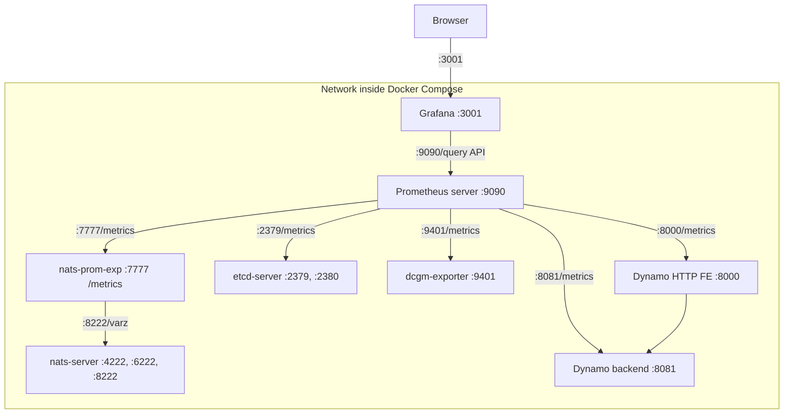

# Metrics Visualization with Prometheus and Grafana

This directory contains configuration for visualizing metrics from the metrics aggregation service using Prometheus and Grafana.

> [!NOTE]
> For detailed information about Dynamo's metrics system, including hierarchical metrics, automatic labeling, and usage examples, see the [Metrics Guide](./metrics.md).

## Overview

### Components

- **Prometheus Server**: Collects and stores metrics from Dynamo services and other components.
- **Grafana**: Provides dashboards by querying the Prometheus Server.

### Topology

Default Service Relationship Diagram:


The dcgm-exporter service in the Docker Compose network is configured to use port 9401 instead of the default port 9400. This adjustment is made to avoid port conflicts with other dcgm-exporter instances that may be running simultaneously. Such a configuration is typical in distributed systems like SLURM.

As of Q2 2025, Dynamo HTTP Frontend metrics are exposed when you build containers with `--framework VLLM` or `--framework TRTLLM`.

### Available Metrics

#### Backend Component Metrics

The core Dynamo backend system automatically exposes metrics with the `dynamo_component_*` prefix for all components that use the `DistributedRuntime` framework:

- `dynamo_component_inflight_requests`: Requests currently being processed (gauge)
- `dynamo_component_request_bytes_total`: Total bytes received in requests (counter)
- `dynamo_component_request_duration_seconds`: Request processing time (histogram)
- `dynamo_component_requests_total`: Total requests processed (counter)
- `dynamo_component_response_bytes_total`: Total bytes sent in responses (counter)
- `dynamo_component_system_uptime_seconds`: DistributedRuntime uptime (gauge)

#### KV Router Statistics (kvstats)

KV router statistics are automatically exposed by LLM workers and KV router components with the `dynamo_component_kvstats_*` prefix. These metrics provide insights into GPU memory usage and cache efficiency:

- `dynamo_component_kvstats_active_blocks`: Number of active KV cache blocks currently in use (gauge)
- `dynamo_component_kvstats_total_blocks`: Total number of KV cache blocks available (gauge)
- `dynamo_component_kvstats_gpu_cache_usage_percent`: GPU cache usage as a percentage (0.0-1.0) (gauge)
- `dynamo_component_kvstats_gpu_prefix_cache_hit_rate`: GPU prefix cache hit rate as a percentage (0.0-1.0) (gauge)

These metrics are published by:
- **LLM Workers**: vLLM and TRT-LLM backends publish these metrics through their respective publishers
- **KV Router**: The KV router component aggregates and exposes these metrics for load balancing decisions

#### Specialized Component Metrics

Some components expose additional metrics specific to their functionality:

- `dynamo_preprocessor_*`: Metrics specific to preprocessor components

#### Frontend Metrics

When using Dynamo HTTP Frontend (`--framework VLLM` or `--framework TRTLLM`), these metrics are automatically exposed with the `dynamo_frontend_*` prefix and include `model` labels containing the model name:

- `dynamo_frontend_inflight_requests`: Inflight requests (gauge)
- `dynamo_frontend_queued_requests`: Number of requests in HTTP processing queue (gauge)
- `dynamo_frontend_input_sequence_tokens`: Input sequence length (histogram)
- `dynamo_frontend_inter_token_latency_seconds`: Inter-token latency (histogram)
- `dynamo_frontend_output_sequence_tokens`: Output sequence length (histogram)
- `dynamo_frontend_request_duration_seconds`: LLM request duration (histogram)
- `dynamo_frontend_requests_total`: Total LLM requests (counter)
- `dynamo_frontend_time_to_first_token_seconds`: Time to first token (histogram)

**Note**: The `dynamo_frontend_inflight_requests` metric tracks requests from HTTP handler start until the complete response is finished, while `dynamo_frontend_queued_requests` tracks requests from HTTP handler start until first token generation begins (including prefill time). HTTP queue time is a subset of inflight time.

##### Model Configuration Metrics

The frontend also exposes model configuration metrics with the `dynamo_frontend_model_*` prefix. These metrics are populated from the worker backend registration service when workers register with the system:

**Runtime Config Metrics (from ModelRuntimeConfig):**
These metrics come from the runtime configuration provided by worker backends during registration.

- `dynamo_frontend_model_total_kv_blocks`: Total KV blocks available for a worker serving the model (gauge)
- `dynamo_frontend_model_max_num_seqs`: Maximum number of sequences for a worker serving the model (gauge)
- `dynamo_frontend_model_max_num_batched_tokens`: Maximum number of batched tokens for a worker serving the model (gauge)

**MDC Metrics (from ModelDeploymentCard):**
These metrics come from the Model Deployment Card information provided by worker backends during registration. Note that when multiple worker instances register with the same model name, only the first instance's configuration metrics (runtime config and MDC metrics) will be populated. Subsequent instances with duplicate model names will be skipped for configuration metric updates, though the worker count metric will reflect all instances.

- `dynamo_frontend_model_context_length`: Maximum context length for a worker serving the model (gauge)
- `dynamo_frontend_model_kv_cache_block_size`: KV cache block size for a worker serving the model (gauge)
- `dynamo_frontend_model_migration_limit`: Request migration limit for a worker serving the model (gauge)

**Worker Management Metrics:**
- `dynamo_frontend_model_workers`: Number of worker instances currently serving the model (gauge)

#### Request Processing Flow

This section explains the distinction between two key metrics used to track request processing:

1. **Inflight**: Tracks requests from HTTP handler start until the complete response is finished
2. **HTTP Queue**: Tracks requests from HTTP handler start until first token generation begins (including prefill time)

**Example Request Flow:**
```
curl -s localhost:8000/v1/completions -H "Content-Type: application/json" -d '{
  "model": "Qwen/Qwen3-0.6B",
  "prompt": "Hello let's talk about LLMs",
  "stream": false,
  "max_tokens": 1000
}'
```

**Timeline:**
```
Timeline:    0, 1, ...
Client ────> Frontend:8000 ────────────────────> Dynamo component/backend (vLLM, SGLang, TRT)
             │request start                     │received                              │
             |                                  |                                      |
             │                                  ├──> start prefill ──> first token ──> |last token
             │                                  │     (not impl)       |               |
             ├─────actual HTTP queue¹ ──────────┘                      │               |
             │                                                         │               │
             ├─────implemented HTTP queue ─────────────────────────────┘               |
             │                                                                         │
             └─────────────────────────────────── Inflight ────────────────────────────┘
```

**Concurrency Example:**
Suppose the backend allows 3 concurrent requests and there are 10 clients continuously hitting the frontend:
- All 10 requests will be counted as inflight (from start until complete response)
- 7 requests will be in HTTP queue most of the time
- 3 requests will be actively processed (between first token and last token)

**Testing Setup:**
Try launching a frontend and a Mocker backend that allows 3 concurrent requests:
```bash
$ python -m dynamo.frontend --http-port 8000
$ python -m dynamo.mocker --model-path Qwen/Qwen3-0.6B --max-num-seqs 3
# Launch your 10 concurrent clients here
# Then check the queued_requests and inflight_requests metrics from the frontend:
$ curl -s localhost:8000/metrics|grep -v '^#'|grep -E 'queue|inflight'
dynamo_frontend_queued_requests{model="qwen/qwen3-0.6b"} 7
dynamo_frontend_inflight_requests{model="qwen/qwen3-0.6b"} 10
```

**Real setup using vLLM (instead of Mocker):**
```bash
$ python -m dynamo.vllm --model Qwen/Qwen3-0.6B  \
   --enforce-eager --no-enable-prefix-caching --max-num-seqs 3
```

**Key Differences:**
- **Inflight**: Measures total request lifetime including processing time
- **HTTP Queue**: Measures queuing time before processing begins (including prefill time)
- **HTTP Queue ≤ Inflight** (HTTP queue is a subset of inflight time)

### Required Files

The following configuration files are located in the `deploy/metrics/` directory:
- [docker-compose.yml](../../deploy/docker-compose.yml): Defines the Prometheus and Grafana services
- [prometheus.yml](../../deploy/metrics/prometheus.yml): Contains Prometheus scraping configuration
- [grafana-datasources.yml](../../deploy/metrics/grafana-datasources.yml): Contains Grafana datasource configuration
- [grafana_dashboards/grafana-dashboard-providers.yml](../../deploy/metrics/grafana_dashboards/grafana-dashboard-providers.yml): Contains Grafana dashboard provider configuration
- [grafana_dashboards/grafana-dynamo-dashboard.json](../../deploy/metrics/grafana_dashboards/grafana-dynamo-dashboard.json): A general Dynamo Dashboard for both SW and HW metrics.
- [grafana_dashboards/grafana-dcgm-metrics.json](../../deploy/metrics/grafana_dashboards/grafana-dcgm-metrics.json): Contains Grafana dashboard configuration for DCGM GPU metrics
- [grafana_dashboards/grafana-kvbm-dashboard.json](../../deploy/metrics/grafana_dashboards/grafana-kvbm-dashboard.json): Contains Grafana dashboard configuration for KVBM metrics

### Metric Name Constants

The [prometheus_names.rs](../../lib/runtime/src/metrics/prometheus_names.rs) module provides centralized Prometheus metric name constants and sanitization utilities for the Dynamo metrics system. This module ensures consistency across all components and prevents metric name duplication.

#### Key Features

- **Centralized Constants**: All Prometheus metric names are defined as constants to avoid duplication and typos
- **Automatic Sanitization**: Functions to sanitize metric and label names according to Prometheus naming rules
- **Component Organization**: Metric names are organized by component (frontend, work_handler, nats_client, etc.)
- **Validation Arrays**: Arrays of metric names for iteration and validation purposes

#### Metric Name Prefixes

- `dynamo_component_*`: Core component metrics (requests, latency, bytes, etc.)
- `dynamo_frontend_*`: Frontend service metrics (LLM HTTP service)
- `nats_client_*`: NATS client connection and message metrics
- `nats_service_*`: NATS service statistics metrics
- `kvstats_*`: KV cache statistics from LLM workers

#### Sanitization Functions

The module provides functions to ensure metric and label names comply with Prometheus naming conventions:

- `sanitize_prometheus_name()`: Sanitizes metric names (allows colons and `__`)
- `sanitize_prometheus_label()`: Sanitizes label names (no colons, no `__` prefix)
- `build_component_metric_name()`: Builds full component metric names with proper prefixing

This centralized approach ensures all Dynamo components use consistent, valid Prometheus metric names without manual coordination.

## Getting Started

### Prerequisites

1. Make sure Docker and Docker Compose are installed on your system

### Quick Start

1. Start Dynamo dependencies. Assume you're at the root dynamo path:

   ```bash
   # Start the basic services (etcd & natsd), along with Prometheus and Grafana
   docker compose -f deploy/docker-compose.yml --profile metrics up -d

   # Minimum components for Dynamo (will not have Prometheus and Grafana): etcd/nats/dcgm-exporter
   docker compose -f deploy/docker-compose.yml up -d
   ```

   Optional: To target specific GPU(s), export the variable below before running Docker Compose
   ```bash
   export CUDA_VISIBLE_DEVICES=0,2
   ```

2. Web servers started. The ones that end in /metrics are in Prometheus format:
   - Grafana: `http://localhost:3001` (default login: dynamo/dynamo)
   - Prometheus Server: `http://localhost:9090`
   - NATS Server: `http://localhost:8222` (monitoring endpoints: /varz, /healthz, etc.)
   - NATS Prometheus Exporter: `http://localhost:7777/metrics`
   - etcd Server: `http://localhost:2379/metrics`
   - DCGM Exporter: `http://localhost:9401/metrics`


   - Start worker(s) that publishes KV Cache metrics: [lib/runtime/examples/service_metrics/README.md](../../lib/runtime/examples/service_metrics/README.md) can populate dummy KV Cache metrics.

### Configuration

#### Prometheus

The Prometheus configuration is specified in [prometheus.yml](../../deploy/metrics/prometheus.yml). This file is set up to collect metrics from the metrics aggregation service endpoint.

Please be aware that you might need to modify the target settings to align with your specific host configuration and network environment.

After making changes to prometheus.yml, it is necessary to reload the configuration using the command below. Simply sending a kill -HUP signal will not suffice due to the caching of the volume that contains the prometheus.yml file.

```
docker compose -f deploy/docker-compose.yml up prometheus -d --force-recreate
```

#### Grafana

Grafana is pre-configured with:
- Prometheus datasource
- Sample dashboard for visualizing service metrics


### Troubleshooting

1. Verify services are running:
  ```bash
  docker compose ps
  ```

2. Check logs:
  ```bash
  docker compose logs prometheus
  docker compose logs grafana
  ```

3. Check Prometheus targets at `http://localhost:9090/targets` to verify metric collection.

## Developer Guide

### Creating Metrics at Different Hierarchy Levels

#### Runtime-Level Metrics

```rust
use dynamo_runtime::DistributedRuntime;

let runtime = DistributedRuntime::new()?;
let namespace = runtime.namespace("my_namespace")?;
let component = namespace.component("my_component")?;
let endpoint = component.endpoint("my_endpoint")?;

// Create endpoint-level counters (this is a Prometheus Counter type)
let requests_total = endpoint.metrics().create_counter(
    "requests_total",
    "Total requests across all namespaces",
    &[]
)?;

let active_connections = endpoint.metrics().create_gauge(
    "active_connections",
    "Number of active client connections",
    &[]
)?;
```

#### Namespace-Level Metrics

```rust
let namespace = runtime.namespace("my_model")?;

// Namespace-scoped metrics
let model_requests = namespace.metrics().create_counter(
    "model_requests",
    "Requests for this specific model",
    &[]
)?;

let model_latency = namespace.metrics().create_histogram(
    "model_latency_seconds",
    "Model inference latency",
    &[],
    Some(vec![0.001, 0.01, 0.1, 1.0, 10.0])
)?;
```

#### Component-Level Metrics

```rust
let component = namespace.component("backend")?;

// Component-specific metrics
let backend_requests = component.metrics().create_counter(
    "backend_requests",
    "Requests handled by this backend component",
    &[]
)?;

let gpu_memory_usage = component.metrics().create_gauge(
    "gpu_memory_bytes",
    "GPU memory usage in bytes",
    &[]
)?;
```

#### Endpoint-Level Metrics

```rust
let endpoint = component.endpoint("generate")?;

// Endpoint-specific metrics
let generate_requests = endpoint.metrics().create_counter(
    "generate_requests",
    "Generate endpoint requests",
    &[]
)?;

let generate_latency = endpoint.metrics().create_histogram(
    "generate_latency_seconds",
    "Generate endpoint latency",
    &[],
    Some(vec![0.001, 0.01, 0.1, 1.0, 10.0])
)?;
```

### Creating Vector Metrics with Dynamic Labels

Use vector metrics when you need to track metrics with different label values:

```rust
// Counter with labels
let requests_by_model = endpoint.metrics().create_countervec(
    "requests_by_model",
    "Requests by model type",
    &["model_type", "model_size"],
    &[]  // no constant labels
)?;

// Increment with specific labels
requests_by_model.with_label_values(&["llama", "7b"]).inc();
requests_by_model.with_label_values(&["gpt", "13b"]).inc();

// Gauge with labels
let memory_by_gpu = component.metrics().create_gaugevec(
    "gpu_memory_bytes",
    "GPU memory usage by device",
    &["gpu_id", "memory_type"],
    &[]  // no constant labels
)?;

memory_by_gpu.with_label_values(&["0", "allocated"]).set(8192.0);
memory_by_gpu.with_label_values(&["0", "cached"]).set(4096.0);
```

### Creating Histograms

Histograms are useful for measuring distributions of values like latency:

```rust
let latency_histogram = endpoint.metrics().create_histogram(
    "request_latency_seconds",
    "Request latency distribution",
    &[],
    Some(vec![0.001, 0.005, 0.01, 0.05, 0.1, 0.5, 1.0, 5.0])
)?;

// Record latency values
latency_histogram.observe(0.023); // 23ms
latency_histogram.observe(0.156); // 156ms
```

### Transitioning from Plain Prometheus

If you're currently using plain Prometheus metrics, transitioning to Dynamo's `MetricsRegistry` is straightforward:

#### Before (Plain Prometheus)

```rust
use prometheus::{Counter, Opts, Registry};

// Create a registry to hold metrics
let registry = Registry::new();
let counter_opts = Opts::new("my_counter", "My custom counter");
let counter = Counter::with_opts(counter_opts).unwrap();
registry.register(Box::new(counter.clone())).unwrap();

// Use the counter
counter.inc();

// To expose metrics, you'd need to set up an HTTP server manually
// and implement the /metrics endpoint yourself
```

#### After (Dynamo MetricsRegistry)

```rust
let counter = endpoint.metrics().create_counter(
    "my_counter",
    "My custom counter",
    &[]
)?;

counter.inc();
```

**Note:** The metric is automatically registered when created via the endpoint's `metrics().create_counter()` factory method.

**Benefits of Dynamo's approach:**
- **Automatic registration**: Metrics created via endpoint's `metrics().create_*()` factory methods are automatically registered with the system
- Automatic labeling with namespace, component, and endpoint information
- Consistent metric naming with `dynamo_` prefix
- Built-in HTTP metrics endpoint when enabled with `DYN_SYSTEM_ENABLED=true`
- Hierarchical metric organization

### Advanced Features

#### Custom Buckets for Histograms

```rust
// Define custom buckets for your use case
let custom_buckets = vec![0.001, 0.01, 0.1, 1.0, 10.0];
let latency = endpoint.metrics().create_histogram(
    "api_latency_seconds",
    "API latency in seconds",
    &[],
    Some(custom_buckets)
)?;
```

#### Metric Aggregation

```rust
// Aggregate metrics across multiple endpoints
let requests_total = namespace.metrics().create_counter(
    "requests_total",
    "Total requests across all endpoints",
    &[]
)?;
```


## Troubleshooting

1. Verify services are running:
  ```bash
  docker compose ps
  ```

2. Check logs:
  ```bash
  docker compose logs prometheus
  docker compose logs grafana
  ```

3. Check Prometheus targets at `http://localhost:9090/targets` to verify metric collection.
