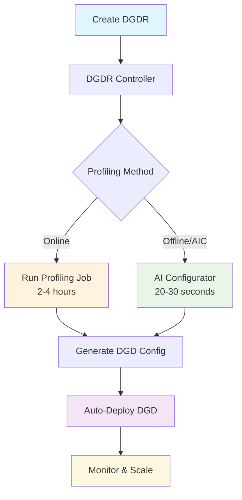

# SLA-Driven Profiling and Planner Deployment Quick Start Guide

Complete workflow to deploy SLA-optimized Dynamo models using DynamoGraphDeploymentRequests (DGDR). This guide shows how to automatically profile models and deploy them with optimal configurations that meet your Service Level Agreements (SLAs).

> [!IMPORTANT]
> **Prerequisites**: This guide assumes you have a Kubernetes cluster with GPU nodes and have completed the [Dynamo Platform installation](/docs/kubernetes/installation_guide.md).

## Overview

The DGDR workflow automates the entire process from SLA specification to deployment:

1. **Define SLAs**: Specify performance requirements (TTFT, ITL) and model information in a DGDR Custom Resource
2. **Automatic Profiling**: The Dynamo Operator automatically profiles your model to find optimal configurations
3. **Auto-Deploy**: The system automatically deploys the optimal configuration that meets your SLAs



## What is a DynamoGraphDeploymentRequest (DGDR)?

A **DynamoGraphDeploymentRequest (DGDR)** is a Kubernetes Custom Resource that serves as the primary interface for users to request model deployments with specific performance and resource constraints. Think of it as a "deployment order" where you specify:

- **What** model you want to deploy (`model`)
- **How** it should perform (SLA targets: `ttft`, `itl`)
- **Where** it should run (optional GPU preferences)
- **Which** backend to use (`backend`: vllm, sglang, or trtllm)
- **Which** images to use (`profilingConfig.profilerImage`, `deploymentOverrides.workersImage`)

The Dynamo Operator watches for DGDRs and automatically:
1. Discovers available GPU resources in your cluster
2. Runs profiling (online or offline) to find optimal configurations
3. Generates an optimized DynamoGraphDeployment (DGD) configuration
4. Deploys the DGD to your cluster

**Key Benefits:**
- **Declarative**: Specify what you want, not how to achieve it
- **Automated**: No manual profiling job setup or result processing
- **SLA-Driven**: Ensures deployments meet your performance requirements
- **Integrated**: Works seamlessly with the Dynamo Operator

## Prerequisites

Before creating a DGDR, ensure:
- **Dynamo platform installed** with the operator running (see [Installation Guide](/docs/kubernetes/installation_guide.md))
- **[kube-prometheus-stack](/docs/kubernetes/observability/metrics.md) installed and running** (required for SLA planner)
- **Image pull secrets configured** if using private registries (typically `nvcr-imagepullsecret` for NVIDIA images)
- **Sufficient GPU resources** available in your cluster for profiling
- **Runtime images available** that contain both profiler and runtime components

### Container Images

Each DGDR requires you to specify container images for the profiling and deployment process:

**profilingConfig.profilerImage** (Required):
Specifies the container image used for the profiling job itself. This image must contain the profiler code and dependencies needed for SLA-based profiling.

**deploymentOverrides.workersImage** (Optional):
Specifies the container image used for DynamoGraphDeployment worker components (frontend, workers, planner). This image is used for:
- Temporary DGDs created during online profiling (for performance measurements)
- The final DGD deployed after profiling completes

If `workersImage` is omitted, the image from the base config file (e.g., `disagg.yaml`) is used. You may use our public images (0.6.1 and later) or build and push your own.

```yaml
spec:
  profilingConfig:
    profilerImage: "nvcr.io/nvidia/ai-dynamo/vllm-runtime:0.6.1"
  deploymentOverrides:
    workersImage: "nvcr.io/nvidia/ai-dynamo/vllm-runtime:0.6.1"  # Optional
```

## Quick Start: Deploy with DGDR

### Step 1: Create Your DGDR

Dynamo provides sample DGDR configurations in `benchmarks/profiler/deploy/`. You can use these as starting points:

**Available Sample DGDRs:**
- **`profile_sla_dgdr.yaml`**: Standard online profiling for dense models
- **`profile_sla_aic_dgdr.yaml`**: Fast offline profiling using AI Configurator (TensorRT-LLM)
- **`profile_sla_moe_dgdr.yaml`**: Online profiling for MoE models (SGLang)

Or, you can create your own DGDR for your own needs:

```yaml
apiVersion: nvidia.com/v1alpha1
kind: DynamoGraphDeploymentRequest
metadata:
  name: my-model-deployment  # Change the name
  namespace: default         # Change the namespace
spec:
  model: "Qwen/Qwen3-0.6B"     # Update to your model
  backend: vllm                # Backend: vllm, sglang, or trtllm

  profilingConfig:
    profilerImage: "nvcr.io/nvidia/ai-dynamo/vllm-runtime:0.6.1"  # Required
    config:
      sla:
        isl: 3000    # Adjust to your workload
        osl: 150     # Adjust to your workload
        ttft: 200    # Your target (ms)
        itl: 20      # Your target (ms)

      sweep:
        use_ai_configurator: false  # Set to true for fast profiling (TensorRT-LLM only)

  deploymentOverrides:
    workersImage: "nvcr.io/nvidia/ai-dynamo/vllm-runtime:0.6.1"  # Optional

  autoApply: true  # Auto-deploy after profiling
```

> [!TIP]
> For detailed explanations of all configuration options (SLA, hardware, sweep, AIC, planner), see the [DGDR Configuration Reference](/docs/benchmarks/sla_driven_profiling.md#dgdr-configuration-reference).

### Step 2: Apply the DGDR

The rest of this quickstart will use the DGDR sample that uses AIC profiling. If you use a different DGDR file and/or name, be sure to adjust the commands accordingly.

```bash
export NAMESPACE=your-namespace
kubectl apply -f benchmarks/profiler/deploy/profile_sla_aic_dgdr.yaml -n $NAMESPACE
```

The Dynamo Operator will immediately begin processing your request.

### Step 3: Monitor Progress

Watch the DGDR status:

```bash
# View status
kubectl get dgdr -n $NAMESPACE

# Detailed status
kubectl describe dgdr sla-aic -n $NAMESPACE

# Watch profiling job logs
kubectl logs -f job/profile-sla-aic -n $NAMESPACE
```

**DGDR Status States:**
- `Pending`: Initial state, preparing to profile
- `Profiling`: Running profiling job (20-30 seconds for AIC, 2-4 hours for online)
- `Deploying`: Generating and applying DGD configuration
- `Ready`: DGD successfully deployed and running
- `Failed`: Error occurred (check events for details)

> [!NOTE]
> With AI Configurator, profiling completes in **20-30 seconds**! This is much faster than online profiling which takes 2-4 hours.

### Step 4: Access Your Deployment

Once the DGDR reaches `Ready` state, your model is deployed and ready to serve:

```bash
# Find the frontend service
kubectl get svc -n $NAMESPACE | grep trtllm-disagg

# Port-forward to access locally
kubectl port-forward svc/trtllm-disagg-frontend 8000:8000 -n $NAMESPACE

# Test the endpoint
curl http://localhost:8000/v1/models
```

### Step 5 (Optional): Access the Planner Grafana Dashboard

If you want to monitor the SLA Planner's decision-making in real-time, you can deploy the Planner Grafana dashboard.

```bash
kubectl apply -n monitoring -f deploy/observability/k8s/grafana-planner-dashboard-configmap.yaml
```

Follow the instructions in [Dynamo Metrics Collection on Kubernetes](../kubernetes/observability/metrics.md) to access the Grafana UI and select the **Dynamo Planner Dashboard**.

The dashboard displays:
- **Worker Counts & GPU Usage**: Current prefill/decode worker counts and cumulative GPU hours
- **Observed Metrics**: Real-time TTFT, ITL, request rate, and sequence lengths from Prometheus
- **Predicted Metrics**: Planner's load predictions and recommended replica counts
- **Correction Factors**: How the planner adjusts predictions based on observed vs expected performance

> [!TIP]
> Use the **Namespace** dropdown at the top of the dashboard to filter metrics for your specific deployment namespace.

## DGDR Configuration Details

### Required Fields

| Field | Type | Description |
|-------|------|-------------|
| `spec.model` | string | Model identifier (e.g., "meta-llama/Llama-3-70b") |
| `spec.backend` | enum | Inference backend: `vllm`, `sglang`, or `trtllm` |
| `spec.profilingConfig.profilerImage` | string | Container image for profiling job |
| `spec.profilingConfig.config.sla` | object | SLA targets (isl, osl, ttft, itl) |

### Optional Fields

| Field | Type | Description |
|-------|------|-------------|
| `spec.deploymentOverrides.workersImage` | string | Container image for DGD worker components. If omitted, uses image from base config file. |
| `spec.autoApply` | boolean | Automatically deploy DGD after profiling (default: false) |
| `spec.deploymentOverrides` | object | Customize metadata (name, namespace, labels, annotations) and image for auto-created DGD |

### SLA Configuration

The `sla` section defines performance requirements and workload characteristics:

```yaml
sla:
  isl: 3000      # Average input sequence length (tokens)
  osl: 150       # Average output sequence length (tokens)
  ttft: 200      # Target Time To First Token (milliseconds, float)
  itl: 20        # Target Inter-Token Latency (milliseconds, float)
```

**Choosing SLA Values:**
- **ISL/OSL**: Based on your expected traffic patterns
- **TTFT**: First token latency target (lower = more GPUs needed)
- **ITL**: Token generation latency target (lower = more GPUs needed)
- **Trade-offs**: Tighter SLAs require more GPU resources

### Profiling Methods

Choose between **online profiling** (real measurements, 2-4 hours) or **offline profiling** with AI Configurator (estimated, 20-30 seconds):

```yaml
# Online Profiling (Default)
sweep:
  use_ai_configurator: false

# Offline Profiling (AI Configurator - TensorRT-LLM only)
sweep:
  use_ai_configurator: true
  aic_system: h200_sxm
  aic_hf_id: Qwen/Qwen3-32B
  aic_backend_version: "0.20.0"
```

> [!NOTE]
> For detailed comparison, supported configurations, and limitations, see [SLA-Driven Profiling Documentation](/docs/benchmarks/sla_driven_profiling.md#profiling-methods).

### Hardware Configuration

For details on hardware configuration and GPU discovery options, see [Hardware Configuration in SLA-Driven Profiling](/docs/benchmarks/sla_driven_profiling.md#hardware-configuration).

### Advanced Configuration

#### Using Existing DGD Configs (Recommended for Custom Setups)

If you have an existing DynamoGraphDeployment config (e.g., from `examples/backends/*/deploy/disagg.yaml` or custom recipes), you can reference it via ConfigMap:

**Step 1: Create ConfigMap from your DGD config file:**

```bash
kubectl create configmap deepseek-r1-config \
  --from-file=disagg.yaml=/path/to/your/disagg.yaml \
  --namespace $NAMESPACE \
  --dry-run=client -o yaml | kubectl apply -f -
```

**Step 2: Reference the ConfigMap in your DGDR:**

```yaml
apiVersion: nvidia.com/v1alpha1
kind: DynamoGraphDeploymentRequest
metadata:
  name: deepseek-r1
spec:
  model: deepseek-ai/DeepSeek-R1
  backend: sglang

  profilingConfig:
    profilerImage: "nvcr.io/nvidia/ai-dynamo/sglang-runtime:0.6.1"
    configMapRef:
      name: deepseek-r1-config
      key: disagg.yaml  # Must match the key used in --from-file
    config:
      sla:
        isl: 4000
        osl: 500
        ttft: 300
        itl: 10
      sweep:
        use_ai_configurator: true
      aic:
        system: h200_sxm
        model_name: DEEPSEEK_V3
        backend_version: "0.20.0"

  deploymentOverrides:
    workersImage: "nvcr.io/nvidia/ai-dynamo/sglang-runtime:0.6.1"

  autoApply: true
```

> **What's happening**: The profiler uses the DGD config from the ConfigMap as a **base template**, then optimizes it based on your SLA targets. The controller automatically injects `spec.model` into `deployment.model` and `spec.backend` into `engine.backend` in the final configuration.

#### Inline Configuration (Simple Use Cases)

For simple use cases without a custom DGD config, provide profiler configuration directly. The profiler will auto-generate a basic DGD configuration from your `model` and `backend`:

```yaml
profilingConfig:
  config:
    # SLA targets (required for profiling)
    sla:
      isl: 8000   # Input sequence length
      osl: 200    # Output sequence length
      ttft: 200.0 # Time To First Token (ms)
      itl: 10.0   # Inter-Token Latency (ms)

    # Hardware constraints (optional)
    hardware:
      min_num_gpus_per_engine: 2
      max_num_gpus_per_engine: 8
      gpu_type: h200_sxm

    # Profiling sweep settings (optional)
    sweep:
      prefill_interpolation_granularity: 16  # Number of samples for prefill ISL sweep
      decode_interpolation_granularity: 6    # Number of samples for decode sweep
```

> **Note**: `engine.config` is a **file path** to a DGD YAML file, not inline configuration. Use ConfigMapRef (recommended) or leave it unset to auto-generate.

#### Planner Configuration Passthrough
Add planner-specific settings. Planner arguments use a `planner_` prefix:

```yaml
profilingConfig:
  config:
    planner:
      planner_min_endpoint: 2
```

## Understanding Profiling Results

For details about the profiling process, performance plots, and interpolation data, see [SLA-Driven Profiling Documentation](/docs/benchmarks/sla_driven_profiling.md#profiling-process-details).

## Advanced Topics

### DGDR Immutability

DGDRs are **immutable** - if you need to update SLAs or configuration:

1. Delete the existing DGDR: `kubectl delete dgdr sla-aic`
2. Create a new DGDR with updated specifications

### Manual Deployment Control

There are two ways to manually control deployment after profiling:

#### Option 1: Use DGDR-Generated Configuration (Recommended)

Disable auto-deployment to review the generated DGD before applying:

```yaml
spec:
  autoApply: false
```

Then manually extract and apply the generated DGD:

```bash
# Extract generated DGD from DGDR status
kubectl get dgdr sla-aic -n $NAMESPACE -o jsonpath='{.status.generatedDeployment}' | kubectl apply -f -

# Or save to file first for review/modification
kubectl get dgdr sla-aic -n $NAMESPACE -o jsonpath='{.status.generatedDeployment}' > my-dgd.yaml

vi my-dgd.yaml
kubectl apply -f my-dgd.yaml -n $NAMESPACE
```

The generated DGD includes optimized configurations and the SLA planner component. The required `planner-profile-data` ConfigMap is automatically created when profiling completes, so the DGD will deploy successfully.

#### Option 2: Use Standalone Planner Templates (Advanced)

For advanced use cases, you can manually deploy using the standalone planner templates in `examples/backends/*/deploy/disagg_planner.yaml`:

```bash
# After profiling completes, profiling data is automatically stored in ConfigMaps

# OPTIONAL: Inspect profiling results stored in ConfigMaps
# View the generated DGD configuration
kubectl get configmap dgdr-output-<dgdr-name> -n $NAMESPACE -o yaml

# View the planner profiling data (JSON format)
kubectl get configmap planner-profile-data -n $NAMESPACE -o yaml

# Update the PROMETHEUS_ENDPOINT environment variable in the planner template
# to match your cluster's Prometheus service location (see comments in the template)

# Update backend planner manifest as needed, then deploy
kubectl apply -f examples/backends/<backend>/deploy/disagg_planner.yaml -n $NAMESPACE
```

> **Note**: The standalone templates are provided as examples and may need customization for your model and requirements. The DGDR-generated configuration (Option 1) is recommended as it's automatically tuned to your profiling results and SLA targets.
>
> **Important - Prometheus Configuration**: The planner queries Prometheus to get frontend request metrics for scaling decisions. If you see errors like "Failed to resolve prometheus service", ensure the `PROMETHEUS_ENDPOINT` environment variable in your planner configuration correctly points to your Prometheus service. See the comments in the example templates for details.

### Relationship to DynamoGraphDeployment (DGD)

- **DGDR**: High-level "intent" - what you want deployed
- **DGD**: Low-level "implementation" - how it's deployed

The DGDR controller generates a DGD that:
- Uses optimal TP configurations from profiling
- Includes SLA planner for autoscaling
- Has deployment and engine settings tuned for your SLAs

The generated DGD is tracked via labels:
```yaml
metadata:
  labels:
    dgdr.nvidia.com/name: sla-aic
    dgdr.nvidia.com/namespace: your-namespace
```

### Accessing Detailed Profiling Artifacts

By default, profiling jobs save essential data to ConfigMaps for planner integration. For advanced users who need access to detailed artifacts (logs, performance plots, AIPerf results, etc), configure the DGDR to use `dynamo-pvc`. This is optional and will not affect the functionality of profiler or Planner.

**What's available in ConfigMaps (always created):**
- Generated DGD configuration
- Profiling data for Planner (`.json` files)

**What's available in PVC if attached to DGDR (optional):**
- Performance plots (PNGs)
- DGD configuration and logs of all services for each profiled deployment
- AIPerf profiling artifacts for each AIPerf run
- Raw profiling data (`.npz` files)
- Profiler log

**Setup:**

1. Set up the benchmarking PVC:
```bash
export NAMESPACE=your-namespace
deploy/utils/setup_benchmarking_resources.sh
```

2. Add `outputPVC` to your DGDR's `profilingConfig`:
```yaml
spec:
  profilingConfig:
    outputPVC: "dynamo-pvc"
    config:
      # ... rest of config
```

3. After profiling completes, access results:
```bash
kubectl apply -f deploy/utils/manifests/pvc-access-pod.yaml -n $NAMESPACE
kubectl wait --for=condition=Ready pod/pvc-access-pod -n $NAMESPACE --timeout=60s
kubectl cp $NAMESPACE/pvc-access-pod:/data ./profiling-results
kubectl delete pod pvc-access-pod -n $NAMESPACE
```

## Troubleshooting

### Quick Diagnostics

```bash
# Check DGDR status and events
kubectl describe dgdr sla-aic -n $NAMESPACE

# Check operator logs
kubectl logs -n $NAMESPACE -l app.kubernetes.io/name=dynamo-operator --tail=100

# Check profiling job logs
kubectl logs -l job-name=profile-sla-aic -n $NAMESPACE
```

### Common Issues

| Issue | Quick Fix |
|-------|-----------|
| **DGDR stuck in Pending** | Check GPU availability: `kubectl get nodes -o jsonpath='{.items[*].status.allocatable.nvidia\.com/gpu}'` |
| **Image pull errors** | Verify secret exists: `kubectl get secret nvcr-imagepullsecret -n $NAMESPACE` |
| **Profiling fails** | Check job logs: `kubectl logs -l job-name=profile-sla-aic -n $NAMESPACE` |
| **SLA cannot be met** | Relax TTFT/ITL targets or add more GPUs |
| **DGD not deployed** | Verify `autoApply: true` in DGDR spec |

> [!NOTE]
> For comprehensive troubleshooting including AI Configurator constraints, performance debugging, and backend-specific issues, see [SLA-Driven Profiling Troubleshooting](/docs/benchmarks/sla_driven_profiling.md#troubleshooting).

## Configuration Reference

For comprehensive documentation of all DGDR configuration options, see the [DGDR Configuration Reference](/docs/benchmarks/sla_driven_profiling.md#dgdr-configuration-reference).

This includes detailed explanations of:
- **SLA Configuration**: ISL, OSL, TTFT, ITL with use cases and trade-offs
- **Hardware Configuration**: GPU constraints and search space control
- **Sweep Configuration**: Profiling behavior and interpolation settings
- **AI Configurator Configuration**: System types, model mappings, backend versions
- **Planner Configuration**: Autoscaling and adjustment parameters
- **Complete Examples**: Full DGDRs for online, offline (AIC), and MoE profiling

## Related Documentation

- [DGDR API Reference](/docs/kubernetes/api_reference.md)
- [Pre-Deployment Profiling Details](/docs/benchmarks/sla_driven_profiling.md)
- [SLA Planner Architecture](/docs/planner/sla_planner.md)
- [Dynamo Operator Guide](/docs/kubernetes/dynamo_operator.md)
