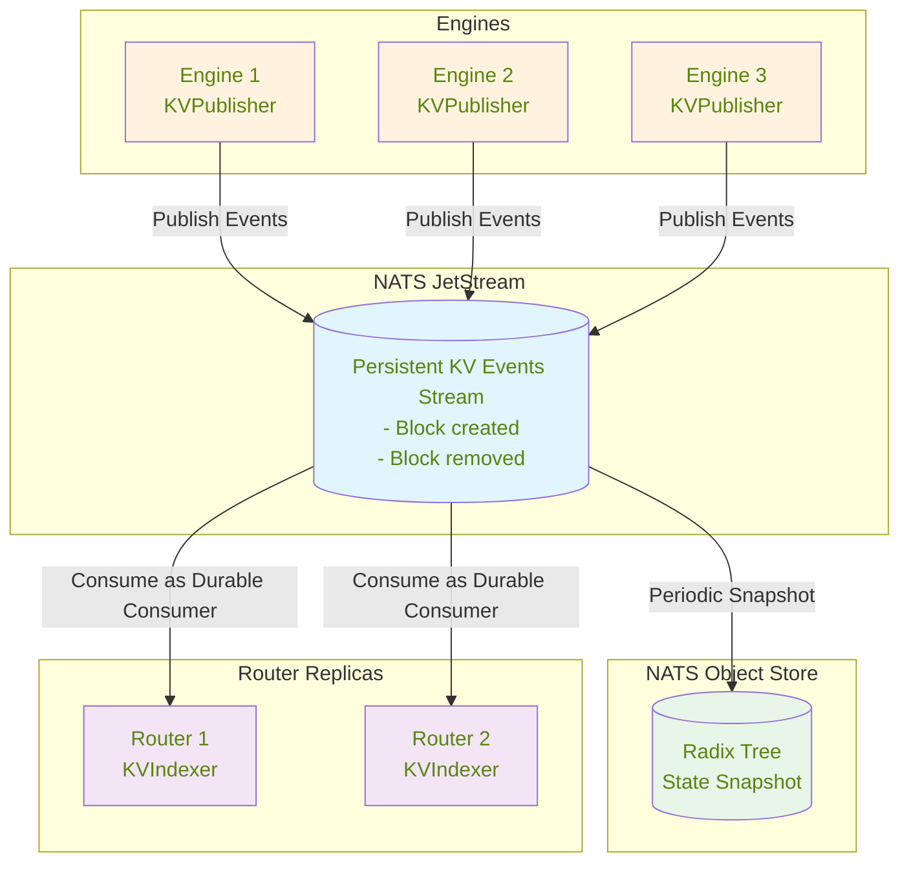
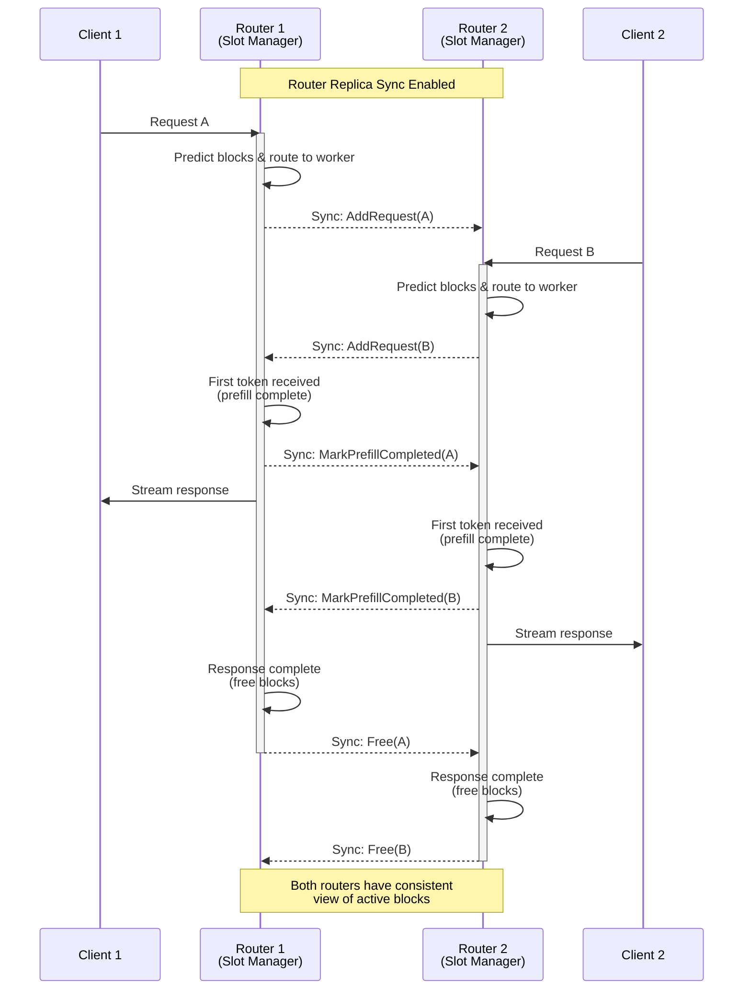

<!--
SPDX-FileCopyrightText: Copyright (c) 2025 NVIDIA CORPORATION & AFFILIATES. All rights reserved.
SPDX-License-Identifier: Apache-2.0
-->

# KV Cache Routing
This document explains how Dynamo's Key-Value (KV) cache routing optimizes large language model inference by intelligently directing requests to workers with the most relevant cached data, while maintaining load balance through worker utilization metrics.

To enable KV cache aware routing start the frontend node like this:
```
python -m dynamo.frontend --router-mode kv
```

When KV blocks are created or removed, the engine notifies the Dynamo router, which then identifies the worker with the best matching blocks and routes traffic accordingly.

To evaluate the benefits of KV-aware routing, compare your workload's performance using `--router-mode random|round-robin` against KV-aware routing.

The main KV-aware routing arguments:

- `--kv-overlap-score-weight`: Controls the importance of prefix cache overlaps in prefill cost calculations. Higher values improve Time To First Token (TTFT) at the cost of Inter-Token Latency (ITL). When set to 0, the router ignores prefix caches and uses pure load balancing. Defaults to 1.

- `--router-temperature`: Controls worker selection randomness through softmax sampling of router cost logits. A value of 0 (default) ensures deterministic selection of the lowest-cost worker, while higher values introduce more randomness.

- `--no-kv-events`: Disables KV event tracking. By default (when this flag is not provided), the router uses KV events to monitor block creation and deletion from workers. When disabled with this flag, the router predicts cache state based on routing decisions with TTL-based expiration (default 120s) and pruning. Use this flag if your backend doesn't support KV events (or you are not confident in the accuracy or responsiveness of the events).

- `--router-replica-sync`:  Disabled by default. Enables NATS-based synchronization of local routing decisions between router replicas. When enabled, routers share their active sequence information and local predictions of block usage, improving routing consistency across instances. Note that this does not sync the radix tree or cached KV block states themselves - those are synchronized through JetStream events

- `--router-reset-states`: When specified, resets the router state on startup by clearing both the JetStream event stream and NATS object store, starting with a fresh state. By default (when this flag is not provided), the router persists state across restarts, downloading any available snapshot from NATS object store and continuing to consume events from where it left off. This enables routers to maintain KV cache awareness across restarts. **Warning**: Using `--router-reset-states` can bring existing router replicas into an inconsistent state. Only use this flag when launching the first router replica in a component, or consider using a different namespace/component for a clean slate.

- `--router-snapshot-threshold`: Sets the number of messages in the JetStream before triggering a snapshot. When the message count exceeds this threshold, a router will attempt to purge acknowledged messages from the stream and create a snapshot of the current radix tree state in NATs object store. Defaults to 1000000. This helps manage stream size and provides faster initialization for routers that restart.

- `--no-track-active-blocks`: Disables tracking of active blocks (blocks being used for ongoing generation/decode phases). By default, the router tracks active blocks for load balancing. Disable this when routing to workers that only perform prefill (no decode phase), as tracking decode load is not relevant. This reduces router overhead and simplifies state management.

- `--busy-threshold`: Threshold (0.0-1.0) for determining when a worker is considered busy based on KV cache usage. When a worker's KV cache active blocks exceed this percentage of total blocks, it will be marked as busy and excluded from routing. If not set, busy detection is disabled. This feature works with all routing modes (`--router-mode kv|round-robin|random`) as long as backend engines emit `ForwardPassMetrics`.

- `--router-ttl`: Time-to-live in seconds for blocks in the router's local cache predictions. Blocks older than this duration will be automatically expired and removed from the router's radix tree. Defaults to 120.0 seconds when `--no-kv-events` is used. This helps manage memory usage by removing stale cache predictions that are unlikely to be accurate.

- `--router-max-tree-size`: Maximum tree size (number of blocks) before pruning is triggered. When the total number of blocks in the radix tree exceeds this threshold, the router will prune the least recently used blocks. Defaults to 1048576 (2^20 blocks) when `--no-kv-events` is used. This prevents unbounded memory growth in long-running deployments.

- `--router-prune-target-ratio`: Target size ratio to prune down to when `--router-max-tree-size` is exceeded. For example, with a value of 0.8 (default) and max tree size of 1048576, the router will prune down to approximately 838860 blocks when the threshold is exceeded. Defaults to 0.8 when `--no-kv-events` is used. This creates headroom before the next pruning cycle.

>[!Note]
> State persistence is only available when KV events are enabled (default). When using `--no-kv-events`, state persistence is not currently supported.
>
> When `--kv-overlap-score-weight` is set to 0 or `--no-kv-events` is set, no KvIndexer will be launched to drain and process KV events. It's recommended to disable your backend workers from relaying events through `KvEventPublisher` to avoid event accumulation in JetStream. WIP to enable disabling publishing of KV events completely in these cases.
>
> The cli args `--router-ttl`, `--router-max-tree-size`, and `--router-prune-target-ratio` control local cache management when the router operates without receiving events from workers. When KV events are enabled (default), the router relies on worker-side eviction events and these parameters are ignored.

## Prerequisites and Limitations

>[!Note]
> **KV Router Requirements**: The KV router currently works only with **dynamic endpoints** that are registered via [`register_llm()`](../development/backend-guide.md#writing-python-workers-in-dynamo) with `model_input=ModelInput.Tokens`. Your backend handler receives pre-tokenized requests with `token_ids` instead of raw text.

**Current Limitations (WIP):**
- **Static endpoints**: Not yet supported. The KV router requires dynamic model discovery via etcd to track worker instances and their KV cache states.
- **Multimodal models**: Not yet supported. The KV router currently tracks token-based blocks only.

**What this means for your setup:**
1. Backend workers must call `register_llm()` with `model_input=ModelInput.Tokens` (see [Backend Guide](../development/backend-guide.md) or [example implementations](https://github.com/ai-dynamo/dynamo/tree/main/lib/bindings/python/examples/hello_world))
2. Your handler receives requests with pre-tokenized `token_ids`, not raw text or multimodal inputs
3. You cannot use `--static-endpoint` mode with KV routing (use dynamic discovery instead)

For basic model registration without KV routing, you can use `--router-mode round-robin` or `--router-mode random` with both static and dynamic endpoints.

## Disaggregated Serving (Prefill and Decode)

Dynamo supports disaggregated serving where prefill (prompt processing) and decode (token generation) are handled by separate worker pools. When you register workers with `ModelType.Prefill` (see [Backend Guide](../development/backend-guide.md#model-types)), the frontend automatically detects them and activates an internal prefill router.

### Automatic Prefill Router Activation

The prefill router is automatically created when:
1. A decode model is registered (e.g., via `register_llm()` with `ModelType.Chat | ModelType.Completions`)
2. A prefill worker is detected with the same model name and `ModelType.Prefill`

**Key characteristics of the prefill router:**
- **Always disables active block tracking** (`track_active_blocks=false`) since prefill workers don't perform decode
- **Seamlessly integrated** into the request pipeline between preprocessing and decode routing
- **Falls back gracefully** to decode-only mode if prefill fails or no prefill workers are available

### Setup Example

When both workers are registered, requests are automatically routed.

```python
# Decode worker registration (in your decode worker)
await register_llm(
    model_input=ModelInput.Tokens,
    model_type=ModelType.Chat | ModelType.Completions,
    endpoint=generate_endpoint,
    model_name="meta-llama/Llama-2-7b-hf",
    # ... other parameters
)

# Prefill worker registration (in your prefill worker)
await register_llm(
    model_input=ModelInput.Tokens,
    model_type=ModelType.Prefill,  # <-- Mark as prefill worker
    endpoint=generate_endpoint,
    model_name="meta-llama/Llama-2-7b-hf",  # Must match decode model name
    # ... other parameters
)
```

> [!Note]
> The unified frontend with automatic prefill routing is currently enabled for vLLM and TensorRT-LLM backends. For SGLang (work in progress), you need to launch a separate standalone router as the prefill router targeting the prefill endpoints. See example script: [`examples/backends/sglang/launch/disagg_router.sh`](../../examples/backends/sglang/launch/disagg_router.sh).

## Overview

The KV-aware router operates on two key principles to optimize request routing:

### Global KV Cache State via JetStream

First, KV events from engines are sent to a persistent NATS JetStream. Each KV router/indexer replica acts as a durable consumer, pulling messages from this shared stream to maintain a global view of cached blocks across all engines. This architecture ensures consistency across router replicas and persistence across restarts.



### Local Active Block Management with Replica Sync

Second, in addition to cached blocks, each router replica needs to track active blocks (blocks being used for ongoing generation) as load metrics. Since this information is highly time-sensitive, it should be predicted immediately when:
- The router receives and routes a request
- The first token is generated (prefill complete)
- The response ends (request freed)

This is managed locally in each router via a "slot manager". To maintain consistency across the system, router replicas synchronize these local predictions with each other through NATS core messaging.



This dual-layer approach—persistent global KV cache state via JetStream and ephemeral active block synchronization via router replicas—enables the system to make optimal routing decisions that balance cache reuse with load distribution.

## Basic Routing
Dynamo supports several routing strategies when sending requests from one component to another component's endpoint.

First, we must create a client tied to a components endpoint, we can do this using the labels defined above. Here we are getting a client tied to the `generate` endpoint of the `VllmWorker` component.

```python
client = namespace('dynamo').component('VllmWorker').endpoint('generate').client()
```

We can then use the default routing methods exposed by the client class to send requests to the `VllmWorker` component.

- **Random routing**: Default strategy, available via `client.generate()` or `client.random()`
- **Round-robin routing**: Cycles through available workers via `client.round_robin()`
- **Direct routing**: Explicitly targets a specific worker via `client.direct(input, component_id)`

KV Cache routing uses direct routing with a special worker selection algorithm.

## Serving Multiple Router Replicas

For improved fault tolerance, you can launch multiple frontend + router replicas. Since the frontend and router are currently tied together, you'll need to use different HTTP ports for each instance. (The separation of the frontend and Router is WIP.)

### Router State Management

The KV Router tracks two types of state (see [KV Router Architecture](../router/README.md) for details):

1. **Prefix blocks (cached KV blocks)**: Maintained in a radix tree, tracking which blocks are cached on each worker. This state is **persistent** - backed by NATS JetStream events and object store snapshots. New router replicas automatically sync this state on startup, ensuring consistent cache awareness across restarts.

2. **Active blocks (decoding blocks)**: Tracks blocks currently being used for active generation requests. This state is **ephemeral** - when a new router replica starts, it begins with zero active block knowledge but becomes eventually consistent as it handles requests.

### Enabling Router Replica Synchronization

```bash
# Router replica 1
python -m dynamo.frontend --router-mode kv --port 8000 --router-replica-sync

# Router replica 2 (can be started later)
python -m dynamo.frontend --router-mode kv --port 8001 --router-replica-sync
```

The `--router-replica-sync` flag enables active block synchronization between replicas:
- Active blocks are shared via NATS core messaging (fire-and-forget)
- Replicas exchange routing decisions to maintain consistent load estimates
- A new replica start with zero active blocks but quickly converge through request handling, by itself and active syncing with other replicas

Without this flag, each replica maintains its own isolated view of active blocks, potentially leading to suboptimal routing.

### Persistence and Recovery

**Prefix blocks persist by default:**
- Stored in NATS JetStream with 1-hour retention
- Snapshots saved to NATS object store at configurable thresholds
- New replicas automatically restore this state on startup

You can a launch a third Router replica even if the first two Router replicas are down, and it will recover the full prefix state. (As mentioned above, the tracking of active blocks will not persist, but will become eventually consistent through request handling.)

```bash
python -m dynamo.frontend --router-mode kv --port 8002 --router-replica-sync
```

>[!Note]
> If you need to start with a fresh state, you have two options:
> 1. **Recommended**: Use a different namespace/component (see [Distributed Runtime](/docs/design_docs/distributed_runtime.md)) which will start a new stream and NATS object store path
> 2. **Use with caution**: Launch a router with the `--router-reset-states` flag, which will purge the entire stream and radix snapshot. This should only be done when launching the first router replica in a component, as it can bring existing router replicas into an inconsistent state.

## Understanding KV Cache
The leading Large Language Models (LLMs) today are auto-regressive and based off of the [transformer architecture](https://proceedings.neurips.cc/paper_files/paper/2017/file/3f5ee243547dee91fbd053c1c4a845aa-Paper.pdf). One key inference optimization technique is to cache the already computed keys and values and to reuse them for the future tokens. This is called the [KV Cache](https://developer.nvidia.com/blog/mastering-llm-techniques-inference-optimization/#key-value_caching).

### KV Cache Optimizations
Every inference framework will have a KV Cache for each worker. A popular inference framework library is [vLLM](https://github.com/vllm-project/vllm) where a key contribution was [PagedAttention](https://arxiv.org/abs/2309.06180), which allowed them to manage KV Cache in an efficient way by chunking requests into blocks.

Another popular inference framework, [SGLang](https://github.com/sgl-project/sglang), contributed [RadixAttention](https://arxiv.org/abs/2312.07104) which introduced a
prefix tree which allows for efficient matching, inserting and eviction of KV Cache blocks. The prefix tree structure popularized KV Cache reuse.

In Dynamo, we introduce a KVPublisher which emits KV Cache events that occur at each worker and a KVIndexer which keeps track of these events globally.

To get a feel for how KV Cache management works on a single worker with KV Cache reuse turned on and where the KVPublisher gets plugged in, we can walk through the KV Block management flow:
1. Request tokenization: The incoming prompt is converted into tokens
2. Block partitioning: The token sequence is divided into fixed-size blocks (e.g., 16 or 64 tokens per block)
3. Block hashing: Each block of tokens is hashed to create a unique identifier
4. Cache lookup:
    - For each block, the system checks if a matching block already exists in the KV cache
    - If a match is found, the existing KV cache block is reused
    - If no match is found, the system proceeds to the next step
5. Resource allocation:
    - For blocks without matches, the system attempts to allocate new memory space
    - If sufficient memory is available, allocate memory space and proceed to step 7
    - If memory is constrained, proceed to step 6
6. Cache eviction (when necessary):
    - The system applies an eviction policy (e.g., LRU, LFU) to identify blocks for removal
    - Selected blocks are evicted from the cache
    - **KVPublisher emits a KV removed event notifying KVIndexer about the removed block.**
    - Alternatively, some systems may offload less-frequently used blocks to CPU memory.
7. KV computation:
    - For new blocks, the model computes key and value tensors
    - These tensors are stored in the newly allocated cache blocks
    - **KVPublisher emits a kv stored event notifying KVIndexer about newly stored blocks**.

Further details can be found for: [TRT-LLM](https://developer.nvidia.com/blog/introducing-new-kv-cache-reuse-optimizations-in-nvidia-tensorrt-llm/), [vLLM](https://docs.vllm.ai/en/latest/design/automatic_prefix_caching.html#design-automatic-prefix-caching) and [SGLang](https://lmsys.org/blog/2024-01-17-sglang/).

## KV Cache Routing and Load Balancing
```text
+---------+          +------------------+           +---------+
|  Tokens |--------->| KV Aware Router  |---------> | Worker 2|
+---------+          +------------------+           +---------+
                             |
          +------------------+------------------+
          |                  |                  |
          | Cached: 2 blocks | Cached: 5 blocks | Cached: 8 blocks
          | Prefill: 8 blks  | Prefill: 5 blks  | Prefill: 2 blks
          | Decode: 10 blks  | Decode: 5 blks   | Decode: 9 blks
          v                  v                  v
   +----------------+  +----------------+  +----------------+
   |   Worker 1     |  |   Worker 2     |  |   Worker 3     |
   +----------------+  +----------------+  +----------------+
```

KV Cache reuse introduces complexity to LLM serving load balancing. While it can significantly reduce computation costs, routing strategies that ignore worker-specific KV states can lead to:
- Missed cache reuse opportunities due to suboptimal worker selection
- System throughput degradation from uneven request distribution across workers

The router uses a cost function that considers both the prefill cost (influenced by cached blocks) and the decode load to make optimal routing decisions:

### Cost Calculation

1. **Prefill blocks**: Calculated by dividing the number of tokens requiring prefill processing by the block size. The system predicts this based on input tokens and available cached blocks per worker, updating the count when the first output token signals prefill completion.

2. **Decode blocks**: Estimated from the request's input tokens and each worker's active sequences. The count updates when requests complete and their blocks are freed.

3. **Cost formula**: `cost = overlap_score_weight * prefill_blocks + decode_blocks`
   - Lower costs indicate better routing choices
   - `overlap_score_weight` balances cache hit optimization against load distribution
   - Higher weights favor cache reuse (improving TTFT), while lower weights prioritize even load distribution (improving ITL)

### Worker Selection

The router selects the worker with the lowest cost. When `router_temperature` is set to a non-zero value, the router uses softmax sampling on the normalized cost logits to introduce randomness in the selection, which can help with load distribution.

Example calculation with `overlap_score_weight = 1.0`:
- Worker 1: cost = 1.0 * 8 + 10 = 18
- **Worker 2: cost = 1.0 * 5 + 5 = 10** (selected - lowest cost)
- Worker 3: cost = 1.0 * 2 + 9 = 11

## Events

### KVPublisher
The KVPublisher can be initialized and then called in the inference framework where blocks are allocated and removed.

The two types of events are:
- KV stored event
- KV removed event

The publisher can be initialized and used through C bindings or Python bindings.

### Deterministic Event IDs

Engines do not need to emit deterministic block identifiers in KV events, as the router uses local block hashes (computed from token content) for tracking and matching blocks across workers. However, it is strongly preferred that engines do emit deterministic block identifiers, as this keeps the KvIndexer's internal lookup table smaller and more efficient. To ensure deterministic behavior, all workers should use identical engine versions/configuration. If your engine relies on Python's builtin `hash()` for any event IDs, set `PYTHONHASHSEED=0`; otherwise this setting has no effect.

### KVIndexer
The KVIndexer builds and maintains a global view of cached blocks in a prefix tree. We modify the original prefix tree by also storing the worker id on each node. This is so we can return the number of matched blocks for each worker.

The KVIndexer has a method `find_matches_for_request`, which takes in tokens and returns a dictionary with keys of worker id and values of the number of matched KV Blocks.

### Inter-Router Communication

In distributed deployments with multiple routers, each router maintains visibility over only a portion of the total requests. To ensure consistent routing decisions, routers synchronize their states through three event types:

1. **AddRequest**: Notifies other routers when a request is assigned to a worker. Includes request ID, worker ID, token sequence blocks, and overlap score to track block usage across the system.

2. **MarkPrefillCompleted**: Signals when a request moves from prefill to decode phase, allowing routers to update their worker load calculations by excluding completed prefill tokens.

3. **Free**: Indicates request completion and resource release, enabling accurate block reference counting across all routers.

Each event carries a unique router ID to prevent self-event processing. This asynchronous communication system ensures optimal routing decisions by maintaining consistent KV cache state across all routers, even as they handle different request streams.

### Event Persistence and Recovery

KV cache events are persisted in NATS JetStream, allowing router replicas to maintain their global view of KV blocks across restarts. By default, routers persist their state - they download any available snapshot from NATS object store and continue consuming events from their last acknowledged position in the stream. This default behavior ensures KV cache awareness is maintained across router restarts without any additional configuration.

To manage stream growth, when the message count exceeds `--router-snapshot-threshold`, a router acquires an etcd-based distributed lock, purges acknowledged messages from the stream, and uploads the current radix tree state to NATS object store. This snapshot serves as a checkpoint for faster initialization of future router instances.


## Using KvPushRouter Python API

Instead of launching the KV Router via command line, you can create a `KvPushRouter` object directly in Python. This allows per-request routing configuration overrides.

>[!Warning]
> **Multiple Routers in Same Process**: If you need to run multiple `KvPushRouter` instances for fault tolerance or load distribution, you must launch them in **separate processes** (e.g., using `python -m dynamo.frontend` with different ports). Creating multiple `KvPushRouter` objects in the same Python process is not supported - they share the same cancellation token from the component's primary lease, so dropping one router will cancel all routers in that process. For in-process routing, use a single `KvPushRouter` instance.

### Methods

The `KvPushRouter` provides the following methods:

- **`generate(token_ids, model, ...)`**: Route and execute a request, returning an async stream of responses. Automatically handles worker selection, state tracking, and lifecycle management.

- **`best_worker(token_ids, router_config_override=None, request_id=None)`**: Query which worker would be selected for given tokens. Returns `(worker_id, dp_rank, overlap_blocks)`.
  - Without `request_id`: Query-only, doesn't update router state
  - With `request_id`: Updates router state to track the request. **Note**: If used with `request_id`, you must call `mark_prefill_complete()` and `free()` at the appropriate lifecycle points to maintain accurate load tracking

- **`best_worker_id(token_ids, router_config_override=None, request_id=None)`**: **[DEPRECATED - use `best_worker()` instead]** Query which worker would be selected for given tokens. Returns `(worker_id, overlap_blocks)`.
  - Without `request_id`: Query-only, doesn't update router state
  - With `request_id`: Updates router state to track the request. **Note**: If used with `request_id`, you must call `mark_prefill_complete()` and `free()` at the appropriate lifecycle points to maintain accurate load tracking

- **`get_potential_loads(token_ids)`**: Get detailed load information for all workers, including potential prefill tokens and active decode blocks. Returns a list of load dictionaries.

- **`mark_prefill_complete(request_id)`**: Signal that a request has completed its prefill phase. Only used for [manual lifecycle management](#2-manual-state-management-advanced) when using `best_worker_id()` for manual routing instead of `generate()`.

- **`free(request_id)`**: Signal that a request has completed and its resources should be released. Only used for [manual lifecycle management](#2-manual-state-management-advanced) when using `best_worker_id()` for manual routing instead of `generate()`.

- **`dump_events()`**: Dump all KV cache events from the router's indexer as a JSON string. Useful for debugging and analysis.

### Setup

First, launch your backend engines:
```bash
python -m dynamo.vllm --model meta-llama/Llama-2-7b-hf
```

### Example Script

```python
import asyncio
from dynamo._core import DistributedRuntime, KvPushRouter, KvRouterConfig

async def main():
    # Get runtime and create endpoint
    runtime = DistributedRuntime.detached()
    namespace = runtime.namespace("dynamo")
    component = namespace.component("backend")
    endpoint = component.endpoint("generate")

    # Create KV router
    kv_router_config = KvRouterConfig()
    router = KvPushRouter(
        endpoint=endpoint,
        block_size=16,
        kv_router_config=kv_router_config
    )

    # Your input tokens
    token_ids = [1, 2, 3, 4, 5, 6, 7, 8, 9, 10]

    # Generate with per-request routing override
    stream = await router.generate(
        token_ids=token_ids,
        model="meta-llama/Llama-2-7b-hf",
        stop_conditions={
            "max_tokens": 20,        # Generate exactly 20 tokens
            "ignore_eos": True,      # Don't stop at EOS token
        },
        sampling_options={
            "temperature": 0.7,
            "top_p": 0.9,
        },
        router_config_override={
            "overlap_score_weight": 2.0,    # Prioritize cache hits for this request
            "router_temperature": 0.5,       # Add routing randomness
        }
    )

    # Collect generated tokens
    generated_tokens = []
    async for response in stream:
        if isinstance(response, dict) and "token_ids" in response:
            generated_tokens.extend(response["token_ids"])

    print(f"Generated {len(generated_tokens)} tokens: {generated_tokens}")

if __name__ == "__main__":
    asyncio.run(main())
```

### Routing Patterns

The `KvPushRouter` supports multiple usage patterns depending on your control requirements:

#### 1. Automatic Routing (Recommended)
Call `generate()` directly and let the router handle everything:
```python
stream = await router.generate(token_ids=tokens, model="model-name")
```
- **Best for**: Most use cases
- **Router automatically**: Selects best worker, updates state, routes request, tracks lifecycle

#### 2. Manual State Management (Advanced)
Use `best_worker_id(request_id=...)` to select and track, then manage the request yourself:
```python
worker_id, overlap = await router.best_worker_id(tokens, request_id="req-123")
response = await client.generate(tokens, request_id="req-123")
# await anext(response)  # Get first token
await router.mark_prefill_complete("req-123")  # After first token
# async for _ in response:  # Continue generating
#     ...
await router.free("req-123")  # After completion
```
- **Best for**: Custom request handling with router state tracking
- **Requires**: Calling `mark_prefill_complete()` and `free()` at correct lifecycle points
- **Caution**: Incorrect lifecycle management degrades load balancing accuracy

#### 3. Hierarchical Router Probing
Query without state updates, then route through a chosen router:
```python
# Probe multiple routers without updating state
worker_id_1, overlap_1 = await router_1.best_worker_id(tokens)  # No request_id
worker_id_2, overlap_2 = await router_2.best_worker_id(tokens)

# Pick the best router based on results
chosen_router = router_1 if overlap_1 > overlap_2 else router_2
stream = await chosen_router.generate(tokens, model="model-name", worker_id=worker_id)
```
- **Best for**: Multi-tier deployments (e.g., Envoy Gateway routing to multiple router groups)
- **Advantage**: Query multiple routers before committing to one

#### 4. Custom Load-Based Routing
Use `get_potential_loads()` to implement custom routing logic:
```python
loads = await router.get_potential_loads(tokens)
# Apply custom logic (e.g., weighted scoring, constraints)
best_worker = min(loads, key=lambda x: custom_cost_fn(x))
stream = await router.generate(tokens, model="model-name", worker_id=best_worker['worker_id'])
```
- **Best for**: Custom optimization strategies beyond the built-in cost function
- **Advantage**: Full control over worker selection logic
- **See also**: Detailed example below in "Custom Routing Example: Minimizing TTFT"

All patterns support `router_config_override` to adjust routing behavior per-request without recreating the router.

### Custom Routing Example: Minimizing TTFT

Here's an example of using `get_potential_loads()` to implement custom routing that minimizes Time To First Token (TTFT) by selecting the worker with the least prefill work:

```python
import asyncio
from dynamo._core import DistributedRuntime, KvPushRouter, KvRouterConfig

async def minimize_ttft_routing():
    # Setup router
    runtime = DistributedRuntime.detached()
    namespace = runtime.namespace("dynamo")
    component = namespace.component("backend")
    endpoint = component.endpoint("generate")

    router = KvPushRouter(
        endpoint=endpoint,
        block_size=16,
        kv_router_config=KvRouterConfig()
    )

    # Your input tokens
    token_ids = [1, 2, 3, 4, 5, 6, 7, 8, 9, 10]

    # Get potential loads for all workers
    potential_loads = await router.get_potential_loads(token_ids)

    # Find worker with minimum prefill tokens (best for TTFT)
    best_worker = min(potential_loads, key=lambda x: x['potential_prefill_tokens'])

    print(f"Worker loads: {potential_loads}")
    print(f"Selected worker {best_worker['worker_id']} with {best_worker['potential_prefill_tokens']} prefill tokens")

    # Route directly to the selected worker
    stream = await router.generate(
        token_ids=token_ids,
        model="meta-llama/Llama-2-7b-hf",
        worker_id=best_worker['worker_id'],  # Force routing to optimal worker
        stop_conditions={"max_tokens": 20}
    )

    # Process response
    async for response in stream:
        if isinstance(response, dict) and "token_ids" in response:
            print(f"Generated tokens: {response['token_ids']}")

if __name__ == "__main__":
    asyncio.run(minimize_ttft_routing())
```

This approach gives you complete control over routing decisions, allowing you to optimize for different metrics based on your specific requirements. As some examples:

- **Minimize TTFT**: Select worker with lowest `potential_prefill_tokens`
- **Maximize cache reuse**: Use `best_worker_id()` which considers both prefill and decode loads
- **Balance load**: Consider both `potential_prefill_tokens` and `potential_decode_blocks` together

See [KV Router Architecture](../router/README.md) for performance tuning details.
