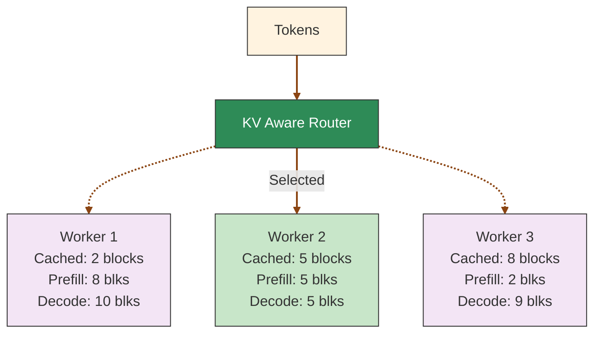
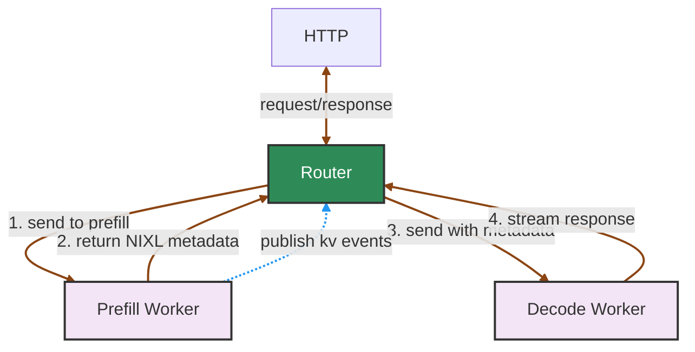

<!--
SPDX-FileCopyrightText: Copyright (c) 2025-2026 NVIDIA CORPORATION & AFFILIATES. All rights reserved.
SPDX-License-Identifier: Apache-2.0
-->

# Router Guide

## Overview

For quick start instructions, start with the [Router README](README.md). This guide covers details into further configuration, disaggregated serving setup, and parameter tuning.

## KV Cache Routing

KV cache routing optimizes large language model inference by intelligently directing requests to workers with the most relevant cached data. By maximizing cache reuse, it reduces redundant computation and improves both throughput and latency.



KV Cache reuse introduces complexity to LLM serving load balancing. While it can significantly reduce computation costs, routing strategies that ignore worker-specific KV states can lead to:
- Missed cache reuse opportunities due to suboptimal worker selection
- System throughput degradation from uneven request distribution across workers

The router uses a cost function that considers both the prefill cost (influenced by cached blocks) and the decode load to make optimal routing decisions:

### Cost Calculation

1. **Prefill blocks**: Calculated by dividing the number of tokens requiring prefill processing by the block size. The system predicts this based on input tokens and available cached blocks per worker, updating the count when the first output token signals prefill completion.

2. **Decode blocks**: Estimated from the request's input tokens and each worker's active sequences. The count updates when requests complete and their blocks are freed.

3. **Cost formula**: `cost = overlap_score_weight * prefill_blocks + decode_blocks`
   - Lower costs indicate better routing choices
   - `overlap_score_weight` balances cache hit optimization against load distribution
   - Higher weights favor cache reuse (improving TTFT), while lower weights prioritize even load distribution (improving ITL)

### Worker Selection

The router selects the worker with the lowest cost. When `router_temperature` is set to a non-zero value, the router uses softmax sampling on the normalized cost logits to introduce randomness in the selection, which can help with load distribution.

Example calculation with `overlap_score_weight = 1.0`:
- Worker 1: cost = 1.0 * 8 + 10 = 18
- **Worker 2: cost = 1.0 * 5 + 5 = 10** (selected - lowest cost)
- Worker 3: cost = 1.0 * 2 + 9 = 11

### Using the KV Cache Router

To enable KV cache-aware routing, start the frontend node like this:
```bash
python -m dynamo.frontend --router-mode kv
```

When KV blocks are created or removed, the engine notifies the Dynamo router, which then identifies the worker with the best matching blocks and routes traffic accordingly.

To evaluate the benefits of KV-aware routing, compare your workload's performance using `--router-mode random|round-robin` against KV-aware routing.

The main KV-aware routing arguments:

- `--kv-overlap-score-weight`: Controls the importance of prefix cache overlaps in prefill cost calculations. Higher values improve Time To First Token (TTFT) at the cost of Inter-Token Latency (ITL). When set to 0, the router ignores prefix caches and uses pure load balancing. Defaults to 1.

- `--router-temperature`: Controls worker selection randomness through softmax sampling of router cost logits. A value of 0 (default) ensures deterministic selection of the lowest-cost worker, while higher values introduce more randomness.

- `--no-kv-events`: Disables KV event tracking. By default (when this flag is not provided), the router uses KV events to monitor block creation and deletion from workers. When disabled with this flag, the router predicts cache state based on routing decisions with TTL-based expiration (default 120s) and pruning. Use this flag if your backend doesn't support KV events (or you are not confident in the accuracy or responsiveness of the events).

- `--router-replica-sync`:  Disabled by default. Enables NATS-based synchronization of local routing decisions between router replicas. When enabled, routers share their active sequence information and local predictions of block usage, improving routing consistency across instances. Note that this does not sync the radix tree or cached KV block states themselves - those are synchronized through JetStream events

- `--router-reset-states`: When specified, resets the router state on startup by clearing both the JetStream event stream and NATS object store, starting with a fresh state. By default (when this flag is not provided), the router persists state across restarts, downloading any available snapshot from NATS object store and continuing to consume events from where it left off. This enables routers to maintain KV cache awareness across restarts. **Warning**: Using `--router-reset-states` can bring existing router replicas into an inconsistent state. Only use this flag when launching the first router replica in a component, or consider using a different namespace/component for a clean slate.

- `--router-snapshot-threshold`: Sets the number of messages in the JetStream before triggering a snapshot. When the message count exceeds this threshold, a router will attempt to purge acknowledged messages from the stream and create a snapshot of the current radix tree state in NATs object store. Defaults to 1000000. This helps manage stream size and provides faster initialization for routers that restart.

- `--no-track-active-blocks`: Disables tracking of active blocks (blocks being used for ongoing generation/decode phases). By default, the router tracks active blocks for load balancing. Disable this when routing to workers that only perform prefill (no decode phase), as tracking decode load is not relevant. This reduces router overhead and simplifies state management.

- `--no-assume-kv-reuse`: When tracking active blocks, disables the assumption of KV cache reuse. By default (`router_assume_kv_reuse=true`), the router computes actual block hashes for sequence tracking to deduplicate blocks and optimize load balancing. When disabled via this flag, the router generates random hashes for sequence blocks, treating each request's blocks as unique. This is useful in disaggregated setups where prefill transfers blocks to decode workers that may already have those blocks cached, but the engine cannot coordinate transfers to avoid duplication. Without this flag, the router's load balancing heuristics would undercount decode blocks when duplicates exist.

- `--active-decode-blocks-threshold`: Initial threshold (0.0-1.0) for determining when a worker is considered busy based on KV cache block utilization. When a worker's KV cache active blocks exceed this percentage of total blocks, it will be marked as busy and excluded from routing. If not set, blocks-based busy detection is disabled. This feature works with all routing modes (`--router-mode kv|round-robin|random`) as long as backend engines publish load metrics. The threshold can be dynamically updated at runtime via the `/busy_threshold` HTTP endpoint (see [Dynamic Threshold Configuration](#dynamic-threshold-configuration)).

- `--active-prefill-tokens-threshold`: Literal token count threshold for determining when a worker is considered busy based on prefill token utilization. When active prefill tokens exceed this threshold, the worker is marked as busy. If not set, tokens-based busy detection is disabled.

- `--router-ttl`: Time-to-live in seconds for blocks in the router's local cache predictions. Blocks older than this duration will be automatically expired and removed from the router's radix tree. Defaults to 120.0 seconds when `--no-kv-events` is used. This helps manage memory usage by removing stale cache predictions that are unlikely to be accurate.

- `--router-max-tree-size`: Maximum tree size (number of blocks) before pruning is triggered. When the total number of blocks in the radix tree exceeds this threshold, the router will prune the least recently used blocks. Defaults to 1048576 (2^20 blocks) when `--no-kv-events` is used. This prevents unbounded memory growth in long-running deployments.

- `--router-prune-target-ratio`: Target size ratio to prune down to when `--router-max-tree-size` is exceeded. For example, with a value of 0.8 (default) and max tree size of 1048576, the router will prune down to approximately 838860 blocks when the threshold is exceeded. Defaults to 0.8 when `--no-kv-events` is used. This creates headroom before the next pruning cycle.

>[!Note]
> **State persistence** depends on the event transport mode:
> - **JetStream mode** (default): State persists across router restarts via JetStream and NATS object store snapshots.
> - **NATS Core with Local Indexer mode** (`--enable-local-indexer` on workers): State persists on workers—router rebuilds state by querying workers on startup.
> - **No KV events** (`--no-kv-events`): State persistence is not supported.
>
> **Request plane is independent of KV event transport.**
> `DYN_REQUEST_PLANE` controls how **requests** are sent (TCP/HTTP/NATS), but KV-aware routing still uses **NATS** for KV events in both JetStream and NATS Core + Local Indexer modes.
> When KV events are enabled (default), NATS is automatically initialized. You can optionally set `NATS_SERVER=nats://...` to specify a custom NATS server; otherwise, it defaults to `localhost:4222`.
> Use `--no-kv-events` to disable KV events and remove the NATS requirement entirely (with request plane being `tcp` or `http`).
>
> When `--kv-overlap-score-weight` is set to 0, no KvIndexer is created and prefix matching is disabled (pure load balancing). When `--no-kv-events` is set, a KvIndexer is still created but no event subscriber is launched to consume KV events from workers. Instead, the router predicts cache state based on its own routing decisions with TTL-based expiration and pruning.
>
> **Backend Configuration:** When using `--no-kv-events`, configure your backend workers to disable KV event publishing:
> - **vLLM**: Use `--kv-events-config '{"enable_kv_cache_events": false}'`
> - **SGLang**: Do not use `--kv-events-config`
> - **TRT-LLM**: Do not use `--publish-events-and-metrics`
>
> The cli args `--router-ttl`, `--router-max-tree-size`, and `--router-prune-target-ratio` control local cache management when the router operates without receiving events from workers. When KV events are enabled (default), the router relies on worker-side eviction events and these parameters are ignored.

To implement KV event publishing for custom inference engines, enabling them to participate in Dynamo's KV cache-aware routing, see [KV Event Publishing for Custom Engines](../integrations/kv_events_custom_engines.md).

## Basic Routing

Dynamo supports several routing strategies when sending requests from one component to another component's endpoint.

First, we must create a client tied to a components endpoint, we can do this using the labels defined above. Here we are getting a client tied to the `generate` endpoint of the `VllmWorker` component.

```python
client = namespace('dynamo').component('VllmWorker').endpoint('generate').client()
```

We can then use the default routing methods exposed by the client class to send requests to the `VllmWorker` component.

- **Random routing**: Default strategy, available via `client.generate()` or `client.random()`
- **Round-robin routing**: Cycles through available workers via `client.round_robin()`
- **Direct routing**: Explicitly targets a specific worker via `client.direct(input, component_id)`

KV Cache routing uses direct routing with a special worker selection algorithm.

For benchmarking KV router performance, see the [KV Router A/B Benchmarking Guide](../benchmarks/kv-router-ab-testing.md).

For custom routing logic and advanced patterns, see [Routing Patterns](router_examples.md#routing-patterns) in the examples documentation.

## Tuning Guidelines

### 1. Understand Your Workload Characteristics

- **Prefill-heavy workloads** (long prompts, short generations): Increase `kv-overlap-score-weight`
- **Decode-heavy workloads** (short prompts, long generations): Decrease `kv-overlap-score-weight`

### 2. Monitor Key Metrics

The router logs the cost calculation for each worker:
```text
Formula for worker_1: 125.3 = 1.0 * 100.5 + 25.0 (cached_blocks: 15)
```

This shows:
- Total cost (125.3)
- Overlap weight × prefill blocks (1.0 × 100.5)
- Active blocks (25.0)
- Cached blocks that contribute to overlap (15)

### 3. Temperature-Based Routing

The `router_temperature` parameter controls routing randomness:
- **0.0 (default)**: Deterministic selection of the best worker
- **> 0.0**: Probabilistic selection, higher values increase randomness
- Useful for preventing worker saturation and improving load distribution

### 4. Iterative Optimization

1. Begin with default settings
2. Monitor TTFT and ITL metrics
3. Adjust `kv-overlap-score-weight` to meet your performance goals:
   - To reduce TTFT: Increase the weight
   - To reduce ITL: Decrease the weight
4. If you observe severe load imbalance, increase the temperature setting

## Disaggregated Serving

Dynamo supports disaggregated serving where prefill (prompt processing) and decode (token generation) are handled by separate worker pools. When you register workers with `ModelType.Prefill` (see [Backend Guide](../development/backend-guide.md)), the frontend automatically detects them and activates an internal prefill router.

### Automatic Prefill Router Activation

The prefill router is automatically created when:
1. A decode model is registered (e.g., via `register_llm()` with `ModelType.Chat | ModelType.Completions`)
2. A prefill worker is detected with the same model name and `ModelType.Prefill`

**Key characteristics of the prefill router:**
- **Always disables active block tracking** (`track_active_blocks=false`) since prefill workers don't perform decode
- **Seamlessly integrated** into the request pipeline between preprocessing and decode routing
- **Falls back gracefully** to decode-only mode if prefill fails or no prefill workers are available

### Setup Example

When both workers are registered, requests are automatically routed.

```python
# Decode worker registration (in your decode worker)
decode_endpoint = runtime.namespace("dynamo").component("decode").endpoint("generate")

await register_llm(
    model_input=ModelInput.Tokens,
    model_type=ModelType.Chat | ModelType.Completions,
    endpoint=decode_endpoint,
    model_name="meta-llama/Llama-2-7b-hf",
    # ... other parameters
)

await decode_endpoint.serve_endpoint(decode_handler.generate)

# Prefill worker registration (in your prefill worker)
prefill_endpoint = runtime.namespace("dynamo").component("prefill").endpoint("generate")

await register_llm(
    model_input=ModelInput.Tokens,
    model_type=ModelType.Prefill,  # <-- Mark as prefill worker
    endpoint=prefill_endpoint,
    model_name="meta-llama/Llama-2-7b-hf",  # Must match decode model name
    # ... other parameters
)

await prefill_endpoint.serve_endpoint(prefill_handler.generate)
```

> [!Note]
> The unified frontend with automatic prefill routing is currently enabled for vLLM and TensorRT-LLM backends. For SGLang (work in progress), you need to launch a separate standalone router as the prefill router targeting the prefill endpoints. See example script: [`examples/backends/sglang/launch/disagg_router.sh`](../../examples/backends/sglang/launch/disagg_router.sh).

### Request Flow

The following diagram shows an overview of the major components in disaggregated serving:



## Serving Multiple Router Replicas

For improved fault tolerance, you can launch multiple frontend + router replicas. Since the frontend and router are currently tied together, you'll need to use different HTTP ports for each instance. (The separation of the frontend and Router is WIP.)

### Router State Management

The KV Router tracks two types of state (see [Router Design](../design_docs/router_design.md) for details):

1. **Prefix blocks (cached KV blocks)**: Maintained in a radix tree, tracking which blocks are cached on each worker. This state is **persistent** - backed by NATS JetStream events and object store snapshots. New router replicas automatically sync this state on startup, ensuring consistent cache awareness across restarts.

2. **Active blocks (decoding blocks)**: Tracks blocks currently being used for active generation requests. This state is **ephemeral** - when a new router replica starts, it begins with zero active block knowledge but becomes eventually consistent as it handles requests.

### Enabling Router Replica Synchronization

```bash
# Router replica 1
python -m dynamo.frontend --router-mode kv --port 8000 --router-replica-sync

# Router replica 2 (can be started later)
python -m dynamo.frontend --router-mode kv --port 8001 --router-replica-sync
```

The `--router-replica-sync` flag enables active block synchronization between replicas:
- Active blocks are shared via NATS core messaging (fire-and-forget)
- Replicas exchange routing decisions to maintain consistent load estimates
- A new replica start with zero active blocks but quickly converge through request handling, by itself and active syncing with other replicas

Without this flag, each replica maintains its own isolated view of active blocks, potentially leading to suboptimal routing.

### Persistence and Recovery

Persistence behavior depends on which event transport mode is active:

**JetStream Mode (default):**
- Prefix blocks are stored in NATS JetStream with 1-hour retention
- Snapshots saved to NATS object store at configurable thresholds
- New replicas automatically restore this state on startup
- You can launch a third Router replica even if the first two are down, and it will recover the full prefix state

```bash
python -m dynamo.frontend --router-mode kv --port 8002 --router-replica-sync
```

**NATS Core with Local Indexer Mode:**
- State persists on workers—events are fire-and-forget but workers retain their local indexer state
- On startup, the router queries each worker's local indexer to rebuild state
- Recovery depends on workers being available; if a worker is down, its blocks cannot be recovered
- Simpler infrastructure (no JetStream required) but less resilient

>[!Note]
> If you need to start with a fresh state in JetStream mode, you have two options:
> 1. **Recommended**: Use a different namespace/component (see [Distributed Runtime](/docs/design_docs/distributed_runtime.md)) which will start a new stream and NATS object store path
> 2. **Use with caution**: Launch a router with the `--router-reset-states` flag, which will purge the entire stream and radix snapshot. This should only be done when launching the first router replica in a component, as it can bring existing router replicas into an inconsistent state.

## Dynamic Threshold Configuration

Dynamic threshold configuration allows you to adjust worker busy thresholds at runtime without restarting the frontend, enabling real-time tuning of load balancing behavior based on observed system performance.

The busy thresholds can be updated at runtime without restarting the frontend. The frontend exposes HTTP endpoints at `/busy_threshold`:

**Get or set a model's thresholds (POST):**
```bash
# Set both thresholds for a model
curl -X POST http://localhost:8000/busy_threshold \
  -H "Content-Type: application/json" \
  -d '{"model": "meta-llama/Llama-2-7b-hf", "active_decode_blocks_threshold": 0.85, "active_prefill_tokens_threshold": 1000}'
# Response: {"model": "meta-llama/Llama-2-7b-hf", "active_decode_blocks_threshold": 0.85, "active_prefill_tokens_threshold": 1000}

# Set only active decode blocks threshold
curl -X POST http://localhost:8000/busy_threshold \
  -H "Content-Type: application/json" \
  -d '{"model": "meta-llama/Llama-2-7b-hf", "active_decode_blocks_threshold": 0.85}'
# Response: {"model": "meta-llama/Llama-2-7b-hf", "active_decode_blocks_threshold": 0.85, "active_prefill_tokens_threshold": <current_value>}

# Get current thresholds (omit threshold fields)
curl -X POST http://localhost:8000/busy_threshold \
  -H "Content-Type: application/json" \
  -d '{"model": "meta-llama/Llama-2-7b-hf"}'
# Response: {"model": "meta-llama/Llama-2-7b-hf", "active_decode_blocks_threshold": 0.85, "active_prefill_tokens_threshold": 1000}
# Or if not configured: {"model": "...", "active_decode_blocks_threshold": null, "active_prefill_tokens_threshold": null}
```

**List all configured thresholds (GET):**
```bash
curl http://localhost:8000/busy_threshold
# Response: {"thresholds": [{"model": "meta-llama/Llama-2-7b-hf", "active_decode_blocks_threshold": 0.85, "active_prefill_tokens_threshold": 1000}]}
```

## See Also

- **[Router README](README.md)**: Quick start guide for the KV Router
- **[Router Examples](router_examples.md)**: Python API usage, K8s examples, and custom routing patterns
- **[Router Design](../design_docs/router_design.md)**: Architecture details and event transport modes
- **[KV Event Publishing for Custom Engines](../integrations/kv_events_custom_engines.md)**: Integrate custom inference engines with KV-aware routing
