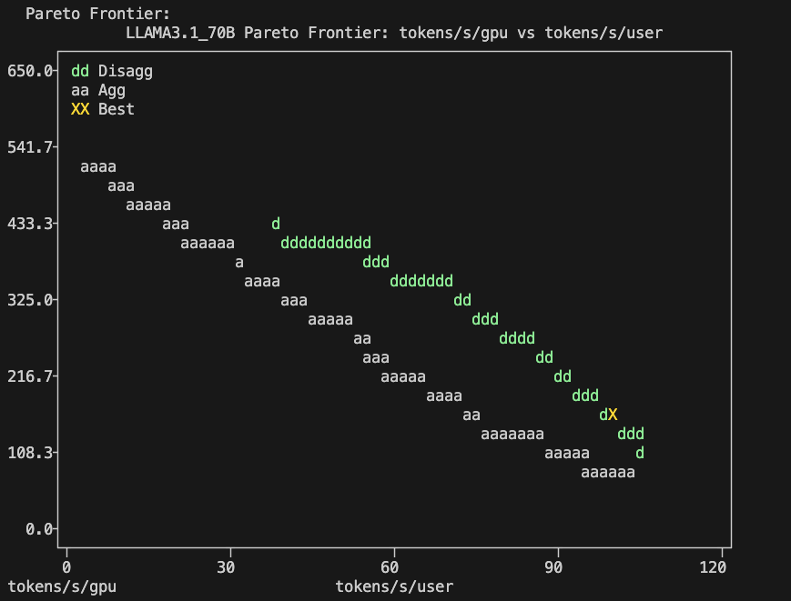
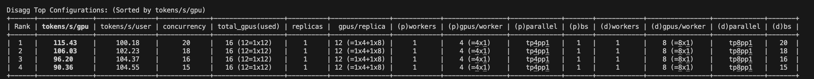

# Distributed Inferences with Dynamo
## 1. Single-Node-Sized Models hosting on multiple Nodes
For SNS (Single-Node-Sized) Model, we can use Dynamo aggregated serving to deploy multiple replicas of the model and create a frontend with different routing strategies
1. Install Dynamo CRD
```sh
export RELEASE_VERSION=0.5.0 # any version of Dynamo 0.3.2+
helm fetch https://helm.ngc.nvidia.com/nvidia/ai-dynamo/charts/dynamo-crds-${RELEASE_VERSION}.tgz
helm install dynamo-crds dynamo-crds-${RELEASE_VERSION}.tgz --namespace default
```
2. Install Dynamo platform
Create a K8S namespace for your Dynamo application and install the Dynamo platform. It will install following pods:
- ETCD
- NATS
- Dynamo Operator Controller
```sh
export NAMESPACE=YOUR_DYNAMO_NAMESPACE
kubectl create namespace ${NAMESPACE}
helm fetch https://helm.ngc.nvidia.com/nvidia/ai-dynamo/charts/dynamo-platform-${RELEASE_VERSION}.tgz
helm install dynamo-platform dynamo-platform-${RELEASE_VERSION}.tgz --namespace ${NAMESPACE}
```
3. Model hosting with vLLM backend
This `agg_router.yaml` is adpated from vLLM deployment [example](https://github.com/ai-dynamo/dynamo/blob/main/examples/backends/vllm/deploy/agg_router.yaml). It has following customizations
- Deployed `Qwen/Qwen2.5-1.5B-Instruct` model
- Use KV cache based routing in frontend deployment via the `DYN_ROUTER_MODE=kv` environment variable
- Mounted a local cache folder `/YOUR/LOCAL/CACHE/FOLDER` for model artifacts reuse
- Created 4 replicas for this model deployment by setting `replicas: 4`
- Added `debug` flag environment variable for observability

Create a K8S secret with your Huggingface token and then deploy the models
```sh
export HF_TOKEN=YOUR_HF_TOKEN
kubectl create secret generic hf-token-secret \
    --from-literal=HF_TOKEN=${HF_TOKEN} \
    --namespace ${NAMESPACE}
kubectl apply -f agg_router.yaml --namespace ${NAMESPACE}
```
4. Testing the deployment and run benchmarks
After deployment, forward the frontend service to access the API:
```sh
kubectl port-forward svc/vllm-agg-router-frontend 8000:8000 -n ${NAMESPACE}
```
and use following request to test the deployed model
```sh
curl localhost:8000/v1/chat/completions \
  -H "Content-Type: application/json" \
  -d '{
    "model": "Qwen/Qwen2.5-1.5B-Instruct",
    "messages": [
    {
        "role": "user",
        "content": "In the heart of Eldoria, an ancient land of boundless magic and mysterious creatures, lies the long-forgotten city of Aeloria. Once a beacon of knowledge and power, Aeloria was buried beneath the shifting sands of time, lost to the world for centuries. You are an intrepid explorer, known for your unparalleled curiosity and courage, who has stumbled upon an ancient map hinting at ests that Aeloria holds a secret so profound that it has the potential to reshape the very fabric of reality. Your journey will take you through treacherous deserts, enchanted forests, and across perilous mountain ranges. Your Task: Character Background: Develop a detailed background for your character. Describe their motivations for seeking out Aeloria, their skills and weaknesses, and any personal connections to the ancient city or its legends. Are they driven by a quest for knowledge, a search for lost familt clue is hidden."
    }
    ],
    "stream": false,
    "max_tokens": 30
  }'
  ```
You can also benchmark the performance of the endpoint by [AIPerf](https://github.com/ai-dynamo/aiperf/blob/main/README.md)

## 2. Deploy Single-Node-Sized Models using AIConfigurator
AIConfigurator helps users to find a strong starting configuration for disaggregated serving. We can use it as a guidance for the SNS (Single-Node-Sized) Model's serving.
1. Install AI Configurator
```sh
pip3 install aiconfigurator
```
2. Assume we have 2 GPU nodes with 16 H200 in total, and we want to deploy Llama 3.1-70B-Instruct model with an optimal disaggregated serving configuration. Run AI configurator for this model
```sh
aiconfigurator cli default --model LLAMA3.1_70B --total_gpus 16 --system h200_sxm
```
and from the output, you can see the Pareto curve with the suggested P/D settings

3. Start the serving with 1 prefill worker with tensor parallelism 4 and 1 decoding worker with tensor parallelism 8 as AI Configurator suggested. Update the `my-tag` in `disagg_router.yaml` with the latest Dynamo version and your local cache folder path and run following command.

```sh
kubectl apply -f disagg_router.yaml --namespace ${NAMESPACE}
```

4. Forward the port and test out the performance as described in the section above.
