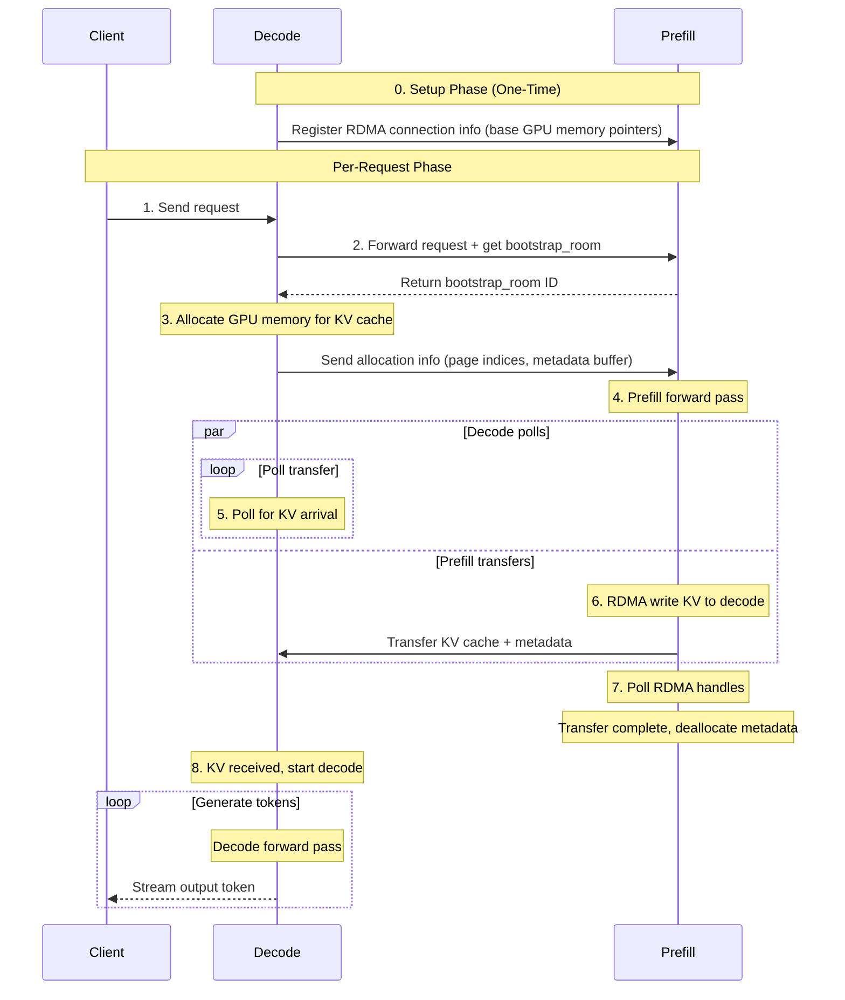

# SGLang Disaggregated Serving

This document explains how SGLang's disaggregated prefill-decode architecture works, both standalone and within Dynamo.

## Overview

Disaggregated serving separates the prefill and decode phases of LLM inference into different workers. This architecture allows for:
- Independent scaling of prefill and decode resources
- Better resource utilization (prefill is compute-bound, decode is memory-bound)
- Efficient KV cache transfer between workers using RDMA

## How Dynamo Integrates with SGLang Disaggregation

**SGLang's standalone approach:**
1. The load balancer receives a request from the client
2. A random `(prefill, decode)` pair is selected from the pool of available workers
3. Request is sent to both `prefill` and `decode` workers via asyncio tasks
4. Internally disaggregation is done from prefill → decode

**Dynamo's approach:**

Because Dynamo has a discovery mechanism, we do not use a load balancer. Instead:
1. Route to a decode worker first
2. Choose a prefill worker via round-robin or KV-aware selection
3. Send the request to both workers
4. SGLang's bootstrap server (part of the `tokenizer_manager`) is used in conjunction with NIXL/Mooncake to handle the KV transfer

## Disaggregation Flow

The following diagram shows the complete request flow for disaggregated serving:

### Key Steps Explained

**Setup Phase (One-Time)**
- Decode workers register their RDMA connection information with prefill workers
- This includes base GPU memory pointers for direct memory access

**Per-Request Flow**
1. **Request initiation**: Client sends request to decode worker
2. **Bootstrap room allocation**: Decode forwards to prefill and receives a bootstrap_room ID for coordination
3. **Memory allocation**: Decode allocates GPU memory pages for incoming KV cache
4. **Prefill execution**: Prefill worker processes the prompt and generates KV cache
5. **KV transfer**: Prefill uses RDMA to write KV cache directly to decode's GPU memory (while decode polls for completion)
6. **Cleanup**: Prefill deallocates transfer metadata after confirming completion
7. **Decode phase**: Decode worker generates tokens using the transferred KV cache
8. **Streaming**: Tokens are streamed back to the client as they're generated

### Performance Characteristics

- **RDMA transfer**: Zero-copy GPU-to-GPU transfer with minimal CPU involvement
- **Parallel operations**: Decode can poll while prefill transfers data
- **One-time setup**: RDMA connections established once, reused for all requests