# Prompt Embeddings

Dynamo supports prompt embeddings (also known as prompt embeds) as a secure alternative input method to traditional text prompts. By allowing applications to use pre-computed embeddings for inference, this feature not only offers greater flexibility in prompt engineering but also significantly enhances privacy and data security. With prompt embeddings, sensitive user data can be transformed into embeddings before ever reaching the inference server, reducing the risk of exposing confidential information during the AI workflow.


## How It Works

| Path | What Happens |
|------|--------------|
| **Text prompt** | Tokenize → Embedding Layer → Transformer |
| **Prompt embeds** | Validate → Bypass Embedding → Transformer |


## Architecture

```mermaid
flowchart LR
    subgraph FE["Frontend (Rust)"]
        A[Request] --> B{prompt_embeds?}
        B -->|No| C[🔴 Tokenize text]
        B -->|Yes| D[🟢 Validate base64+size]
        C --> E[token_ids, ISL=N]
        D --> F[token_ids=empty, skip ISL]
    end

    subgraph RT["Router (NATS)"]
        G[Route PreprocessedRequest]
    end

    subgraph WK["Worker (Python)"]
        H[TokensPrompt#40;token_ids#41;]
        I[Decode → EmbedsPrompt#40;tensor#41;]
    end

    subgraph VLLM["vLLM Engine"]
        J[🔴 Embedding Layer]
        K[🟢 Bypass Embedding]
        L[Transformer Layers]
        M[LM Head → Response]
    end

    E --> G
    F --> G
    G -->|Normal| H
    G -->|Embeds| I
    H --> J --> L
    I --> K --> L
    L --> M
```



| Layer | **Normal Flow** | **Prompt Embeds**  |
|---|---|---|
| **Frontend (Rust)** | 🔴 Tokenize text → token_ids, compute ISL | 🟢 Validate base64+size, skip tokenization |
| **Router (NATS)** | Forward token_ids in PreprocessedRequest | Forward prompt_embeds string |
| **Worker (Python)** | `TokensPrompt(token_ids)` | Decode base64 → `EmbedsPrompt(tensor)` |
| **vLLM Engine** | 🔴 Embedding Layer → Transformer | 🟢 Bypass Embedding → Transformer |


## Quick Start

Send pre-computed prompt embeddings directly to vLLM, bypassing tokenization.

### 1. Enable Feature

```bash
python -m dynamo.vllm --model <model-name> --enable-prompt-embeds
```

> **Required:** The `--enable-prompt-embeds` flag must be set or requests will fail.

### 2. Send Request

```python
import torch
import base64
import io
from openai import OpenAI

# Prepare embeddings (sequence_length, hidden_dim)
embeddings = torch.randn(10, 4096, dtype=torch.float32)

# Encode
buffer = io.BytesIO()
torch.save(embeddings, buffer)
buffer.seek(0)
embeddings_base64 = base64.b64encode(buffer.read()).decode()

# Send
client = OpenAI(base_url="http://localhost:8000/v1", api_key="EMPTY")
response = client.completions.create(
    model="meta-llama/Meta-Llama-3.1-8B-Instruct",
    prompt="",  # Can be empty or present; prompt_embeds takes precedence
    max_tokens=100,
    extra_body={"prompt_embeds": embeddings_base64}
)
```

## Configuration

### Docker Compose

```yaml
vllm-worker:
  command:
    - python
    - -m
    - dynamo.vllm
    - --model
    - meta-llama/Meta-Llama-3.1-8B-Instruct
    - --enable-prompt-embeds  # Add this
```

### Kubernetes

```yaml
extraPodSpec:
  mainContainer:
    args:
      - "--model"
      - "meta-llama/Meta-Llama-3.1-8B-Instruct"
      - "--enable-prompt-embeds"  # Add this
```

### NATS Configuration

NATS needs 15MB payload limit (already configured in default deployments):

```yaml
# Docker Compose - deploy/docker-compose.yml
nats-server:
  command: ["-js", "--trace", "-m", "8222", "--max_payload", "15728640"]

# Kubernetes - deploy/cloud/helm/platform/values.yaml
nats:
  config:
    merge:
      max_payload: 15728640
```

## API Reference

### Request

```json
{
  "model": "meta-llama/Meta-Llama-3.1-8B-Instruct",
  "prompt": "",
  "prompt_embeds": "<base64-encoded-pytorch-tensor>",
  "max_tokens": 100
}
```

**Requirements:**
- **Format:** PyTorch tensor serialized with `torch.save()` and base64-encoded
- **Size:** 100 bytes - 10MB (decoded)
- **Shape:** `(seq_len, hidden_dim)` or `(batch, seq_len, hidden_dim)`
- **Dtype:** `torch.float32` (recommended)

**Field Precedence:**
- Both `prompt` and `prompt_embeds` can be provided in the same request
- When both are present, **`prompt_embeds` takes precedence** and `prompt` is ignored
- The `prompt` field can be empty (`""`) when using `prompt_embeds`

### Response

Standard OpenAI format with accurate usage:

```json
{
  "usage": {
    "prompt_tokens": 10,        // Extracted from embedding shape
    "completion_tokens": 15,
    "total_tokens": 25
  }
}
```

## Errors

| Error | Fix |
|-------|-----|
| `ValueError: You must set --enable-prompt-embeds` | Add `--enable-prompt-embeds` to worker |
| `prompt_embeds must be valid base64` | Use `.decode('utf-8')` after `base64.b64encode()` |
| `decoded data must be at least 100 bytes` | Increase sequence length |
| `exceeds maximum size of 10MB` | Reduce sequence length |
| `must be a torch.Tensor` | Use `torch.save()` not NumPy |
| `size of tensor must match` | Use correct hidden dimension for model |

## Examples

### Streaming

```python
stream = client.completions.create(
    model="meta-llama/Meta-Llama-3.1-8B-Instruct",
    prompt="",
    max_tokens=100,
    stream=True,
    extra_body={"prompt_embeds": embeddings_base64}
)

for chunk in stream:
    if chunk.choices:
        print(chunk.choices[0].text, end="", flush=True)
```

### Load from File

```python
embeddings = torch.load("embeddings.pt")

buffer = io.BytesIO()
torch.save(embeddings, buffer)
buffer.seek(0)
embeddings_base64 = base64.b64encode(buffer.read()).decode()

# Use in request...
```


## Limitations

- ❌ Requires `--enable-prompt-embeds` flag (disabled by default)
- ❌ PyTorch format only (NumPy not supported)
- ❌ 10MB decoded size limit
- ❌ Cannot mix with multimodal data (images/video)

## Testing

Comprehensive test coverage ensures reliability:

- **Unit Tests:** 31 tests (11 Rust + 20 Python)
  - Validation, decoding, format handling, error cases, usage statistics
- **Integration Tests:** 21 end-to-end tests
  - Core functionality, performance, formats, concurrency, usage statistics

Run integration tests:
```bash
# Start worker with flag
python -m dynamo.vllm --model Qwen/Qwen3-0.6B --enable-prompt-embeds

# Run tests
pytest tests/integration/test_prompt_embeds_integration.py -v
```

## See Also

- [vLLM Backend](README.md)
- [vLLM Configuration](README.md#configuration)
