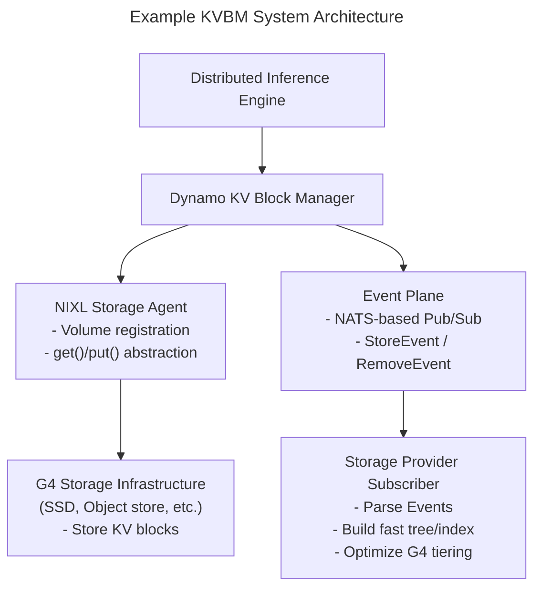

# KVBM Design

This document provides an in-depth look at the architecture, components, framework integrations via the connector API, and the detailed workings of the Dynamo KV Block Manager (KVBM). The design of KVBM takes inspiration from the KV block managers used in vLLM and SGLang, with added influence from historical memory tiering strategies common in general GPU programming. For more details, see [Further Reading](#further-reading).

## KVBM Components


*Internal Components of Dynamo KVBM*

### Core

- **KvBlockManager**: Public facade. Constructs/owns the internal state and exposes the pools and onboarding APIs.
- **Scheduler**: Gates transfer execution relative to model progress (iteration/layer completion) when integrated with a framework connector (e.g., vLLM V1).
- **Config (config.rs)**: Describes model dims, page size, layout choices, and runtime flags used to build pools and layouts.
- **KvBlockManagerState**: Central object wiring together layouts, storage backends, and pools; owns the OffloadManager, metrics, and events hooks.
- **Events/Metrics**: Observability components emitting counters/gauges and event hooks for integration/testing.

### Layouts and Blocks

- **LayoutConfig & LayoutType**: Translate tensor shapes into KV cache layouts (layer-separated or fully-contiguous), including block counts and geometry.
- **Blocks & Metadata**: Typed block handles (mutable/immutable), metadata (e.g., priority), and views by layer/outer dims; used to allocate, register, and match by `sequence_hash`.

### Transfer Manager

- **TransferManager**: Asynchronous transfer orchestrator with per-path queues (Device→Host, Host→Disk, Host→Device, Disk→Device).

### Storage & Pools

- **Device Pool (G1)**: GPU-resident KV block pool. Allocates mutable GPU blocks, registers completed blocks (immutable), serves lookups by sequence hash, and is the target for onboarding (Host→Device, Disk→Device).
- **Host Pool (G2)**: CPU pinned-memory KV block pool. Receives Device offloads (Device→Host), can onboard to Device (Host→Device), and offloads to Disk. Uses pinned (page-locked) memory for efficient CUDA transfers and NIXL I/O.
- **Disk Pool (G3)**: Local SSD NVMe-backed KV block pool. Receives Host offloads (Host→Disk) and provides blocks for onboarding to Device (Disk→Device). NIXL descriptors expose file offsets/regions for zero-copy I/O and optional GDS.
- **Remote Storage (G4)**: Remote or cloud-backed KV block storage. KVBM treats G4 as an opaque blob store accessed through NIXL, unaware of internal layout optimizations.

## KVBM Data Flows


*KVBM Data Flows from device to other memory hierarchies*

### Device → Host (Offload)

- Triggered when explicitly requested to offload by the connector scheduler
- Worker allocates a Host block and performs CUDA D2H/Custom Kernel copy
- Host pool registers the new immutable block (dedup by sequence hash)

### Host → Disk (Offload)

- **Local Disk (G3)**: NIXL Write via POSIX; GDS when available
- **Remote Disk (G4)** (Network FS like NFS/Lustre/GPFS): NIXL Write via POSIX to the mounted FS; batching/concurrency identical
- Triggered on registered host blocks or explicit offload requests
- Worker allocates a Disk block and performs NIXL Write (Host→Disk)
- Disk pool registers the new immutable block (dedup by sequence hash)

### Host → Device (Onboard)

- Called to bring a host block into GPU memory
- Worker uses provided Device targets and performs CUDA H2D/Custom Kernel copy
- Device pool registers the new immutable block

### Disk → Device (Onboard)

- Called to bring a disk block directly into GPU memory
- Worker uses provided Device targets and performs NIXL Read (Disk→Device), possibly via GDS
- Device pool registers the new immutable block

## Internal Architecture Deep Dive


*Internal architecture and key modules in the Dynamo KVBM*

### KvBlockManager as Orchestration Layer

The `KvBlockManager<H, D>` acts as a coordinator across memory tiers—host (CPU), device (GPU), and remote—by managing per-backend block pools and exposing consistent block lifecycle APIs. It tracks KV block locations across device memory (G1), CPU memory within and across nodes (G2), local/pooled SSDs (G3), and remote storage (G4). G1-G4 are key tiers enabled by KVBM. Note that KVBM treats G4 storage as an opaque blob store, unaware of internal layout optimizations.

`KvBlockManager<H, D>` owns:

- A device-side `BlockPool<Device>`
- A host-side `BlockPool<Host>`
- A remote NIXL agent that supports communication and memory sharing across nodes
- A block set registry for remote lookup and import/export of block metadata

Implementation-wise, `KvBlockManagerState` holds the logic: it's initialized by `KvBlockManagerConfig`, which merges runtime, model, and layout configurations. `NixlOptions` injects remote awareness.

### Block Layout and Memory Mapping

Each block is a 2D array `[num_layers][page_size × inner_dim]`. The `BlockLayout` trait abstracts the memory layout. The default implementation, `FullyContiguous`, stores all layers for all blocks in one region with alignment-aware stride computation:

```text
block_stride_in_bytes = align_up(num_layers × layer_stride, alignment);
```

Both CPU and GPU pools share this memory layout, but they use storage-specific backends:

- `DeviceStorage` → CUDA device buffer
- `PinnedStorage` → page-locked host memory
- `SystemStorage` → CPU heap memory (fallback/test)
- `NixlStorage` → remote memory through NIXL RDMA handles (includes storage)

Each layout is constructed using a `LayoutConfig`, and storage is either passed directly or allocated using a `StorageAllocator`.

### BlockPool and Memory Pools (Active and Inactive)

Each `BlockPool<T>` (where `T` is `DeviceStorage`, `PinnedStorage`, etc.) tracks two sub-pools:

- **ActivePool**: Contains blocks currently in use by sequences
- **InactivePool**: Recycled blocks ready for allocation (free list)

When a token block is requested (e.g., `get_mutable_block()`), the allocator pops from `InactivePool`, transitions its state, and returns a writable handle. On sequence commit or eviction, the system resets blocks and returns them to the inactive pool.

### Block State Machine

The state machine (`BlockState`) tracks block lifecycle transitions:

| State | Description | Ownership | Valid Actions/Transitions |
|-------|-------------|-----------|---------------------------|
| Reset | Block hasn't been initialized or was reset. No associated sequence. | Held in InactivePool, reusable | `init_sequence(salt_hash)` → Partial |
| Partial | Block is being filled with tokens for a new sequence. In-progress. | Owned by the sequence creator | `add_token()` / `add_tokens()` (accumulate), `commit()` → Complete, `reset()` → Reset |
| Complete | Block is fully filled with token data but not yet visible to others. | Still owned by creator thread | `register()` → Registered, `reset()` → Reset |
| Registered | Block is finalized and visible for reuse. Available in the deduplication cache. | Shared ownership (global registry) | Auto `drop()` → triggers Remove event and transitions to Reset |

#### Valid State Transitions

| From → To | Trigger | Validation |
|-----------|---------|------------|
| Reset → Partial | `init_sequence(salt_hash)` | Must not be in use |
| Partial → Complete | `commit()` | Must be full |
| Complete → Registered | `register()` | Must be finalized |
| Registered → Reset | Drop of `RegistrationHandle` | Automatic |
| Partial → Reset | Aborted sequence | Explicit or drop |
| Complete → Reset | Invalidated | Explicit or drop |

#### Example Block Lifecycle

A sequence requests a new KV block:

1. Allocator pops from InactivePool → Block is in Reset
2. `init_sequence()` → Transitions to Partial
3. Tokens are appended → State remains Partial
4. On full → `commit()` → State becomes Complete
5. `register()` → Block is hashed and moved to Registered. Blocks can now be used for lookup.
6. On eviction or end-of-life → `drop()` of RAII handle returns block to Reset

### Lifecycle Management using RAII and Event Plane

The system uses RAII for memory lifecycle management. Every block holds metadata and registration state, and registration is coupled with an `EventManager`. On registration and drop:

- `PublishHandle` triggers Register events
- Dropping it triggers Remove events

This pattern ensures consistency for shared memory tracking across workers without requiring explicit deallocation logic. The events are propagated in the Dynamo Events plane. Any Dynamo component subscribed to the events plane can listen to these changes. Note that even the storage provider can subscribe to the events plane and create an internal prefix tree representation that is tailored and optimized for the specific platform.

### Remote Memory Integration using NIXL

The NIXL agent exposes remote memory buffers using `NixlBlockSet`, `RemoteBlocks`, and layout descriptors. Key operations include:

- `nixl_register()`: Registers memory region with NIXL runtime
- `serialize() / deserialize()`: Converts layout and memory into transferable descriptors
- `import_remote_blockset()`: Loads remote node's block layouts into the manager
- `get_remote_blocks_mutable()`: Fetches transferable memory views from another node

`RemoteBlocks` is a lightweight abstraction over shared memory for cross-node block usage (through UCX or other backends).

#### Remote Memory Registration Protocol

The following describes a bidirectional remote memory registration and layout synchronization protocol between workers (e.g., Worker 1 and Worker 2) using NIXL:

**1. Agent Creation & Memory Registration**

Each worker independently sets up a NixlAgent:
- Registers its memory regions (i.e., device memory) through `nixl_register()`
- These regions correspond to blocks managed in the local BlockPool

Once the worker registers the memory, NIXL creates remote-accessible descriptors, which it binds to the memory layout.

**2. Metadata Exchange**

After memory registration, workers exchange serialized layout metadata, encapsulated in a `SerializedNixlBlockLayout`.

Why is this step critical?
- LLM inference workloads often differ in *tensor parallel (TP)* configurations:
  - Worker 1 might have TP=4, while Worker 2 has TP=8
  - Even if both systems use similar `FullyContiguous` layouts, their internal slicing and alignment assumptions differ
- The metadata exchange bridges this semantic mismatch by sharing:
  - LayoutConfig (num_layers, page_size, inner_dim, dtype)
  - BlockSetID
  - Base address + stride information (including alignment)
  - Device ID + memory type (host/device)
- Once workers share metadata, each can reconstruct the layout on its side using `deserialize()`

This enables NIXL to:
- Understand where each layer/block resides
- Perform correct gather-scatter operations during RDMA-like transfers

Without this step, remote fetches would result in data corruption or misaligned tokens.

**3. Serialization & Deserialization: Making Layouts Portable**

In the serialization stage, KVBM exports and `FullyContiguous::serialize()` encodes:
- FullyContiguousConfig
- base_offset
- Physical memory descriptors (NixlStorage), including:
  - Memory type (VRAM, DRAM)
  - Address & size
  - Device ID

The system sends this using NIXL transfer and then injects it into a KVBM scheduler state.

In the deserialization stage, `SerializedNixlBlockLayout::deserialize()` rehydrates this into:
- A fully reconstructed memory layout view
- Local representation of a remote memory slice with correct offsets and size semantics

It also enables direct access to remote memory with consistent logical semantics. This guarantees that even across different system configurations (hardware or LLM shape), both parties agree on the memory view for each KV block.

**4. Ownership Handles and Lifetime Tracking**

Memory ownership in NIXL is tightly coupled with RAII-based handles:
- When a block is registered, it returns a `PublishHandle` which wraps a `RegistrationHandle`
- On drop of this handle, an automatic Remove event is published, which:
  - Deregisters the block from the NIXL layer
  - Removes it from the remote block registry
- This ensures that once the block is evicted from the cache or no longer used in inference, all references are invalidated cleanly across nodes

This mechanism avoids:
- Stale memory access
- Dangling pointers on GPU or host
- Manual deregistration bugs

The system can batch and publish registration events using a Publisher, optimizing performance under high concurrency.

### Storage Backends and Pluggability

You can integrate KVBM with a storage backend by extending or wrapping `NixlEnabledStorage` to support cross-node RDMA registration. All layouts and block pools are generic over these backends, allowing for fine-grained control over memory tiers.



#### NIXL Storage Interface (for Backend Integration)

The NIXL interface abstracts volume interaction and decouples it from mounting, metadata tracking, or direct system I/O. It provides:

- `registerVolume(descriptor)`: Register a logical volume for KV cache data
- `unregisterVolume()`: Cleanly deregister and release volume mappings
- `get() / put()`: Block-level APIs used by KVBM to fetch and store token blocks

These abstractions allow backends to be integrated without tying into the host's file system stack, enabling safe interaction with block devices, local filesystems, and RDMA-capable volumes. Note that these APIs are still being finalized.

#### Dynamo Event Plane (Pub/Sub Coordination Layer)

To support external storage optimizations without modifying KVBM logic, we provide an **event plane** built on NATS.io that emits lifecycle events for all block operations:

- **StoreEvent**: Emitted when a KV block is registered
- **RemoveEvent**: Emitted when a KV block is released or evicted

Each KVEvent (~100 bytes) contains:

| Field | Description |
|-------|-------------|
| `sequence_hash` | Unique identifier of the KV block |
| `prefix_hash` | Prefix grouping for query-level aggregation |
| `block_size` | Size in bytes |
| `storage_location` | Logical volume identifier |
| `event_type` | Store or Remove |
| `extra_metadata` | Reserved fields for partner-specific optimization |

For scalability, the system batches and publishes these events periodically (e.g., every ~10s, or dynamically based on system load).

#### Conceptual Design of a Storage Advisor

This section provides an overview for storage providers interested in integrating as a custom backend to KVBM. **This is optional for KVBM integration with a backend.**

External storage systems are not tightly coupled with Dynamo's execution pipeline. Instead, they passively observe KV block lifecycle events through a subscription model:

1. Storage volumes are pre-provisioned and mounted by the storage provider
2. These volumes are registered with Dynamo through the NIXL Storage Agent using `registerVolume()` APIs
3. Dynamo KV Block Manager interacts only with logical block-level APIs (`get()` and `put()`)
4. The Event Plane asynchronously broadcasts KV lifecycle events using a NATS-based pub/sub channel
5. Storage vendors implement a lightweight subscriber process that listens to these events

To enable fast lookup and dynamic tiering, storage vendors may build internal data structures using the received event stream:

- On receiving a **StoreEvent**: Insert a record into an internal prefix tree, hash map, or LRU index with `prefix_hash`, `sequence_hash`, and associated metadata
- On receiving a **RemoveEvent**: Delete or prune the corresponding record, optionally triggering cleanup or tier migration workflows

With real-time visibility into KV block usage patterns, the storage system can implement smart tiering policies:

- **Hot block promotion**: Frequently accessed KV blocks can be migrated to fast SSD volumes
- **Cold block demotion**: Infrequently used blocks can be demoted to slower storage (HDDs, cloud object storage)
- **Proactive compaction**: If block sizes or prefix patterns indicate fragmentation, the storage backend can coalesce or rewrite blocks

This design ensures that performance, resilience, and extensibility scale independently across the KV layer and the storage backend layer.

## Framework Integrations

KVBM integrates with inference frameworks (vLLM, TensorRT-LLM, SGLang) via Connector APIs to influence KV caching behavior, scheduling, and forward pass execution.

### Connector Architecture

There are two components of the interface:

- **Scheduler (Leader)**: Responsible for orchestration of KV block offload/onboard, builds metadata specifying transfer data to the workers. It also maintains hooks for handling asynchronous transfer completion.
- **Worker**: Responsible for reading metadata built by the scheduler (leader), performs async onboarding/offloading at the end of the forward pass.


*Typical integration of KVBM with inference frameworks (vLLM shown as example)*

### Onboarding Operations


*Onboarding blocks from Host to Device*


*Onboarding blocks from Disk to Device*

### Offloading Operations


*Offloading blocks from Device to Host & Disk*

## Further Reading

- [vLLM Automatic Prefix Caching](https://docs.vllm.ai/en/latest/features/automatic_prefix_caching.html)
- [SGLang HiCache Benchmarks](https://github.com/sgl-project/sglang/tree/main/benchmark/hicache)
- [EMOGI: Efficient Memory-access for Out-of-memory Graph-traversal](https://arxiv.org/abs/2006.06890)

## See Also

- [KVBM Overview](../components/kvbm/README.md)
- [KVBM Guide](../components/kvbm/kvbm-guide.md)
- [NIXL Documentation](https://github.com/ai-dynamo/nixl/blob/main/docs/nixl.md)
