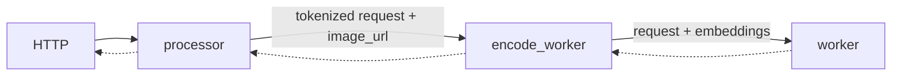
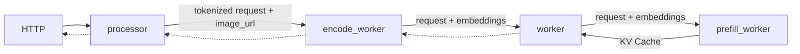

# SGLang Multimodal

This document provides a comprehensive guide for multimodal inference using SGLang backend in Dynamo. SGLang multimodal uses specialized **E/PD or E/P/D** flows with **NIXL (RDMA)** for zero-copy tensor transfer.

## Support Matrix

| Modality | Input Format | Aggregated | Disaggregated | Notes |
|----------|--------------|------------|---------------|-------|
| **Image** | HTTP/HTTPS URL | Yes | Yes | Vision encoder generates embeddings |
| **Image** | Data URL (Base64) | No | No |  |
| **Video** | HTTP/HTTPS URL | No | No |  |
| **Audio** | HTTP/HTTPS URL | No | No |  |

### Supported URL Formats

| Format | Example | Description |
|--------|---------|-------------|
| **HTTP/HTTPS** | `http://example.com/image.jpg` | Remote media files |

## Deployment Patterns

SGLang supports E/PD and E/P/D patterns only (always has a separate encode worker). See [Multimodal Architecture Patterns](index.md#architecture-patterns) for detailed explanations.

| Pattern | Supported | Launch Script | Notes |
|---------|-----------|---------------|-------|
| EPD (Simple Aggregated) | ❌ | N/A | Not supported |
| E/PD (Encode Separate) | ✅ | `multimodal_agg.sh` | Vision encoder separate |
| E/P/D (Full Disaggregation) | ✅ | `multimodal_disagg.sh` | KV cache via bootstrap |
| EP/D (Traditional Disaggregated) | ❌ | N/A | Not supported |

### Component Flags

| Component | Flag | Purpose |
|-----------|------|---------|
| Processor | `--multimodal-processor` | HTTP entry, OpenAI→SGLang conversion |
| Encode Worker | `--multimodal-encode-worker` | Vision encoder, embeddings generation |
| PD Worker | `--multimodal-worker` | Prefill + Decode with embeddings |
| Decode Worker | `--multimodal-worker --serving-mode=decode` | Entry point for disaggregation |
| Prefill Worker | `--multimodal-worker --serving-mode=prefill` | Called by Decode, bootstrap coordination |

### SGLang-Specific Characteristics

- **Vision Encoder in Python**: Encode worker loads vision model (AutoModel) and image processor (AutoImageProcessor)
- **Token Expansion**: Single `<|image_pad|>` token replaced with N tokens based on embedding shape
- **NIXL Transfer**: Embeddings transferred from Encoder → PD Worker using NIXL
- **No Rust Processing**: All tokenization and image handling happens in Python

## Use the Latest Release

We recommend using the latest stable release of dynamo to avoid breaking changes:

[](https://github.com/ai-dynamo/dynamo/releases/latest)

You can find the [latest release](https://github.com/ai-dynamo/dynamo/releases/latest) and check out the corresponding branch with:

```bash
git checkout $(git describe --tags $(git rev-list --tags --max-count=1))
```

## E/PD Serving (Encode Separate)

### Components

- workers:
  - [MultimodalEncodeWorkerHandler](https://github.com/ai-dynamo/dynamo/tree/main/components/src/dynamo/sglang/request_handlers/multimodal/encode_worker_handler.py) for encoding
  - [MultimodalWorkerHandler](https://github.com/ai-dynamo/dynamo/tree/main/components/src/dynamo/sglang/request_handlers/multimodal/worker_handler.py) for prefilling and decoding.
- processor: [MultimodalProcessorHandler](https://github.com/ai-dynamo/dynamo/tree/main/components/src/dynamo/sglang/request_handlers/multimodal/processor_handler.py)
  - tokenizes the prompt using the chat template
  - passes the text and image url to the MultimodalEncodeWorker.

### Workflow

The `MultimodalEncodeWorker` downloads and encodes the image and passes the embeddings to the MultimodalWorker. The work complete event is sent via NATS, while the embeddings tensor is transferred via RDMA through the NIXL interface. The `MultimodalWorker` then prefills and decodes the prompt in the same engine, as in the [LLM aggregated serving](../backends/sglang/README.md) example. Only the processor is registered to the Dynamo frontend as an available endpoint. Workers do NOT register - they are internal components and communicate via NATS.




### Launch

```bash
cd $DYNAMO_HOME/examples/backends/sglang
./launch/multimodal_agg.sh
```

**Client:**

```bash
curl http://localhost:8000/v1/chat/completions \
  -H "Content-Type: application/json" \
  -d '{
    "model": "Qwen/Qwen2.5-VL-7B-Instruct",
    "messages": [
      {
        "role": "user",
        "content": [
          {
            "type": "text",
            "text": "Describe the image."
          },
          {
            "type": "image_url",
            "image_url": {
              "url": "http://images.cocodataset.org/test2017/000000155781.jpg"
            }
          }
        ]
      }
    ],
    "max_tokens": 50,
    "stream": false
  }' | jq
```

## E/P/D Serving (Full Disaggregation)

### Components

- workers:
  - [MultimodalEncodeWorkerHandler](https://github.com/ai-dynamo/dynamo/tree/main/components/src/dynamo/sglang/request_handlers/multimodal/encode_worker_handler.py) for encoding
  - [MultimodalWorkerHandler](https://github.com/ai-dynamo/dynamo/tree/main/components/src/dynamo/sglang/request_handlers/multimodal/worker_handler.py) for decoding
  - [MultimodalPrefillWorkerHandler](https://github.com/ai-dynamo/dynamo/tree/main/components/src/dynamo/sglang/request_handlers/multimodal/worker_handler.py) for prefilling
- processor: [MultimodalProcessorHandler](https://github.com/ai-dynamo/dynamo/tree/main/components/src/dynamo/sglang/request_handlers/multimodal/processor_handler.py) tokenizes the prompt and passes it to the MultimodalEncodeWorker.

### Workflow

In models like Qwen2.5-VL, embeddings are only required during the prefill stage. The image embeddings are transferred via NIXL from the Encode Worker to the Decode Worker (the entry point for disaggregation), which then coordinates with the Prefill Worker. The Prefill Worker processes the embeddings and forwards the KV cache back to the Decode Worker for token generation.



### Launch

```bash
cd $DYNAMO_HOME/examples/backends/sglang
./launch/multimodal_disagg.sh
```

**Client:**

```bash
curl http://localhost:8000/v1/chat/completions \
  -H "Content-Type: application/json" \
  -d '{
    "model": "Qwen/Qwen2.5-VL-7B-Instruct",
    "messages": [
      {
        "role": "user",
        "content": [
          {
            "type": "text",
            "text": "Describe the image."
          },
          {
            "type": "image_url",
            "image_url": {
              "url": "http://images.cocodataset.org/test2017/000000155781.jpg"
            }
          }
        ]
      }
    ],
    "max_tokens": 50,
    "stream": false
  }' | jq
```

## Bootstrap Coordination

SGLang disaggregation uses a bootstrap mechanism for P->D coordination:

### Request Flow (Important)

```text
Client → Frontend → Processor → Encode → DECODE Worker → Prefill Worker
                                               ↑
                                    Entry point for disaggregation!
```

### Bootstrap Process

1. **Decode Worker** receives request from Encode Worker
2. **Decode Worker** calls Prefill Worker via NATS to request bootstrap info
3. **Prefill Worker** generates `{host, port, room}` and returns immediately
4. **Both workers** connect to same "room" using bootstrap coordinates
5. **SGLang internally** transfers KV cache state via bootstrap connection (not NIXL)

### Key Difference from vLLM

- vLLM: Frontend → Prefill → Decode (Prefill is entry point)
- SGLang: Frontend → Processor → Encode → **Decode → Prefill** (Decode is entry point)

## Inter-Component Communication

### Control Flow (NATS)

All component-to-component communication happens via NATS:

#### E/PD Mode (Encode Separate)

```text
Processor → Encode Worker → PD Worker
  (NATS)        (NATS + NIXL embeddings)
```

#### E/P/D Mode (Full Disaggregation)

```text
Processor → Encode Worker → DECODE Worker → Prefill Worker
  (NATS)        (NATS)            (NATS)
                             ↓
                    Decode requests bootstrap
                             ↓
                    Prefill returns {host, port, room}
                             ↓
                    Both connect via bootstrap
                             ↓
                    SGLang internal KV cache transfer
```

### Detailed Message Flow

```text
Processor → Encode Worker:
  - NATS round_robin with SglangMultimodalRequest
  - Contains: tokenized input_ids, image URL, sampling params

Encode Worker → Decode/PD Worker:
  - NATS round_robin to "backend" component
  - Contains: expanded token_ids, NIXL metadata, embeddings shape
  - NIXL transfer: embeddings tensor

Decode Worker → Prefill Worker (disagg only):
  - NATS call to "prefill" component
  - Decode requests bootstrap coordinates
  - Prefill returns: {bootstrap_host, bootstrap_port, bootstrap_room}

Prefill ↔ Decode (via bootstrap):
  - SGLang internal connection (not NATS)
  - KV cache state shared via bootstrap mechanism
```

### Data Transfer (NIXL)

NIXL is used only for embedding transfer:

```python
# Encode Worker
descriptor = connect.Descriptor(precomputed_embeddings)
with connector.create_readable(descriptor) as readable:
    request.serialized_request = readable.metadata()
    await pd_worker_client.round_robin(request)
    await readable.wait_for_completion()

# PD Worker
embeddings = torch.empty(request.embeddings_shape, dtype=torch.float16)
descriptor = connect.Descriptor(embeddings)
read_op = await connector.begin_read(request.serialized_request, descriptor)
await read_op.wait_for_completion()
```

## Vision Encoding Details

### Encode Worker Components

The encode worker loads and runs the vision model in Python:

```python
self.image_processor = AutoImageProcessor.from_pretrained(
    model_path, trust_remote_code=True
)
self.vision_model = AutoModel.from_pretrained(
    model_path,
    device_map="auto",
    torch_dtype=torch.float16,
    trust_remote_code=True
)
```

### Token Expansion Process

1. Processor inserts single image token (e.g., `<|image_pad|>`)
2. Encode worker generates embeddings: `shape = (batch, num_patches, hidden_dim)`
3. Encode worker replaces single token with `num_patches` tokens
4. Downstream worker receives expanded token sequence

Example:

```python
# Before: ["Hello", "<|image_pad|>", "world"]
# After:  ["Hello", "<|image_pad|>", "<|image_pad|>", ...(576 tokens), "world"]
```

## Chat Template Processing

SGLang uses its own chat template system:

```python
from sglang.srt.parser.conversation import chat_templates

conv = chat_templates["qwen2-vl"].copy()
conv.append_message(conv.roles[0], f"{conv.image_token} Describe this image")
processed = tokenizer(text=conv.get_prompt(), return_tensors="pt")
```

Supported templates: `qwen2-vl`, `llama-3`, `vicuna`, etc.

## NIXL Usage

| Use Case | NIXL Used? | Data Transfer | Notes |
|----------|------------|---------------|-------|
| E/PD (Encode Separate) | Yes | Encoder → PD (embeddings) | Vision encoder separate |
| E/P/D (Full Disaggregation) | Yes | Encoder → Prefill (embeddings) | KV cache via SGLang bootstrap |

**Key Difference:** SGLang P/D uses bootstrap mechanism, not NIXL for KV cache like vLLM.

## Known Limitations

- **No Data URL support** - Only HTTP/HTTPS URLs supported; `data:image/...` base64 URLs not supported
- **No pre-computed embeddings** - Cannot use `.pt`, `.pth`, `.bin` embedding files; vision encoder runs for every request
- **No video support** - No video encoder implementation
- **No audio support** - No audio encoder implementation
- **Only Processor registers with Dynamo** - Workers are internal components, frontend routes to Processor only
- **Disaggregated routing** - Decode Worker is the entry point (calls Prefill), cannot route directly to Prefill workers
- **Limited model generalization** - Token expansion logic is model-specific; adding new models may require implementation updates

## Supported Models

SGLang multimodal **only supports image-based vision-language models**:

- **Qwen2-VL** / **Qwen2.5-VL** (primary support)
- Models with `AutoImageProcessor` and vision tower
- Models compatible with SGLang's image embedding format

## Key Files

| File | Description |
|------|-------------|
| `components/src/dynamo/sglang/main.py` | Component initialization, only Processor registers |
| `components/src/dynamo/sglang/request_handlers/multimodal/processor_handler.py` | Processor implementation, OpenAI→SGLang |
| `components/src/dynamo/sglang/request_handlers/multimodal/encode_worker_handler.py` | Vision encoder, embeddings generation |
| `components/src/dynamo/sglang/request_handlers/multimodal/worker_handler.py` | PD/Prefill/Decode workers, NIXL read |
| `components/src/dynamo/sglang/multimodal_utils/multimodal_chat_processor.py` | Chat template processing |
| `components/src/dynamo/sglang/protocol.py` | Request/response data structures |
| `components/src/dynamo/sglang/register.py` | Registration logic (only called for Processor) |
