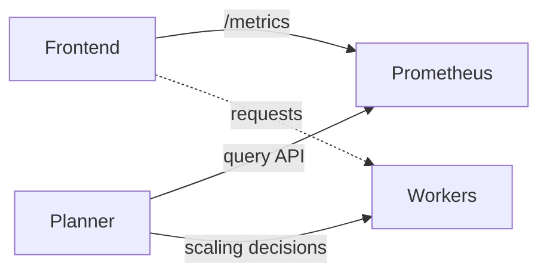

# SLA-based Planner

> [!TIP]
> **New to SLA Planner?** For a complete workflow including profiling and deployment, see the [SLA Profiling + Planner Quick Start Guide](sla-planner-quickstart.md).

This document covers information regarding the SLA-based planner in `examples/common/utils/planner_core.py`.

The SLA (Service Level Agreement)-based planner is an intelligent autoscaling system that monitors system performance and adjusts the number of prefill and decode workers to meet specified TTFT and ITL targets. Unlike the load-based planner that scales based on resource utilization thresholds, the SLA planner uses predictive modeling and performance interpolation to proactively scale the workers.

> [!NOTE]
> Currently, SLA-based planner only supports disaggregated setup.

> [!WARNING]
> Bare metal deployment with local connector is deprecated. Please deploy the SLA planner in k8s.

## Architecture Overview

**Components:**
- **Frontend**: Serves requests and exposes `/metrics`
- **Prometheus**: Scrapes frontend metrics every 5s (by default, can be updated in the podmonitor manifest)
- **Planner**: Queries Prometheus and adjusts worker scaling every adjustment interval
- **Workers**: prefill and backend workers handle inference

The adjustment interval can be defined in the planner manifest as an argument. The default interval value can be found in this [file](https://github.com/ai-dynamo/dynamo/tree/main/components/src/dynamo/planner/defaults.py).



## Features

* **SLA-driven scaling**: Automatically scales prefill/decode workers to meet TTFT and ITL targets
* **Predictive load forecasting**: Uses ARIMA, Prophet, or constant predictors to forecast future load
* **Performance interpolation**: Leverages profiling results data from pre-deployment profiling for accurate scaling decisions
* **Correction factors**: Adapts to real-world performance deviations from profiled data

## Design

The SLA planner consists of several key components:

1. **Load Predictors**: Forecast future request patterns (number of requests, input/output sequence lengths)
2. **Performance Interpolators**: Estimate TTFT and ITL based on profiled performance data
3. **Correction Factors**: Adjust predictions based on observed vs. expected performance
4. **Scaling Logic**: Calculate optimal number of prefill/decode replicas to meet SLA targets

## SLA-Driven Pre-Deployment Profiling

**Prerequisite**: SLA-based planner requires pre-deployment profiling to be completed before deployment. The profiling process analyzes your model's performance characteristics to determine optimal tensor parallelism configurations and scaling parameters that the planner will use during operation.

See [Pre-Deployment Profiling](../benchmarks/sla-driven-profiling.md) for detailed instructions on running the profiling process.

## Load Prediction

The SLA planner use load predictor to predict the number of requests, ISL, and OSL in the next adjustment interval. Currently, three load prediction model is supported:

### Constant Predictor
- **Use case**: Stable and long prediction interval
- **Behavior**: Assumes next load equals current load
- **Configuration**: `load-predictor: "constant"`

### ARIMA Predictor
- **Use case**: Time-series data with trends and seasonality
- **Behavior**: Uses auto-ARIMA to fit optimal model parameters
- **Configuration**: `load-predictor: "arima"`

### Prophet Predictor
- **Use case**: Complex seasonal patterns and trend changes
- **Behavior**: Facebook's [Prophet](https://facebook.github.io/prophet/) model for time-series forecasting
- **Configuration**: `load-predictor: "prophet"`

## Scaling Algorithm

SLA planner uses a sophisticated scaling algorithm. At each adjustment interval, SLA planner performs the following operations:

### 1. Metric Collection
Every adjustment interval, collect:
- Average Time to First Token (TTFT)
- Average Inter-Token Latency (ITL)
- Request count and duration
- Input/Output sequence lengths

### 2. Correction Factor Calculation
Using the collected metrics, SLA planner applies the interpolator to find out the expected TTFT/ITL and calibrate the interpolation model. This step is important because the actual TTFT/ITL can often be different than the ideal world:
- **TTFT**: actual TTFT heavily depends on request queueing and prefix cache hit rate (if use kv reuse). For example, if all requests arrives at the beginning of the adjustment interval, they queue heavily and TTFT will be significantly higher. If prefix cache hit rate is very high, the actual number of tokens in the prefill will be very low and TTFT will be significantly lower.
- **ITL**: actual ITL maybe affected by chunked small prefill request in decode engine.
- **Metric variances**: large variances in request rate, ISL, and OSL may lead to inaccurate estimation of the TTFT/ITL since SLA only consider the average when interpolating.

SLA planner calculate the correction factor with
- **Prefill correction**: `actual_ttft / expected_ttft`
- **Decode correction**: `actual_itl / expected_itl`

### 3. Load Prediction
SLA planner forecasts these metric in the next interval using the load predictor
- Number of requests
- Input sequence length
- Output sequence length

### 4. Calculating Number of Replicas

**Prefill replicas**: SLA planner assumes the prefill correction factor has linear affect on the prefill throughput per GPU as prefill is single-batched.
```
predicted_load = next_requests * next_isl / interval * min(1, prefill_correction)
prefill_replicas = ceil(predicted_load / interpolated_throughput / gpus_per_engine)
```

**Decode replicas**:
```
# 1. apply d_correction_factor to the ITL SLA
corrected_itl = self.args.itl / self.d_correction_factor
# 2. reversely find out what is best throughput/gpu that can achieve corrected_itl under the predicted context length
pred_decode_thpt_per_gpu = self.decode_interpolator.find_best_throughput_per_gpu(
    itl=corrected_itl,
    context_length=next_isl + next_osl / 2
)
# 3. compute number of decode replicas needed
next_num_d = math.ceil(next_num_req * next_osl / self.args.adjustment_interval / pred_decode_thpt_per_gpu / self.args.decode_engine_num_gpu)
```

### 5. Scaling

Finally, SLA planner applies the change by scaling up/down the number of prefill and decode workers to the calculated number of replica in the next interval.

> [!NOTE]
> SLA-planner scales up/down the P/D engines non-blockingly. If `adjustment-interval` is too short, the previous scaling operations may not finish before the new scaling operations are issued. Make sure to set a large enough `adjustment-interval`.

## Deploying

For complete deployment instructions, see the [SLA Planner Quick Start Guide](sla-planner-quickstart.md).

> [!NOTE]
> The SLA planner requires a frontend that reports metrics at the `/metrics` HTTP endpoint with the number of requests, ISL, OSL, TTFT, and ITL in the correct format. The dynamo frontend provides these metrics automatically.

### Virtual Deployment

The SLA planner supports virtual deployment mode for customized environments (e.g., customized cluster) through the `VirtualConnector`. This connector enables the planner to communicate scaling decisions without directly managing the deployment infrastructure.

The `VirtualConnector` acts as a bridge between the SLA planner and external deployment environments. Instead of directly scaling Kubernetes resources, it writes scaling decisions and waits for the deployment environment to acknowledge completion.

#### Scaling Decision Flow

1. **Decision Generation**: The planner calculates optimal worker counts
2. **Change Detection**: The planner skips scaling if the target counts match current counts, logging: `"No scaling needed (prefill=X, decode=Y)"`
3. **Readiness Check**: Before making new decisions, the planner verifies that previous scaling operations have completed by checking if `scaled_decision_id >= decision_id`
4. **Timeout Handling**: If a scaling decision isn't acknowledged within 30 minutes (1800 seconds), the planner proceeds with new decisions anyway
5. **Completion Tracking**: The planner can optionally wait for scaling completion confirmation (blocking mode)

#### Configuration

To use virtual deployment mode:

```yaml
environment: "virtual"
backend: "vllm"  # or "sglang"
```

#### Deployment Environment Requirements

The external deployment environment must use `VirtualConnectorClient`:

```
from dynamo._core import DistributedRuntime, VirtualConnectorClient

client = VirtualConnectorClient(distributed_runtime, namespace)
```

1. **Monitor Planner**: Continuously watch for scaling decisions: `await client.wait()`. This blocks until there is a change.
2. **Parse Decisions**: Read `num_prefill_workers` and `num_decode_workers` values: `decision = await client.get()`
3. **Execute Scaling**: Apply the scaling decisions to the actual deployment infrastructure
4. **Acknowledge Completion**: Mark the decision completed when scaling is finished: `await client.complete(decision)`

A scaling decision (returned by `client.get()`) contains the following fields, which are -1 if not set yet:
- `num_prefill_workers`: Integer specifying the target number of prefill workers
- `num_decode_workers`: Integer specifying the target number of decode workers
- `decision_id`: Integer with incremental ID for each scaling decision

See `components/planner/test/test_virtual_connector.py` for a full example.

