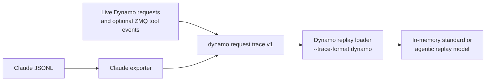

<!--
SPDX-FileCopyrightText: Copyright (c) 2025-2026 NVIDIA CORPORATION & AFFILIATES. All rights reserved.
SPDX-License-Identifier: Apache-2.0
-->

# Coding Trace Export

Rust-native exporters for privacy-preserving coding-agent traces.

## Claude Exporter

The Claude exporter lives in `dynamo-bench` and is invoked as:

```bash
cargo run -p dynamo-bench --bin claude_trace_export \
  --no-default-features --features claude-trace-export -- \
  --output-file /tmp/claude_trace.jsonl
```

That command writes two files:

- `dynamo.request.trace.v1` JSONL with request/tool events, usage-shaped replay hashes, and Claude root/subagent identity in `agent_context`
- Sidecar JSONL: text-free structural metadata such as context shape, top-level tool calls, and nested progress-derived timing

The sidecar path is derived from the output path by inserting `.sidecar` before the extension.

## Default Discovery

If `--input-path` is omitted, the exporter:

1. Starts from the current working directory.
2. Walks every ancestor directory upward to `/`.
3. For each ancestor, checks the matching encoded Claude project directory under `~/.claude/projects/<encoded-absolute-path>`.
4. Also scans the home-level Claude root `~/.claude/projects`.

`history.jsonl` is ignored. Session-local `subagents/*.jsonl` files are included.

## Optional Input Override

Use `--input-path` to restrict the export to a specific file or directory:

```bash
cargo run -p dynamo-bench --bin claude_trace_export \
  --no-default-features --features claude-trace-export -- \
  --input-path ~/.claude/projects/<encoded-path> \
  --output-file /tmp/claude_trace.jsonl
```

`--input-path` may point to:

- a specific Claude session JSONL file
- an encoded Claude project directory under `~/.claude/projects`
- a repo root whose encoded Claude project directory should be used
- a directory containing Claude session JSONL files

## Important Flags

```bash
cargo run -p dynamo-bench --bin claude_trace_export \
  --no-default-features --features claude-trace-export -- \
  --input-path ~/.claude/projects/<encoded-path> \
  --tokenizer deepseek-ai/DeepSeek-R1-Distill-Llama-8B \
  --block-size 64 \
  --delta-overlap-words 50 \
  --tokenizer-workers 8 \
  --output-file /tmp/claude_trace.jsonl
```

- `--anonymize-session-id`: replace Claude session IDs with stable anonymized IDs
- `--delta-overlap-words`: approximate tokenization by re-tokenizing only the final `N` words of the previous prompt plus the new delta; default is `50`
- `--tokenizer-workers`: number of worker threads used for session-parallel tokenization

## Parsing Semantics

The exporter:

- uses top-level non-sidechain `user`, `assistant`, and `system` rows for the main transcript
- reconstructs each `subagents/*.jsonl` file as a separate child session
- groups assistant fragments by `requestId`, then `message.id`, across interleaved tool-result rows
- excludes `thinking` and `redacted_thinking`
- pairs `compact_boundary` with its injected `isCompactSummary` row and emits the otherwise-hidden summarizer request
- resets post-compaction transcript state to the summary while retaining Claude's observed stable cache prefix
- skips local command wrapper noise such as `<local-command-caveat>`, `<local-command-stdout>`, and command wrapper rows
- preserves top-level tool-use and tool-result structure in hashed text form
- emits matched `tool_end` / `tool_error` events with Claude-observed timing
- records each tool's source request, consuming request, child session, and blocking/background execution mode under the Claude-only `tool.claude` replay metadata
- treats an asynchronous Agent launch result as an acknowledgement; the tool completes at its matching queued completion notification and joins the first later parent request
- mines `progress` rows for text-free sidecar metrics only

## Output Semantics

- Root turns use Claude `sessionId` as `agent_context.session_id`.
- Child turns use Claude `agentId` as `session_id`; completed Agent results recover the immediate `parent_session_id`, with root `sessionId` as the fallback.
- Request ingress is approximated by the most recent preceding user/tool-result timestamp. EOF does not imply `session_final`, because Claude sessions can resume.
- Source Claude timestamps are parsed as UTC and normalized to millisecond replay timing; recorder-envelope timestamps are relative to the first request.
- When Claude usage is present, input length and cached-prefix shape come from `input_tokens + cache_creation_input_tokens + cache_read_input_tokens`. The sequence hashes are deterministic synthetic hashes because local Claude JSONL omits the system prompt and complete tool schemas needed to reproduce wire-exact token IDs. The sidecar records this as `replay_hash_fidelity=synthetic_usage_shaped`.
- The synthetic compaction request keeps Claude's `preTokens` input length, reuses every recoverable pre-compaction prefix block, and reserves a synthetic suffix for the unknown instruction. Its duration and context sizes come from `compactMetadata`; output length comes from tokenizing `isCompactSummary` because `postTokens` is post-compaction context size, not summary output. The exporter omits `cached_tokens` because Claude does not record cache usage for this hidden request.
- The first post-compaction request reuses exactly Claude's observed `cache_read_input_tokens`, writes the new summary suffix once, and makes that suffix available to later turns. A full cache reset and a zero-write summary are both intentionally avoided.
- Rows are written incrementally as turns are merged across sessions.
- Every export runs a source-to-output fidelity verifier. Request and compaction cardinality/timing, usage, tool classes/errors, child links, pre-compaction and post-compaction cached-prefix hashes, and forward causal references fail the export on mismatch.
- The verifier always prints non-fatal source limitations: synthetic KV hashes, unmatched tools, missing background completions, unresolved child sessions, and `ai-title` rows that lack enough timing/usage data to replay as requests.
- `tool.claude` is exporter-only replay evidence, not a requirement for live request-trace or ZMQ tool-event producers. Direct replay consumes it while reconstructing the in-memory request graph and falls back to timestamps when it is absent.
- `request.claude.compaction` is likewise exporter-only evidence. Direct replay ignores the metadata and replays the row as an ordinary model request.

## Replay Metadata Flow



The Claude exporter adds `tool.claude` causality and `request.claude.compaction` evidence to the canonical request trace. The direct replay loader consumes tool causality while the compaction row follows the ordinary request path. Live traces can omit both Claude-only objects. Neither path writes an intermediate Mooncake file.
