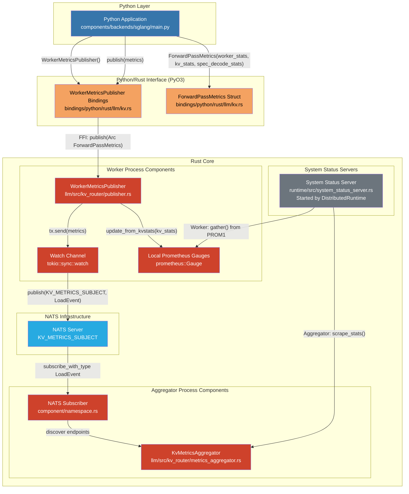
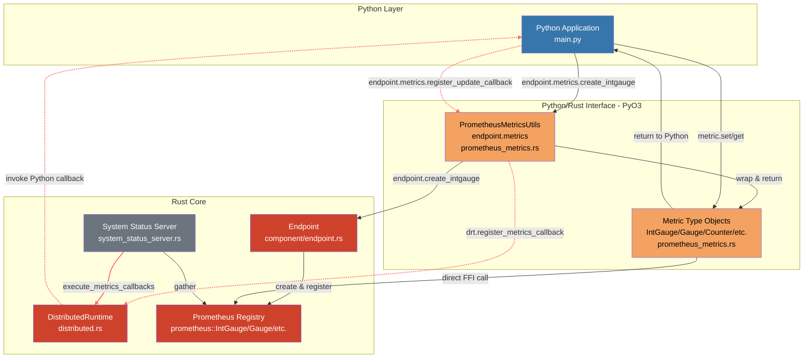

<!-- SPDX-FileCopyrightText: Copyright (c) 2025 NVIDIA CORPORATION & AFFILIATES. All rights reserved. -->
<!-- SPDX-License-Identifier: Apache-2.0 -->

# Dynamo MetricsRegistry for Python

Python MetricsRegistry allows you to create and manage Prometheus metrics from Python:

- **Metric Types**: Counter, IntCounter, Gauge, IntGauge, Histogram, and their Vec variants (CounterVec, IntCounterVec, GaugeVec, IntGaugeVec)
- **Metric Introspection**: Access metric names, constant labels, and variable label names
- **Automatic Registration**: Metrics are automatically registered with the component hierarchy (namespace/component/endpoint) and available on the HTTP system status server
- **Optional Callback Support**: Register Python callbacks to update metrics before scraping

Example:
```python
from dynamo.runtime import DistributedRuntime

async def main():
    drt = DistributedRuntime()
    endpoint = drt.namespace("ns").component("comp").endpoint("ep")

    # Create metrics
    counter = endpoint.metrics.create_intcounter("requests_total", "Total requests")
    gauge_vec = endpoint.metrics.create_intgaugevec(
        "active_connections",
        "Active connections by status",
        ["status"],  # variable labels
        [("region", "us-west")]  # constant labels
    )

    # Introspect metrics
    print(counter.name())           # "ns_comp_ep_requests_total"
    print(counter.const_labels())   # {"dynamo_namespace": "ns", ...}
    print(gauge_vec.variable_labels())  # ["status"]

    # Use metrics
    counter.inc()
    gauge_vec.set(5, {"status": "active"})
```

## Python-Rust Metrics Integration

This directory demonstrates two methods for passing metrics between Python and Rust in the Dynamo runtime.

### Method 1: ForwardPassMetrics Pub/Sub via NATS (Legacy method for passing metrics)

Python maintains its own metrics dictionary, serializes it, and publishes to NATS. Rust subscribes to NATS, deserializes the metrics, and updates Prometheus gauges.

**Communication pattern**: Unidirectional (Python → NATS → Rust). Python publishes metrics; no feedback from Rust to Python.

**Example**: Used by `WorkerMetricsPublisher` in production code

```python
from dynamo.llm import WorkerMetricsPublisher, ForwardPassMetrics

# Create publisher
publisher = WorkerMetricsPublisher()
await publisher.create_endpoint(component, metrics_labels)

# Python maintains its own metrics dict
metrics_dict = {
    "num_running_reqs": 5,
    "num_waiting_reqs": 10,
    "gpu_cache_usage": 0.75,
}

# Serialize and publish to NATS
metrics = ForwardPassMetrics(metrics_dict)
publisher.publish(metrics)

# Rust subscribes to NATS, deserializes, and updates Prometheus
```

### Adding/Changing Metrics in Method 1

When you need to add or modify metrics in Method 1 (ForwardPassMetrics Pub/Sub via NATS), you must update **multiple files**:

1. **`lib/llm/src/kv_router/protocols.rs`** - Add field to struct (WorkerStats is part of ForwardPassMetrics):
   ```rust
   pub struct WorkerStats {
       pub request_active_slots: u64,
       pub request_total_slots: u64,
       pub num_requests_waiting: u64,
       pub new_metric_field: u64,  // ADD THIS
   }
   ```

2. **`lib/llm/src/kv_router/publisher.rs`** - Manually create Prometheus gauge using DRT:
   ```rust
   fn new(component: &Component) -> Result<Self> {
       use dynamo_runtime::metrics::MetricsRegistry;

       // ... existing gauges ...

       // Manually create and register new Prometheus gauge
       let new_metric_gauge = component.create_gauge(
           "new_metric_name",
           "Description of new metric",
           &[],  // labels
       )?;

       // Store in struct
       Ok(KvStatsPrometheusGauges {
           kv_active_blocks_gauge,
           kv_total_blocks_gauge,
           gpu_cache_usage_gauge,
           gpu_prefix_cache_hit_rate_gauge,
           new_metric_gauge,  // ADD THIS
       })
   }
   ```

3. **`lib/llm/src/kv_router/publisher.rs`** - Update gauge in `update_from_kvstats()`:
   ```rust
   fn update_from_kvstats(&self, kv_stats: &KvStats) {
       // ... existing updates ...
       self.new_metric_gauge.set(worker_stats.new_metric_field as f64);
   }
   ```

4. **`components/backends/sglang/.../publisher.py`** - Update Python code to compute new metric:
   ```python
   def collect_metrics():
       worker_stats = WorkerStats(
           request_active_slots=...,
           new_metric_field=compute_new_metric(),  # ADD THIS
       )
   ```

**Result**: Changes require touching 3-4 files across Rust and Python codebases.

### Method 2: Dynamo MetricsRegistry in Python

Python creates typed metric objects using `endpoint.metrics.create_*()` methods, which automatically register with the endpoint. Python updates values through these objects with methods that have type hints (via `.pyi` files). Rust creates the underlying Prometheus metrics and calls Python callbacks before scraping.

**Communication pattern**: Currently unidirectional (Python → Rust for updates, Rust → Python for callback invocation). Could be extended to bidirectional communication in the future (e.g., Rust notifying Python of scrape events, configuration changes) without major architectural changes.

**Key advantage:** No Rust code modifications needed - metrics are defined and updated entirely in Python.

This method supports two update patterns:

#### Example A: Background Thread Updates (server_with_loop.py)

Update metrics continuously from a background thread, independent of scraping:

```python
# Create metric objects (automatically registered)
# Note: Prometheus prefixes these with "dynamo_component_", so they appear as:
#   - dynamo_component_request_total_slots
#   - dynamo_component_gpu_cache_usage_percent
request_slots: IntGauge = endpoint.metrics.create_intgauge(
    "request_total_slots", "Total request slots available"
)
gpu_usage: Gauge = endpoint.metrics.create_gauge(
    "gpu_cache_usage_percent", "GPU cache usage percentage"
)

# Background thread continuously updates metrics
def update_metrics_in_loop():
    count = 0
    while True:
        count += 1
        request_slots.set(1024 + count)
        gpu_usage.set(0.01 + (count * 0.01))
        time.sleep(2)

updater = threading.Thread(target=update_metrics_in_loop, daemon=True)
updater.start()
```

#### Example B: Callback-based Updates (server_with_callback.py)

Register a callback that updates metrics on-demand when Prometheus scrapes the `/metrics` endpoint:

```python
# Create metric objects (automatically registered)
# Note: Prometheus prefixes these with "dynamo_component_", so they appear as:
#   - dynamo_component_request_total_slots
#   - dynamo_component_gpu_cache_usage_percent
request_slots: IntGauge = endpoint.metrics.create_intgauge(
    "request_total_slots", "Total request slots available"
)
gpu_usage: Gauge = endpoint.metrics.create_gauge(
    "gpu_cache_usage_percent", "GPU cache usage percentage"
)

# Register callback for dynamic updates before scraping
def update_metrics():
    request_slots.set(compute_current_slots())
    gpu_usage.set(get_gpu_usage())

endpoint.metrics.register_update_callback(update_metrics)
```

Both examples support vector metrics with labels:

```python
# Create vector metrics with labels
worker_requests: IntGaugeVec = endpoint.metrics.create_intgaugevec(
    "worker_active_requests",
    "Active requests per worker",
    ["worker_id", "model"]
)

# Update vector metrics with specific label values
worker_requests.set(5, {"worker_id": "worker_1", "model": "llama-3"})
worker_requests.set(3, {"worker_id": "worker_2", "model": "llama-3"})
```

#### Available Metric Types

Method 2 supports all standard Prometheus metric types:

- **Gauges**: `Gauge` (float), `IntGauge` (integer)
- **GaugeVec**: `GaugeVec` (float with labels), `IntGaugeVec` (integer with labels)
- **Counters**: `Counter` (float), `IntCounter` (integer)
- **CounterVec**: `CounterVec` (float with labels), `IntCounterVec` (integer with labels)
- **Histograms**: `Histogram`

All metrics are imported from `dynamo.prometheus_metrics`.

#### Adding/Changing Metrics in Method 2

When you need to add or modify metrics in Method 2 (Dynamic Registration), you only update **Python code**:

1. **Create new metric** - Just add one line in Python (automatically registered):
   ```python
   new_metric: IntGauge = endpoint.metrics.create_intgauge(
       "new_metric_name", "Description of the metric"
   )
   ```

2. **Update in callback** - Add update logic:
   ```python
   def update_metrics():
       request_slots.set(compute_slots())
       gpu_usage.set(compute_gpu_usage())
       new_metric.set(compute_new_metric())  # ADD THIS
   ```

3. **For vector metrics with labels** - Create with label names, update with label values:
   ```python
   # Create vector metric
   new_vec: IntGaugeVec = endpoint.metrics.create_intgaugevec(
       "new_metric_vec", "Description", ["label1", "label2"]
   )

   # Update with specific label values
   new_vec.set(100, {"label1": "value1", "label2": "value2"})
   ```

**Result**: Changes only require modifying Python code. No Rust changes needed. Metrics are automatically created and registered with Prometheus by the Rust runtime when you call `create_*()`.

#### Type-Hinted Methods

Dynamic Registration provides type hints (via `.pyi` stub files) for typed metric classes:

- **Gauges** use `.set()`, `.get()`, `.inc()`, `.dec()`, `.add()`, `.sub()`
- **Counters** use `.inc()`, `.inc_by()`, `.get()` (counters only increase)
- **Histograms** use `.observe()`
- **Vec metrics** take a `labels: Dict[str, str]` parameter for operations

### Architecture Diagrams

#### Component Architecture

##### Method 1: ForwardPassMetrics Pub/Sub via NATS - Component View



##### Method 2: Dynamic Registration - Component View



### Running the Examples

The examples demonstrate Method 2 (Dynamo MetricsRegistry in Python) with two different update patterns.

#### Prerequisites

Update Python bindings if needed:
```bash
cd ~/dynamo/lib/bindings/python
maturin develop
```

#### Run Example A: Background Thread Updates

```bash
cd ~/dynamo/lib/bindings/python/examples/metrics
DYN_SYSTEM_ENABLED=true DYN_SYSTEM_PORT=8081 ./server_with_loop.py
```

#### Run Example B: Callback-based Updates

```bash
cd ~/dynamo/lib/bindings/python/examples/metrics
DYN_SYSTEM_ENABLED=true DYN_SYSTEM_PORT=8081 ./server_with_callback.py
```

**Note:** The environment variables are required:
- `DYN_SYSTEM_ENABLED=true` - Enables the system status server
- `DYN_SYSTEM_PORT=8081` - Sets the port for the metrics endpoint

#### Check the Metrics

The metrics are served via the system status server at:

```bash
curl http://localhost:8081/metrics
```

Expected output includes:

```
# HELP request_total_slots Total request slots available
# TYPE request_total_slots gauge
request_total_slots{dynamo_namespace="ns556",dynamo_component="cp556",dynamo_endpoint="ep556"} 1024

# HELP gpu_cache_usage_percent GPU cache usage percentage
# TYPE gpu_cache_usage_percent gauge
gpu_cache_usage_percent{dynamo_namespace="ns556",dynamo_component="cp556",dynamo_endpoint="ep556"} 0.00

# HELP worker_active_requests Active requests per worker
# TYPE worker_active_requests gauge
worker_active_requests{dynamo_namespace="ns556",dynamo_component="cp556",dynamo_endpoint="ep556",worker_id="worker_1",model="llama-3"} 5
worker_active_requests{dynamo_namespace="ns556",dynamo_component="cp556",dynamo_endpoint="ep556",worker_id="worker_2",model="llama-3"} 3

# HELP internal_update_count Number of times metrics callback was invoked
# TYPE internal_update_count counter
internal_update_count{dynamo_namespace="ns556",dynamo_component="cp556",dynamo_endpoint="ep556",type="internal"} 1
```

Each time you query the `/metrics` endpoint, the `update_metrics()` callback is invoked, updating the metric values with fresh data.
