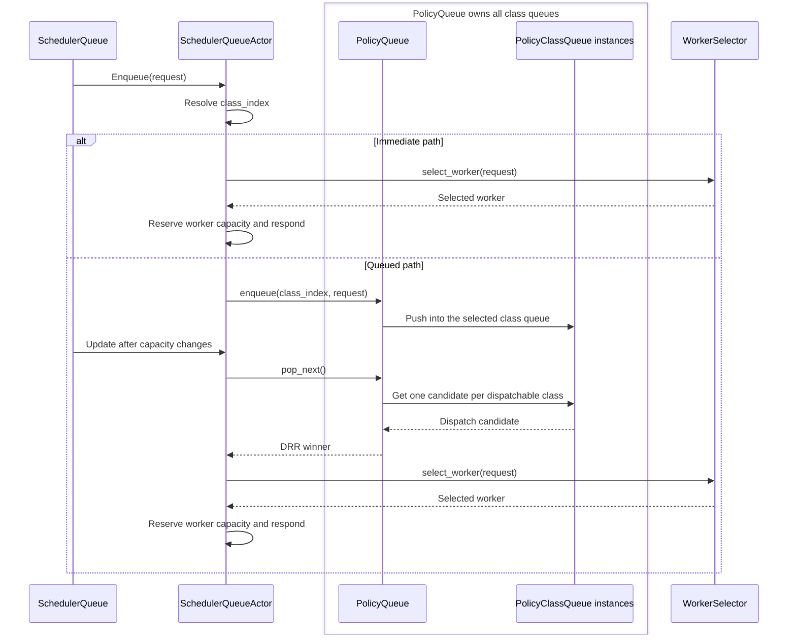

# lib/kv-router/src/scheduling

Scheduling decides whether a request can run now, which worker should receive it, and how its load is recorded while it runs.

## Queue hierarchy

There is one `SchedulerQueueActor` per scheduler. It owns one outer `PolicyQueue`, which owns one `PolicyClassQueue` for every class in the resolved profile.



- `SchedulerQueue` is the public handle that sends commands to the actor.
- `SchedulerQueueActor` classifies each request and chooses the immediate or queued path.
- `PolicyQueue` does not classify requests. It owns all class queues and uses deficit round robin (DRR) to give each class weighted turns.
- Each `PolicyClassQueue` owns ordering and accounting for one class such as `latency`, `agents`, or `batch`.
- `SchedulerQueueActor::admit_one` performs final worker selection and reserves worker capacity after either path.
- A single-class profile still uses `PolicyQueue`, but DRR has no cross-class effect.

## Per-class ready storage

`PolicyQueueEntry<T>` is one queued payload plus its class index, priority key, enqueue sequence, and token/accounting snapshot. In production, `T` is `QueuedRequest`, which wraps the `SchedulingRequest`, enqueue timestamp, and optional block hashes.

```text
PolicyClassQueue("agents")
├── pending: BinaryHeap<PolicyQueueEntry>                 # WorkerPlacement::Any
├── ready_by_worker: FxHashMap<WorkerWithDpRank, BinaryHeap<PolicyQueueEntry>>
│   ├── Worker(7, dp_rank=0) → heap of requests pinned to that rank
│   └── Worker(9, dp_rank=1) → heap of requests pinned to that rank
├── blocked_workers: FxHashSet<WorkerWithDpRank>
└── candidate_worker_heads: BTreeSet<WorkerLaneHead>       # one head per unblocked lane
```

- `pending` is the shared ready heap for requests where the existing selector may choose any eligible worker.
- `ready_by_worker` contains requests pinned to a particular worker and data-parallel rank. Each worker/rank heap is removed when its last request leaves.
- `candidate_worker_heads` tracks the highest-priority request for each worker. A worker is removed from this index while it is full, then checked again when capacity changes.
- A `PolicyClassQueue` does not own worker configuration, capacity, or scoring state. `WorkerWithDpRank` only identifies a queue pinned to one worker/rank; the actor and selector retain worker knowledge.
- Every heap uses the class's configured priority ordering. `BinaryHeap::peek()` reads its highest-priority root in O(1); push and pop are O(log n).
- `PolicyClassQueue::next_dispatchable` compares the shared root with the highest indexed worker head. It removes blocked worker heads until it finds a dispatchable one, so each blocked lane is checked once per capacity update rather than once per pop.
- `round_cursor` marks which class receives the next weighted turn. `carry_class` lets a class spend its unused share before that turn, but only if `next_dispatchable` confirms that its next request can run.
- A full Worker 7 can block only Worker 7's first request. It cannot hide a ready request for Worker 9 or one that can run on any worker.

## Policy-class admission lifecycle

- **Decide:** A request using admission control (`TrackedWithAdmission`) and its cleanup handle (`AdmissionLease`) enter `SchedulerQueueActor`, the single task that owns admission and queue state. The policy can opt out (`Bypass`), allow the request to proceed (`Ready`), or hold it (`Defer`).
- **Wait or choose a worker:** A ready request runs now if capacity is available; otherwise it waits. A deferred request waits until the policy releases it with `MakeReady`. Choosing an exact worker may move the request to a different queue, but the original policy still receives its status updates. Queue limits apply when new requests arrive, not when an existing request moves.
- **Give the router cleanup ownership:** After the actor records which version of the request it owns, it activates the cleanup handle. Selection returns the chosen worker, a context-token counter that only moves forward, and the handle. The LLM router puts both into `RequestGuard` before sending the request to the backend, so dispatch failure or cancellation still releases scheduler state.
- **Run and stream:** After the backend accepts the request, `RequestGuard` first records that fact on the cleanup handle, then notifies the actor through the bounded command queue. Response items update the current context-token count. `Stop`, `EoS`, and `Length` mark the request complete before the item reaches the caller; a normal stream close also completes, while cancellation and errors abort.
- **Release resources:** When `RequestGuard` finishes or is dropped, its cleanup handle is added to the shared cleanup queue. One bounded wake can cover a batch of dropped requests. The actor drains all pending cleanup, releases worker capacity, and tells the policy whether each request completed or aborted. Do not replace this with an unbounded channel or a new task for every dropped request.

## Guardrails

- A request ID identifies at most one active scheduler request. Do not reuse it until the prior request has been cleaned up; cancellation and admission state are keyed by request ID.
- `SchedulerQueueActor::admit_one` is the required admission path: compute projected
  load, select a worker, skip the capacity reservation if the response receiver
  is closed, then reserve capacity before responding. Failed response delivery
  must release that capacity. Do not bypass this for normal scheduling.
- Do not remove or weaken `admission_gate` without proving selection and
  capacity reservation cannot assign more work than the workers can hold.
- Potential-load projection must go through
  `ActiveSequencesMultiWorker::potential_blocks_and_tokens_at(...)` with
  `SchedulingRequest::prefill_token_deltas()`. Do not scan per-worker
  `ActiveSequences` directly from scheduling.
- `SchedulingRequest` helper methods are the single source for effective
  cached tokens, effective overlap, worker allowance, prefill-token defaults,
  and request block count. Do not duplicate this logic in policies or selectors.
- Weighted shortest processing time (WSPT) must use cache-aware prefill cost: pinned requests use the pinned worker's
  effective cached tokens; unpinned requests use the best allowed worker. Do not
  silently fall back to raw input sequence length (ISL) unless tracking is disabled or cache data is
  absent.
- Pinned-worker and allowed-worker constraints must be validated before
  selection and respected by queue capacity checks, selector candidate
  iteration, and WSPT priority.
- Prefill load hints are computed at scheduler/request boundaries from
  selected-worker `cached_tokens`. Do not move ISL/cache-token math back into
  `ActiveSequences`.
- Selectors should be side-effect free: no capacity reservation, no queue mutation, and no
  `PromptRegistry` mutation.
- Do not hold the pending-heap lock while selecting, reading worker capacity,
  responding, or awaiting. The queue heap is only for waiting requests.
- Do not hold `workers_with_configs.borrow()` across `.await`; take a short
  synchronous snapshot or borrow for selection only.
- Any change to queue ordering, WSPT keys, capacity checks, admission
  serialization, or selector scoring should include focused tests and
  before/after routing or queue benchmarks.
- Keep text and external IDs such as request IDs on standard hash collections.
  Use `FxHashMap` / `FxHashSet` for internal numeric hot-path keys only.
