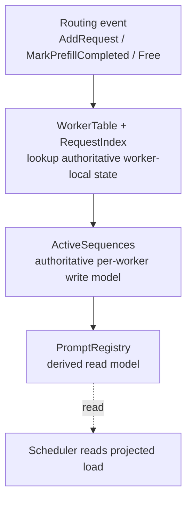

# Sequence State Model

This directory implements the router's active-sequence state for local request routing and replica sync.

For the local, non-remote path, the model is intentionally organized as a one-way write pipeline:

## Source of truth

- `topology.rs` owns `WorkerTable`, which maps a worker identity to its slot.
- `request_maps.rs` owns `RequestIndex`, which maps `request_id -> worker`.
- `single.rs` owns `ActiveSequences`, the authoritative per-worker request, prefill, and block state.
- `prompt_registry.rs` owns `PromptRegistry`, which is not a source of truth. It is a derived routing view.

The local orchestrator in `multi_worker.rs` reads `WorkerTable` and `RequestIndex`, mutates the chosen worker's `ActiveSequences`, then projects the resulting membership/load delta into `PromptRegistry`.

## Why this is a DAG

Within a single local mutation, data moves in one direction:

`event -> authoritative state -> derived read model -> scheduler`

`PromptRegistry` does not write back into `ActiveSequences`, so there is no write-back loop inside the local mutation path.

At runtime there is still a control loop over time, because the scheduler reads the derived view and later emits the next `AddRequest`. That is a system feedback loop, not cyclic state ownership.

## Torn reads are intentional

`PromptRegistry` is allowed to be only eventually consistent with `ActiveSequences`.

That means a reader may temporarily observe:

- a worker-load snapshot from one moment
- prompt membership from another moment
- a combined view that never existed atomically

This is an intentional tradeoff. The derived read model is optimized for lower contention and higher concurrency, not perfect snapshot consistency.

The important safety boundary is:

- lifecycle and ownership invariants live in the write model (`WorkerTable`, `RequestIndex`, `ActiveSequences`)
- scheduling quality lives in the read model (`PromptRegistry`)

So a stale or torn read can lead to a suboptimal routing choice, but it should not cause catastrophic invariant breakage such as losing request ownership or corrupting block membership.

## Eventual consistency contract

- Local writes update `ActiveSequences` first.
- `PromptRegistry` is projected from that authoritative state afterward.
- Replica sync and scheduler decisions may lag behind temporarily.
- The system accepts this lag because the read side is advisory.

This is the core design: a strict local write DAG with an eventually consistent read projection.

## Modeled remaining prefill time

The slot tracker also exposes an internal derived read for modeled remaining prefill time per worker.
This value is computed from admission-time prefill duration hints already stored in `ActiveSequences`,
then projected through `PromptRegistry` with the same advisory read semantics as token load.

This read is not a routing input, protocol payload, metric, or authoritative engine timing signal.
It returns non-negative milliseconds. Elapsed time from the oldest active prefill is applied to the
aggregate modeled backlog, so spillover can reduce later modeled prefills before the final worker
backlog clips at zero. That behavior is intentional because engines may batch or overlap multiple
prefills faster than the per-request model represents.

The active-token load view uses the same aggregate spillover only when all active prefills have
modeled durations. If any active prefill lacks an expected duration, token load falls back to
anchor-only decay so unmodeled no-AIC/default requests do not decay. A zero-duration anchor is treated
as completing its own tokens immediately without inventing token spillover into later requests.
This token-load approximation assumes active modeled prefills have roughly uniform tokens/sec.

If a modeled non-anchor prefill is removed before the anchor, the tracker credits that completed work
by shifting the effective anchor forward by the removed request's modeled duration, capped at the
removal time. This keeps completed non-anchor work from also counting as elapsed progress against the
remaining modeled backlog. `Free` keeps its existing implicit prefill-completion cleanup behavior and
applies the same credit when the prefill is still tracked. Replica-synced state remains advisory and
receive-time anchored.

When any active prefill for a worker lacks an expected duration, the modeled-time read returns
`Err(MissingExpectedDuration)`. That is the normal default/no-AIC or prediction-failed state, and the
tracker fast-returns from the derived snapshot without summing active prefills in that case.
