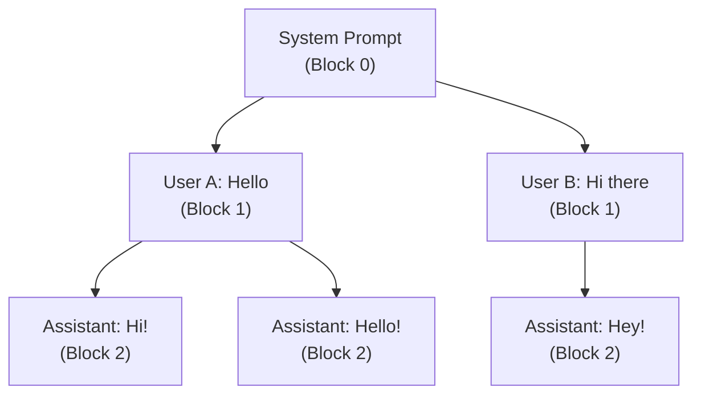
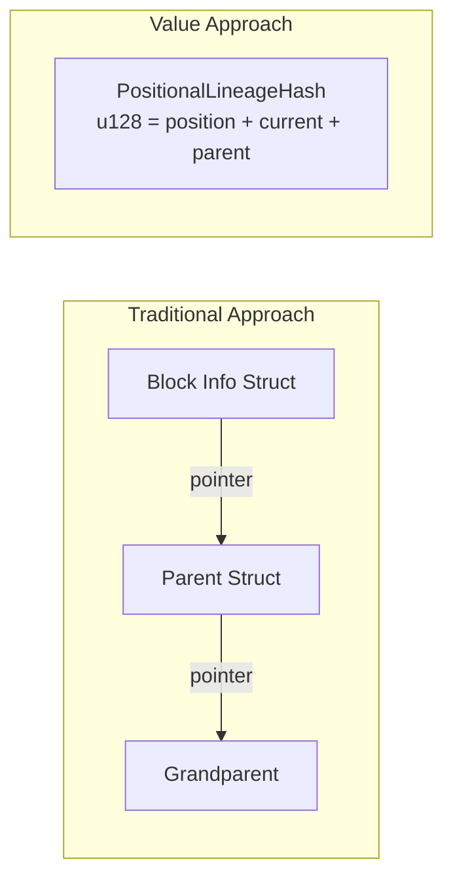
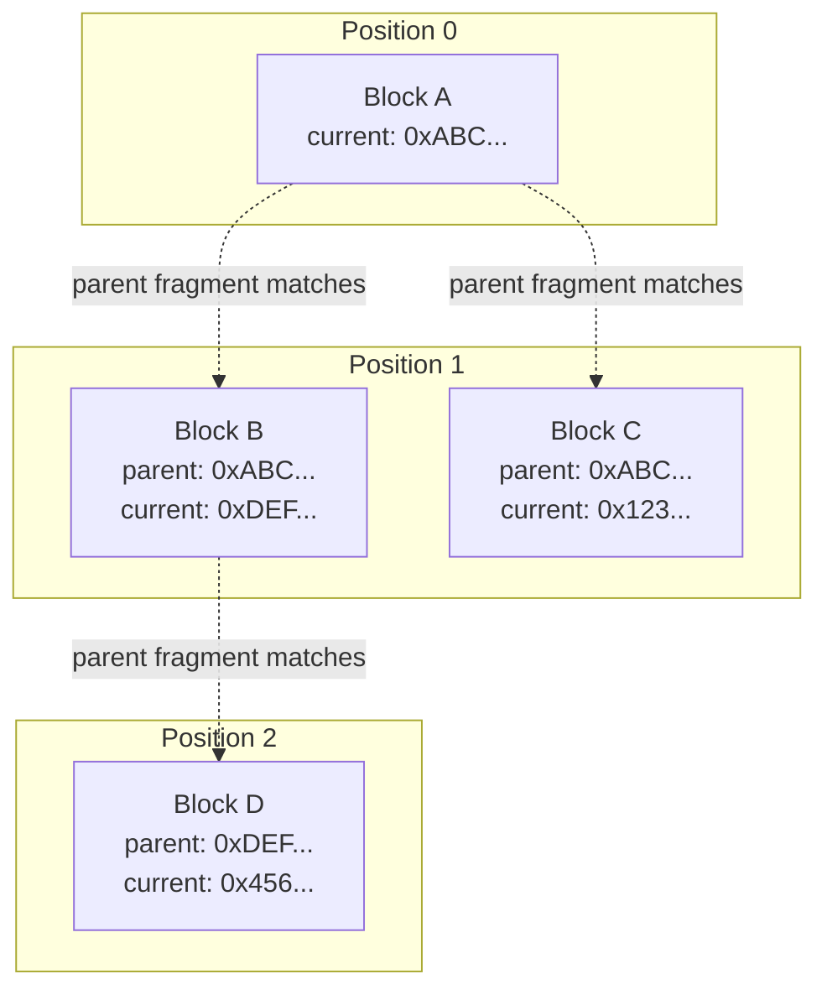
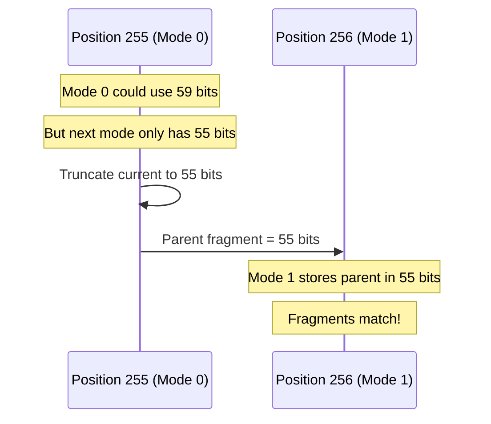
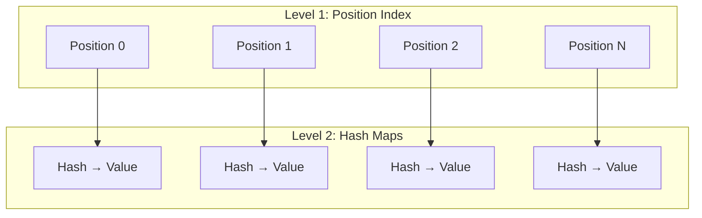
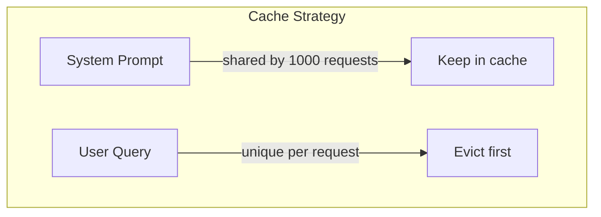
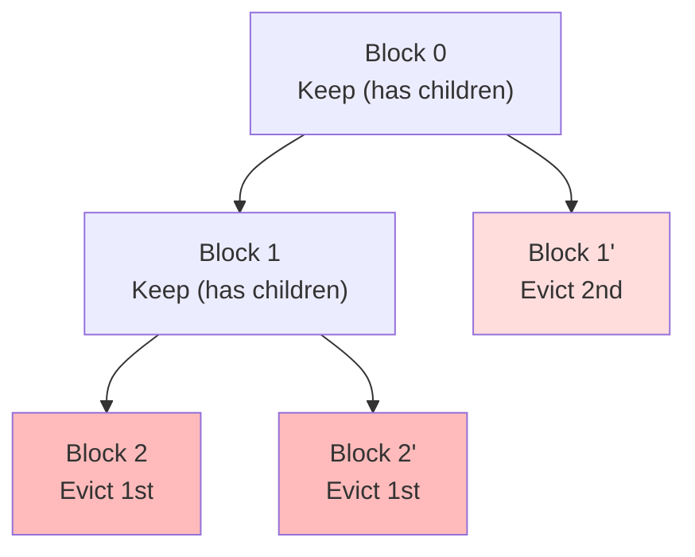

# Token Hashing Design: From Sequences to Lineage

## Executive Summary

The `dynamo-tokens` crate provides a family of hash types that encode increasingly rich information about token sequences in LLM inference systems. The key innovation is **packing complex relationships into simple value types**:

- **SequenceHash** (u64): Content uniqueness
- **PositionalSequenceHash** (u128): Content uniqueness + position
- **PositionalLineageHash** (u128): Content uniqueness + position + parent alignment

By encoding what would traditionally require complex structures with pointers and heap allocations into simple `u128` values, we achieve zero-cost abstractions: O(1) comparisons, lock-free sharing, and cache-friendly access patterns.

---

## The Problem: Token Trees Need Structure

### LLM Inference Creates Trees

When multiple users interact with an LLM, their conversations share common prefixes. A system prompt might be identical across thousands of requests, followed by diverging user inputs:



### Why Traditional Hashing Falls Short

A naive content hash tells us "these tokens are identical" but loses critical information:

| Question | Flat Hash | Positional Hash | Lineage Hash |
|----------|-----------|-----------------|--------------|
| Are these the same tokens? | Yes | Yes | Yes |
| At the same position? | ? | Yes | Yes |
| Who is the parent? | ? | ? | Yes |

Without position and lineage information, caching systems cannot:
- Distinguish identical blocks at different positions
- Efficiently evict leaves while preserving shared prefixes
- Navigate parent-child relationships without external data structures

### The Struct Approach Doesn't Scale

One could imagine a structure like:

```rust
struct BlockInfo {
    content_hash: u64,
    position: u64,
    parent: Option<Arc<BlockInfo>>,  // Heap allocation, reference counting
}
```

This approach has problems:
- **Heap allocation**: Each block requires memory allocation
- **Reference counting**: Arc overhead for thread safety
- **Cache misses**: Following pointers causes cache line misses
- **Synchronization**: Reference counting requires atomic operations

---

## The Solution: Value-Encoded Hashes

### Design Principle: Everything in 128 Bits

All our hash types are simple integers that can be:
- **Copied** by value (no heap allocation)
- **Compared** with a single CPU instruction
- **Shared** across threads without locks
- **Stored** inline in data structures (cache-friendly)



---

## Hash Type Evolution

### 1. SequenceHash (u64) - Content Identity

The foundation: a 64-bit xxhash of token content.

```
┌────────────────────────────────────────────────────────────────┐
│                     SequenceHash (64 bits)                     │
│            xxhash of [tokens + previous_sequence_hash]         │
└────────────────────────────────────────────────────────────────┘
```

**Encodes:** "Is this content unique?"

**Limitation:** Two identical blocks at different positions have the same hash, preventing position-aware deduplication.

### 2. PositionalSequenceHash (u128) - Adding Position

Extends SequenceHash with position awareness using adaptive encoding:

```
┌───────────────────────────────────────────────────────────────────────────────┐
│                     PositionalSequenceHash (128 bits)                         │
├──────────┬─────────────────────────────┬──────────────────────────────────────┤
│  Upper   │  Mode (2) + Position (8-31) │  Local Block Hash (31-54 bits)       │
│ 64 bits  │  Adaptive based on position │  Content signature                   │
├──────────┼─────────────────────────────┴──────────────────────────────────────┤
│  Lower   │                    SequenceHash (64 bits)                          │
│ 64 bits  │                    Full content uniqueness                         │
└──────────┴────────────────────────────────────────────────────────────────────┘
```

**Mode Selection:**

| Mode | Position Bits | Local Hash Bits | Max Position |
|------|---------------|-----------------|--------------|
| 00   | 8             | 54              | 255          |
| 01   | 16            | 46              | 65,535       |
| 10   | 24            | 38              | 16,777,215   |
| 11   | 31            | 31              | 2,147,483,647|

**Encodes:** "Is this the same content at the same position?"

**Limitation:** No parent relationship - cannot traverse backward in the tree.

### 3. PositionalLineageHash (u128) - Adding Lineage

The key innovation: encode parent-child relationships in the hash itself.

```
┌───────────────────────────────────────────────────────────────────────────────┐
│                     PositionalLineageHash (128 bits)                          │
├──────┬───────────┬────────────────────────┬───────────────────────────────────┤
│ Mode │ Position  │  Parent Hash Fragment  │  Current Hash Fragment            │
│ (2)  │ (8-24)    │  (51-59 bits)          │  (51-59 bits)                     │
└──────┴───────────┴────────────────────────┴───────────────────────────────────┘
```

**Mode Selection:**

| Mode | Position Bits | Parent Bits | Current Bits | Max Position |
|------|---------------|-------------|--------------|--------------|
| 00   | 8             | 59          | 59           | 255          |
| 01   | 16            | 55          | 55           | 65,535       |
| 10   | 24            | 51          | 51           | 16,777,215   |

**Encodes:** "Position + Content + Parent Identity"

---

## The Lineage Hash: Deep Dive

### Why Parent Fragments?

Given a block at position N, we can:
1. Extract its parent fragment
2. Look up position N-1 in the radix tree
3. Find all blocks whose current fragment matches our parent fragment

This enables **backward traversal without pointers**.



### Cross-Mode Boundary Alignment

**The Challenge:** When position transitions from 255 to 256, the mode changes from 0 (59-bit fragments) to 1 (55-bit fragments). How do we ensure parent-child matching works?

**The Solution:** Pre-truncate the current hash fragment to the next mode's capacity.



At position 255, we know position 256 will use Mode 1 with 55-bit fragments. So we pre-truncate our current hash to 55 bits, ensuring the child at position 256 can store and match our fragment.

---

## The PositionalHash Trait

A generic abstraction enables polymorphic data structures:

```rust
/// Trait for hashes that include position information.
pub trait PositionalHash {
    /// Returns the position associated with the hash.
    fn position(&self) -> u64;
}
```

Both `PositionalSequenceHash` and `PositionalLineageHash` implement this trait, allowing the same radix tree to work with either:

```rust
pub struct PositionalRadixTree<V, K = PositionalSequenceHash>
where
    K: PositionalHash + Hash + Eq + Clone,
{
    map: DashMap<u64, DashMap<K, V>>,
}
```

---

## PositionalRadixTree: Sparse Two-Level Indexing

The radix tree exploits position to create a sparse, efficient structure:



**Benefits:**
- **O(1) lookup** within a position level
- **Sparse allocation**: Only populated positions have hash maps
- **Lock granularity**: Different positions can be accessed concurrently
- **Memory efficient**: No entries for empty positions

---

## Use Cases

### 1. Hierarchical Block Caching

Token blocks form trees. A caching layer can exploit this structure:



Using lineage hashes, the cache can:
- Identify which blocks are leaves (no children)
- Evict leaves before parents
- Preserve shared prefixes as long as possible

### 2. Lineage-Aware Eviction

When memory pressure requires eviction, evict in tree order:



**Algorithm:**
1. Find all leaf blocks (no children pointing to them)
2. Evict leaves in LRU order
3. When a block becomes a leaf, it becomes evictable
4. Parents are naturally preserved until all children are gone

### 3. Block Deduplication with Position Awareness

When a new block arrives:
1. Compute its lineage hash
2. Check if a block with the same hash exists at that position
3. If yes, reuse the existing block (deduplication)
4. Position awareness prevents false matches across positions

### 4. Parent Traversal Without Pointers

Given a block at position N:
```rust
fn find_parent(hash: PositionalLineageHash, tree: &PositionalRadixTree<Block>) -> Option<Block> {
    let parent_pos = hash.position() - 1;
    let parent_fragment = hash.parent_hash_fragment();

    // Look up by position, filter by fragment match
    tree.position(parent_pos)?
        .iter()
        .find(|entry| entry.key().current_hash_fragment() == parent_fragment)
        .map(|entry| entry.value().clone())
}
```

No pointer chasing, no Arc references, just integer comparisons.

---

## API Reference

### PositionalLineageHash

```rust
impl PositionalLineageHash {
    /// Create from sequence hashes and position
    pub fn new(
        current_seq_hash: SequenceHash,
        parent_seq_hash: Option<SequenceHash>,
        position: u64,
    ) -> Self;

    /// Get the block position
    pub fn position(&self) -> u64;

    /// Get the current block's hash fragment
    pub fn current_hash_fragment(&self) -> u64;

    /// Get the parent block's hash fragment
    pub fn parent_hash_fragment(&self) -> u64;

    /// Get the encoding mode (0, 1, or 2)
    pub fn mode(&self) -> u8;

    /// Get the raw u128 value
    pub fn as_u128(&self) -> u128;
}
```

### PositionalSequenceHash

```rust
impl PositionalSequenceHash {
    /// Create from components
    pub fn new(
        sequence_hash: SequenceHash,
        position: u64,
        local_block_hash: BlockHash,
    ) -> Self;

    /// Get the sequence hash component
    pub fn sequence_hash(&self) -> SequenceHash;

    /// Get the block position
    pub fn position(&self) -> u64;

    /// Get the local block hash
    pub fn local_block_hash(&self) -> BlockHash;
}
```

### PositionalRadixTree

```rust
impl<V, K: PositionalHash + Hash + Eq + Clone> PositionalRadixTree<V, K> {
    /// Create empty tree
    pub fn new() -> Self;

    /// Get/create the sub-map for a hash's position
    pub fn prefix(&self, key: &K) -> RefMut<u64, DashMap<K, V>>;

    /// Get the sub-map for a specific position
    pub fn position(&self, position: u64) -> Option<RefMut<u64, DashMap<K, V>>>;

    /// Count total entries
    pub fn len(&self) -> usize;
}
```

---

## Future Directions

### Compressed Lineage Chains

For very long sequences, consider compressing lineage into skip-list style hashes that encode multiple ancestors.

### Distributed Coordination

The value-semantic design enables efficient network transfer - a u128 can be serialized in 16 bytes, enabling distributed caching systems to coordinate block state.

### Integration with External Caching

The hash types can serve as keys in external caching systems (Redis, memcached) without serialization overhead.

---

## Summary

The `dynamo-tokens` crate demonstrates how careful bit-packing can replace complex data structures with simple value types. By encoding position and lineage information directly in hash values, we achieve:

1. **Zero-cost abstractions**: No heap allocation, no reference counting
2. **Thread safety without locks**: Values can be freely copied and shared
3. **Cache-friendly access**: No pointer chasing, inline storage
4. **Rich semantics**: Position awareness, parent-child relationships

The progression from SequenceHash to PositionalLineageHash shows how each layer adds capabilities while maintaining the simplicity of value semantics.
