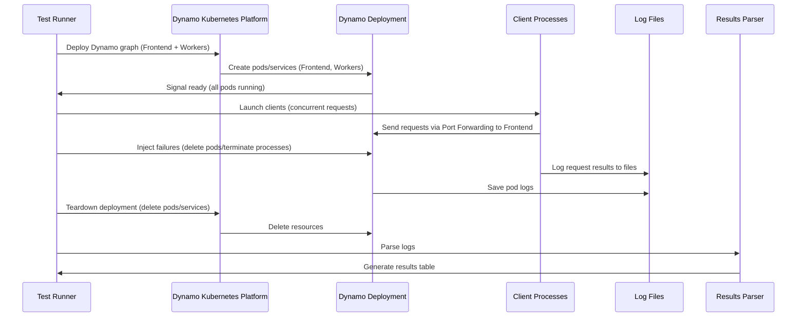
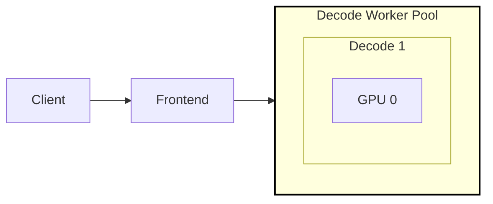
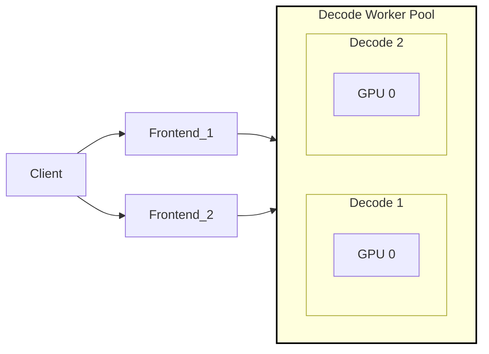
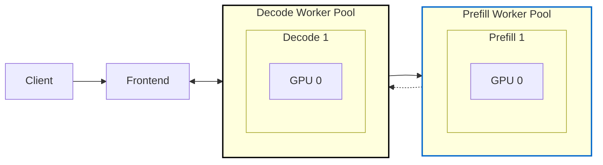
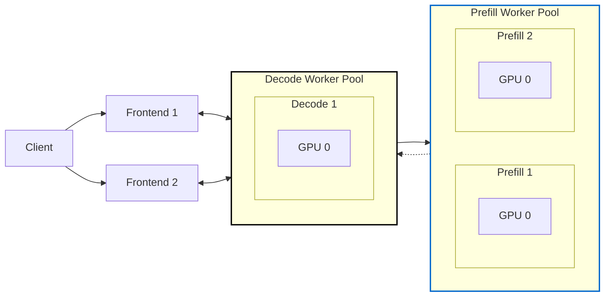

<!--
SPDX-FileCopyrightText: Copyright (c) 2024-2025 NVIDIA CORPORATION & AFFILIATES. All rights reserved.
SPDX-License-Identifier: Apache-2.0

Licensed under the Apache License, Version 2.0 (the "License");
you may not use this file except in compliance with the License.
You may obtain a copy of the License at

http://www.apache.org/licenses/LICENSE-2.0

Unless required by applicable law or agreed to in writing, software
distributed under the License is distributed on an "AS IS" BASIS,
WITHOUT WARRANTIES OR CONDITIONS OF ANY KIND, either express or implied.
See the License for the specific language governing permissions and
limitations under the License.
-->

# Fault Tolerance Test Suite

As a large scale distributed inference serving framework in addition
to providing high throughput and low latency, Dynamo needs to
provide fault detection, resilency, and quick recovery in the face of
unforseen failures. In order to test Dynamo we are developing a test
suite to inject and measure the impact of different types of failure
conditions.

## Test Architecture

The fault tolerance test suite is designed as a set of pytest
configurations that launch typical dynamo deployments in a Kubernetes
environment and then inject failures by terminating processes or
pods. To test the recovery time and impact of failures, a set number of
clients are launched in parallel using **AI-Perf (aiperf)** for load generation.
Each client sends synthetic requests with configurable token patterns.
Log files are stored for each pod as well as for each client and inspected
using a post-processing script that parses AI-Perf metrics.

> [!NOTE]
> Test pass / failure is not an indication of SLA for recovery or resilience
> It only indicates is the test was executed and data was collected

###  Test Sequence Diagram



### Test Scenarios

The test suite is organized around three core components: **Deployments**, **Client Load**, and **Failures**. Each scenario combines these elements to simulate fault conditions and measure system resilience.

#### Deployments

Deployments represent specific graphs that are deployed using the Dynamo Kubernetes Platform.

Below are some representative examples of the generated scenarios:

| Example Scenario Name                         | Backend | Type   | TP | DP | Description                                             |
|-----------------------------------------------|---------|--------|----|----|---------------------------------------------------------|
| `vllm-agg-tp-1-dp-1`                          | vllm    | agg    | 1  | 1  | Basic aggregated worker.                                |
| `vllm-agg-tp-1-dp-2`                          | vllm    | agg    | 1  | 2  | Aggregated worker with Data Parallelism.                |
| `sglang-agg-tp-4-dp-1`                        | sglang  | agg    | 4  | 1  | Aggregated SGLang worker with Tensor Parallelism.       |
| `sglang-disagg-prefill-tp-2-decode-tp-2-dp-1`   | sglang  | disagg | 2  | 1  | Disaggregated SGLang workers with Tensor Parallelism.   |

The full test matrix is generated from these parameters, creating comprehensive test coverage across all configurations.

#### Client Load (AI-Perf Configuration)

- **Load Generator**: AI-Perf (`aiperf`) with synthetic token generation
- **Concurrent Clients**: 10 clients by default, adjustable per scenario
- **Requests per Client**: 150 requests per client (configurable)
- **Input/Output Token Configuration**:
  - Input tokens: mean=100, stddev=0 (consistent length)
  - Output tokens: mean=100, stddev=0 (consistent length)
- **Concurrency**: Sequential requests (concurrency=1) per client
- **Retry Logic**: 3 retry attempts for fault tolerance
- **Streaming Support**: Optional `--streaming` flag for TTFT/ITL metrics
- **No warmup**: warmup-request-count=0 to avoid initial failures

#### Failures

Failures are injected into deployed pods either by using pod delete or
sending signals to specified processes.

The following failure types are defined in `scenarios.py`:

| Failure Name                  | Description                                        | Injection Method              | Applicable Backends |
|-------------------------------|----------------------------------------------------|-------------------------------|---------------------|
| `none`                        | No failure injection (baseline).                   | N/A                           | All                 |
| `frontend`                    | Terminate frontend process.                        | `SIGINT` to `dynamo.frontend` | All                 |
| `frontend_pod`                | Delete frontend pod.                               | Kubernetes API pod deletion   | All                 |
| `decode_worker`               | Terminate decode worker process.                   | `SIGKILL` to `dynamo.<backend>` | All                 |
| `decode_worker_pod`           | Delete decode worker pod.                          | Kubernetes API pod deletion   | All                 |
| `prefill_worker`              | Terminate prefill worker process.                  | `SIGKILL` to `dynamo.<backend>` | All                 |
| `prefill_worker_pod`          | Delete prefill worker pod.                         | Kubernetes API pod deletion   | All                 |
| `vllm_decode_engine_core`     | Terminate VLLM decode engine core process.         | `SIGKILL` to `VLLM::EngineCore` | vllm only           |
| `vllm_prefill_engine_core`    | Terminate VLLM prefill engine core process.        | `SIGKILL` to `VLLM::EngineCore` | vllm only           |
| `sglang_decode_scheduler`     | Terminate SGLang decode scheduler process.         | `SIGKILL` to `sglang::scheduler`| sglang only         |
| `sglang_decode_detokenizer`   | Terminate SGLang decode detokenizer process.       | `SIGKILL` to `sglang::detokenizer`| sglang only         |
| `sglang_prefill_scheduler`    | Terminate SGLang prefill scheduler process.        | `SIGKILL` to `sglang::scheduler`| sglang only         |
| `sglang_prefill_detokenizer`  | Terminate SGLang prefill detokenizer process.      | `SIGKILL` to `sglang::detokenizer`| sglang only         |

#### Example Scenario Breakdown

**Scenario**: `sglang-agg-tp-2-dp-1-decode_worker`

- **Backend**: `sglang`
- **Deployment**: Aggregation with 1 decoder worker replica, using 2 GPUs for tensor parallelism (`agg-tp-2-dp-1`).
- **Client Load**: 10 clients, 100 requests each, max request rate 1/sec.
- **Failure**: Terminates 1 decoder worker process 30 seconds into the test.

#### Example Scenario Execution:

Run all deployments and failure scenarios

```bash
pytest tests/fault_tolerance/deploy/test_deployment.py -s -v --namespace ${NAMESPACE}
```

### Test Results Directory

For each test scenario a directory of log files is created and post-processed to summarize the test.

```
test_fault_scenario[sglang-agg-tp-1-dp-1-frontend]
.
├── client_0/
│   └── attempt_0/
│       ├── profile_export_aiperf.json    # AI-Perf metrics in JSON format
│       ├── profile_export_aiperf.csv     # AI-Perf metrics in CSV format
│       ├── genai_perf.log                # AI-Perf execution log
│       └── logs/
│           └── aiperf.log                # Detailed AI-Perf logs
├── client_1/
│   ├── attempt_0/                        # First attempt (may fail during fault)
│   └── attempt_1/                        # Retry attempt after failure
│       └── [same structure as above]
├── [client_2 through client_9...]
├── Frontend/
│   ├── fault-tolerance-test-frontend-576bd784dc-jv68q.log
│   ├── fault-tolerance-test-frontend-576bd784dc-jv68q.metrics.log
│   ├── fault-tolerance-test-frontend-576bd784dc-jv68q.previous.log  # Pre-restart logs
│   └── fault-tolerance-test-frontend-576bd784dc-jv68q.yaml
├── decode/                                # Or VllmDecodeWorker for vLLM backend
│   └── [same structure as Frontend]
└── test.log.txt

```

| File/Directory Name                | Description                                                                                      |
|------------------------------------|------------------------------------------------------------------------------------------------|
| **client_N/attempt_M/**            | AI-Perf results for client N, attempt M (supports multiple retry attempts)                      |
| **profile_export_aiperf.json**     | Complete AI-Perf metrics including latencies (P50/P90/P99), throughput, token counts           |
| **profile_export_aiperf.csv**      | Tabular format of key metrics for easy analysis                                                |
| **genai_perf.log**                 | AI-Perf execution output (stdout/stderr)                                                       |
| **{Service}/*.log**                | Current container log for pod (Frontend, decode, etc.)                                         |
| **{Service}/*.previous.log**       | Previous container log before restart (contains pre-fault logs)                                |
| **{Service}/*.metrics.log**        | Prometheus metrics from `/metrics` endpoint                                                    |
| **{Service}/*.yaml**               | Pod specification and status transitions                                                       |
| **test.log.txt**                   | Primary test execution log (deployment timing, fault injection, recovery events)               |

### Summary Results

Results are parsed from AI-Perf metrics and presented in table format after each test. The parsing script (`parse_results.py`) extracts comprehensive metrics for each scenario:

#### Per-Test Output Format
```
============================================================
FAULT TOLERANCE TEST SUMMARY - AI-PERF
============================================================
╒═══════════════════════════════════╤════════════════════════════════════════════════════╕
│ Metric                            │ Value                                              │
╞═══════════════════════════════════╪════════════════════════════════════════════════════╡
│ Test Directory                    │ test_fault_scenario[sglang-agg-tp-1-dp-1-frontend] │
├───────────────────────────────────┼────────────────────────────────────────────────────┤
│ Number of Clients                 │ 10                                                 │
├───────────────────────────────────┼────────────────────────────────────────────────────┤
│ === Deployment Metrics ===        │                                                    │
├───────────────────────────────────┼────────────────────────────────────────────────────┤
│ Startup Time                      │ 69.00 sec                                          │
├───────────────────────────────────┼────────────────────────────────────────────────────┤
│ Recovery Time                     │ 2.00 sec                                           │
├───────────────────────────────────┼────────────────────────────────────────────────────┤
│ === Request Metrics ===           │                                                    │
├───────────────────────────────────┼────────────────────────────────────────────────────┤
│ Total Requests                    │ 1500                                               │
├───────────────────────────────────┼────────────────────────────────────────────────────┤
│ Successful Requests               │ 1470                                               │
├───────────────────────────────────┼────────────────────────────────────────────────────┤
│ Failed Requests                   │ 30                                                 │
├───────────────────────────────────┼────────────────────────────────────────────────────┤
│ Success Rate                      │ 98.00%                                             │
├───────────────────────────────────┼────────────────────────────────────────────────────┤
│ === Latency Metrics (seconds) === │                                                    │
├───────────────────────────────────┼────────────────────────────────────────────────────┤
│ Mean Latency                      │ 0.502                                              │
├───────────────────────────────────┼────────────────────────────────────────────────┤
│ P50 Latency                       │ 0.396                                              │
├───────────────────────────────────┼────────────────────────────────────────────────────┤
│ P90 Latency                       │ 0.422                                              │
├───────────────────────────────────┼────────────────────────────────────────────────────┤
│ P99 Latency                       │ 0.761                                              │
├───────────────────────────────────┼────────────────────────────────────────────────────┤
│ === Throughput Metrics ===        │                                                    │
├───────────────────────────────────┼────────────────────────────────────────────────────┤
│ Total Throughput                  │ 19.72 req/s                                        │
├───────────────────────────────────┼────────────────────────────────────────────────────┤
│ Avg Client Throughput             │ 1.97 req/s                                         │
╘═══════════════════════════════════╧════════════════════════════════════════════════════╛
```

| Metric Category       | Metrics Included                                                            |
|-----------------------|-----------------------------------------------------------------------------|
| **Deployment Metrics**| Startup Time, Recovery Time                                                |
| **Request Metrics**   | Total/Successful/Failed Requests, Success Rate                             |
| **Latency Metrics**   | Mean, P50, P90, P99 latencies (in seconds)                                |
| **Token Metrics**     | TTFT (Time to First Token), ITL (Inter-Token Latency) when streaming enabled |
| **Throughput Metrics**| Total and per-client request throughput                                    |

## Example Deployment Architectures

The following architectures are tested with various failure scenarios:

### Aggregated Workers

#### No Redundancy

To demonstrate the failure and recovery time in the case that there is
a single instance of each process we ran a simmple "agg-tp-1-dp-1" configuration.




#### Redundant Workers (Over Provisoned)

To demonstrate the failure and recovery time in the case that there
are multiple instances of each process (except for the frontend) we
ran a simple "agg-tp-1-dp-2" configuration.


1. By immediately detecting a decode worker failure, Dynamo can limit
   the failures and reroute requests to healthy workers with minimal
   impact.

### Disaggregated Workers

#### No Redunancy

To demonstrate the failure and recovery time in the case of a
disaaggregated deployment with a single instance for each process in
the graph we ran a simple `disagg-tp-1-dp-1` configuration.




#### Summary:


1. Prefill worker engine failure causes decode engine failure.

2. When prefill workers fail gracefully, decode workers will automatically do prefill as well.


#### Redundant Workers

To demonstrate the failure and recovery time in the case that there
are multiple instances of each process (except for the frontend and
decode worker) we ran a simple "disagg-tp-1-dp-2"
configuration.





#### Summary:


1. Redundant prefill workers are able to absorb the load.

2. When prefill workers go down, decode workers can also do prefill locally.

## Quick Start

### Install Dynamo Platform

Follow the [instructions](../../../docs/kubernetes/installation_guide.md) to install `Dynamo` in your Kubernetes cluster.

### Mount Workspace and Kube Config

Ensure you are able to run a `Dynamo` deployment directly from your host.

Then run the development container mounting the workspace and your kube config.

```
./container/run.sh --mount-workspace -it -v ~/.kube:/root/.kube
```

### Run the tests

```bash
pytest tests/fault_tolerance/deploy/test_deployment.py -s -v --namespace ${NAMESPACE} --image ${IMAGE}
```


### Note on Running with Additional Credentials

When running on an cluster that requires additional authentication (such as `AKS`) in addition you will need
to authenticate and install cli as appropriate in to the container. As an example, before running the tests you
in an `AKS` cluster you would need to do the following:

```
# In case you have multiple configs
export KUBECONFIG=~/.kube/dynamo-kubeconfig

curl -sL https://aka.ms/InstallAzureCLIDeb
az aks install-cli
az login
```
