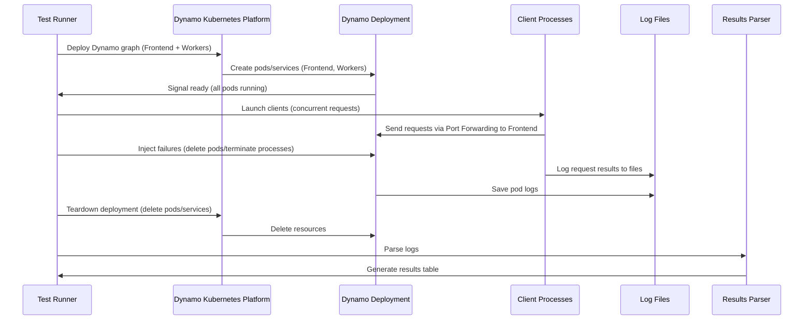
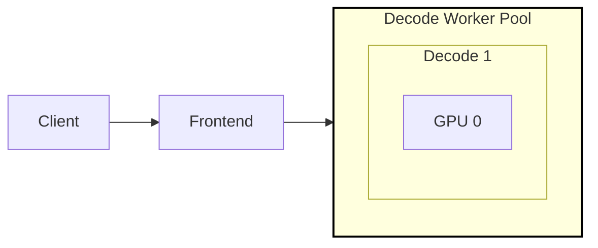
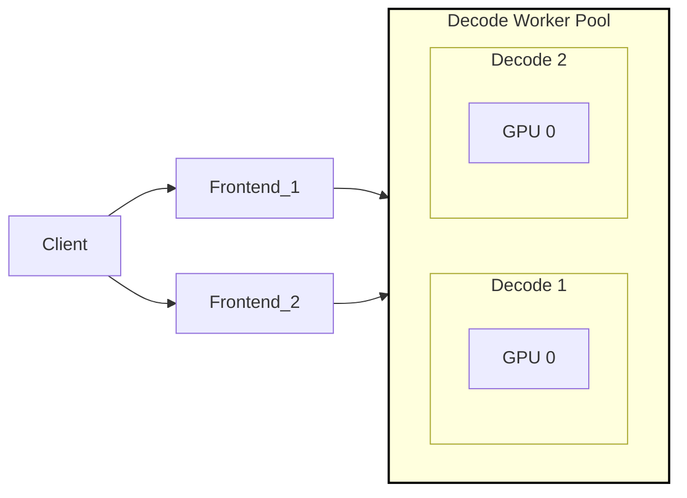
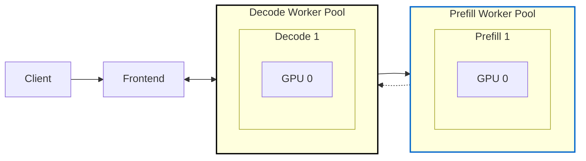
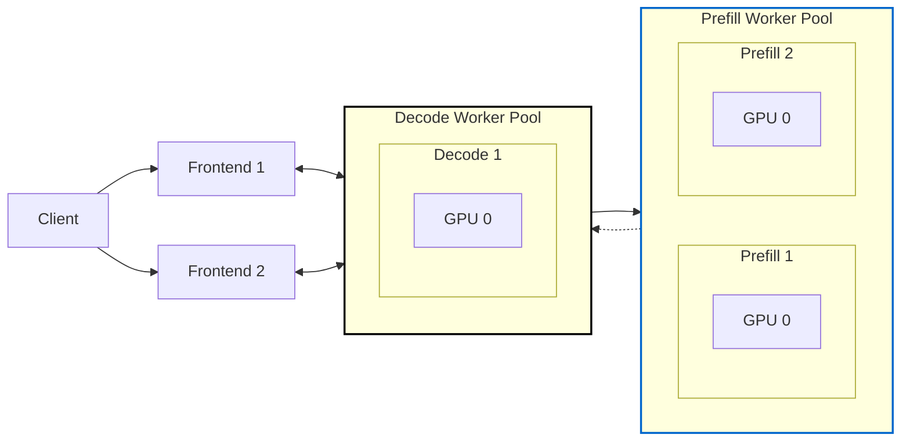

<!--
SPDX-FileCopyrightText: Copyright (c) 2024-2025 NVIDIA CORPORATION & AFFILIATES. All rights reserved.
SPDX-License-Identifier: Apache-2.0

Licensed under the Apache License, Version 2.0 (the "License");
you may not use this file except in compliance with the License.
You may obtain a copy of the License at

http://www.apache.org/licenses/LICENSE-2.0

Unless required by applicable law or agreed to in writing, software
distributed under the License is distributed on an "AS IS" BASIS,
WITHOUT WARRANTIES OR CONDITIONS OF ANY KIND, either express or implied.
See the License for the specific language governing permissions and
limitations under the License.
-->

# Fault Tolerance Test Suite

As a large scale distributed inference serving framework in addition
to providing high throughput and low latency, Dynamo needs to
provide fault detection, resilency, and quick recovery in the face of
unforseen failures. In order to test Dynamo we are developing a test
suite to inject and measure the impact of different types of failure
conditions.

## Test Architecture

The fault tolerance test suite is designed as a set of pytest
configurations that launch typical dynamo deployments in a Kubernetes
environemnt and then inject failures by terminating processes or
pods. To test the recovery time and impact of failures a set number of
clients are launched in parallel. Each client sends a set number of
synchronous requests. Log files are stored for each pod as well as for
each client and inspected using a post-processing script.

> [!NOTE]
> Test pass / failure is not an indication of SLA for recovery or resilience
> It only indicates is the test was executed and data was collected

###  Test Sequence Diagram



### Test Scenarios

The test suite is organized around three core components: **Deployments**, **Client Load**, and **Failures**. Each scenario combines these elements to simulate fault conditions and measure system resilience.

#### Deployments

Deployments represent specific graphs that are deployed using the Dynamo Kubernetes Platform.

Below are some representative examples of the generated scenarios:

| Example Scenario Name                         | Backend | Type   | TP | DP | Description                                             |
|-----------------------------------------------|---------|--------|----|----|---------------------------------------------------------|
| `vllm-agg-tp-1-dp-1`                          | vllm    | agg    | 1  | 1  | Basic aggregated worker.                                |
| `vllm-agg-tp-1-dp-2`                          | vllm    | agg    | 1  | 2  | Aggregated worker with Data Parallelism.                |
| `sglang-agg-tp-4-dp-1`                        | sglang  | agg    | 4  | 1  | Aggregated SGLang worker with Tensor Parallelism.       |
| `sglang-disagg-prefill-tp-2-decode-tp-2-dp-1`   | sglang  | disagg | 2  | 1  | Disaggregated SGLang workers with Tensor Parallelism.   |

The full test matrix is generated from these parameters, creating comprehensive test coverage across all configurations.

#### Client Load

- **Concurrent Clients**: 10 clients by default, adjustable per scenario.
- **Requests per Client**: 100 requests, simulating sustained load.
- **Input/Output Token Length**: 100 tokens for both input prompts and generated outputs.
- **Request Rate Limit**: Ensures clients do not overwhelm the service, with a maximum of 1 request per second per client.

#### Failures

Failures are injected into deployed pods either by using pod delete or
sending signals to specified processes.

The following failure types are defined in `scenarios.py`:

| Failure Name                  | Description                                        | Injection Method              | Applicable Backends |
|-------------------------------|----------------------------------------------------|-------------------------------|---------------------|
| `none`                        | No failure injection (baseline).                   | N/A                           | All                 |
| `frontend`                    | Terminate frontend process.                        | `SIGINT` to `dynamo.frontend` | All                 |
| `frontend_pod`                | Delete frontend pod.                               | Kubernetes API pod deletion   | All                 |
| `decode_worker`               | Terminate decode worker process.                   | `SIGKILL` to `dynamo.<backend>` | All                 |
| `decode_worker_pod`           | Delete decode worker pod.                          | Kubernetes API pod deletion   | All                 |
| `prefill_worker`              | Terminate prefill worker process.                  | `SIGKILL` to `dynamo.<backend>` | All                 |
| `prefill_worker_pod`          | Delete prefill worker pod.                         | Kubernetes API pod deletion   | All                 |
| `vllm_decode_engine_core`     | Terminate VLLM decode engine core process.         | `SIGKILL` to `VLLM::EngineCore` | vllm only           |
| `vllm_prefill_engine_core`    | Terminate VLLM prefill engine core process.        | `SIGKILL` to `VLLM::EngineCore` | vllm only           |
| `sglang_decode_scheduler`     | Terminate SGLang decode scheduler process.         | `SIGKILL` to `sglang::scheduler`| sglang only         |
| `sglang_decode_detokenizer`   | Terminate SGLang decode detokenizer process.       | `SIGKILL` to `sglang::detokenizer`| sglang only         |
| `sglang_prefill_scheduler`    | Terminate SGLang prefill scheduler process.        | `SIGKILL` to `sglang::scheduler`| sglang only         |
| `sglang_prefill_detokenizer`  | Terminate SGLang prefill detokenizer process.      | `SIGKILL` to `sglang::detokenizer`| sglang only         |

#### Example Scenario Breakdown

**Scenario**: `sglang-agg-tp-2-dp-1-decode_worker`

- **Backend**: `sglang`
- **Deployment**: Aggregation with 1 decoder worker replica, using 2 GPUs for tensor parallelism (`agg-tp-2-dp-1`).
- **Client Load**: 10 clients, 100 requests each, max request rate 1/sec.
- **Failure**: Terminates 1 decoder worker process 30 seconds into the test.

#### Example Scenario Execution:

Run all deployments and failure scenarios

```bash
pytest tests/fault_tolerance/deploy/test_deployment.py -s -v --namespace ${NAMESPACE}
```

### Test Results Directory

For each test scenario a directory of log files is created and post processed to summarize the test.

```
test_fault_scenario[agg-tp-1-dp-1-none]
.
├── client_0.log.txt
├── client_1.log.txt
├── client_2.log.txt
├── client_3.log.txt
├── client_4.log.txt
├── client_5.log.txt
├── client_6.log.txt
├── client_7.log.txt
├── client_8.log.txt
├── client_9.log.txt
├── Frontend
│   ├── fault-tolerance-test-frontend-576bd784dc-jv68q.log
│   ├── fault-tolerance-test-frontend-576bd784dc-jv68q.metrics.log
│   ├── fault-tolerance-test-frontend-576bd784dc-jv68q.previous.log
│   └── fault-tolerance-test-frontend-576bd784dc-jv68q.yaml
├── test.log.txt
└── VllmDecodeWorker
    ├── fault-tolerance-test-vllmdecodeworker-56b7bdf447-6tzqq.log
    ├── fault-tolerance-test-vllmdecodeworker-56b7bdf447-6tzqq.metrics.log
    ├── fault-tolerance-test-vllmdecodeworker-56b7bdf447-6tzqq.previous.log
    └── fault-tolerance-test-vllmdecodeworker-56b7bdf447-6tzqq.yaml

```

| File/Directory Name                | Description                                                                                      |
|------------------------------------|------------------------------------------------------------------------------------------------|
| **client_*.log.txt**               | Request/response logs for each client instance (contains JSON-formatted request details)        |
| **{Service}/*.log                  | Container log for pod at end of test (Frontend, VllmDecodeWroer, etc.)                                                                         |
| **{Service}/*.previous.log**       | Previous container log for pod in case of crash / exit. (Frontend, VllmDecodeWroer, etc.). Empty if N/A.               |
| **{Service}/*.metrics.log**        | Metrics as reported by `/metrics` for the service                           |
| **{Service}/*.yaml**               | yaml for pod including status transitions                    |
| **test.log.txt**                   | Primary test execution log (contains fault injection timing, process management, and test status)|

### Summary Results

Results are presented in table format after each test providing summary statistics.
```
Test Group: agg-tp-1-dp-1
╒═════════════════════════╤═══════════╤═══════════╤══════════╤═══════════╤══════════╤═══════════╤═══════════╤════════════╕
│         Failure         │   Startup │   Success │   Failed │   Success │   Failed │   Latency │   Latency │   Recovery │
│                         │           │    Before │   Before │     After │    After │    Before │     After │            │
╞═════════════════════════╪═══════════╪═══════════╪══════════╪═══════════╪══════════╪═══════════╪═══════════╪════════════╡
│          none           │    180.00 │   1500.00 │     0.00 │       N/A │      N/A │      1.19 │       N/A │        N/A │
├─────────────────────────┼───────────┼───────────┼──────────┼───────────┼──────────┼───────────┼───────────┼────────────┤
│        frontend         │    181.00 │    153.00 │     0.00 │    820.00 │   527.00 │      1.21 │      1.18 │       3.36 │
├─────────────────────────┼───────────┼───────────┼──────────┼───────────┼──────────┼───────────┼───────────┼────────────┤
│      frontend_pod       │    169.00 │    140.00 │     0.00 │    785.00 │   305.00 │      1.20 │      1.18 │       5.39 │
├─────────────────────────┼───────────┼───────────┼──────────┼───────────┼──────────┼───────────┼───────────┼────────────┤
│      decode_worker      │    161.00 │    140.00 │     0.00 │    510.00 │   850.00 │      1.21 │      1.18 │     154.11 │
├─────────────────────────┼───────────┼───────────┼──────────┼───────────┼──────────┼───────────┼───────────┼────────────┤
│    decode_worker_pod    │    181.00 │    140.00 │     0.00 │    511.00 │   849.00 │      1.22 │      1.18 │     156.47 │
├─────────────────────────┼───────────┼───────────┼──────────┼───────────┼──────────┼───────────┼───────────┼────────────┤
│ vllm_decode_engine_core │    181.00 │    140.00 │     0.00 │    524.00 │   836.00 │      1.21 │      1.19 │     152.52 │
╘═════════════════════════╧═══════════╧═══════════╧══════════╧═══════════╧══════════╧═══════════╧═══════════╧════════════╛
```


| Column Name           | Description                                                                 |
|-----------------------|-----------------------------------------------------------------------------|
| **Failure**           | Type of fault injection applied during the test (or 'none' for baseline)     |
| **Startup**      | Time (seconds) taken for the service to become ready after initialization    |
| **Succes/nBefore**   | Numoer of client requests that succeeded before fault injection                                   |
| **Failed/nBefore**    | Number of client requests that failed or were invalid before fault injection                      |
| **Success/nAftere**   | Number of client requests that  succeeded after fault injection |
| **Latency Before**     | Average request latency (seconds) for successful requests before fault injection |
| **Latency After**     | Average request latency (seconds) for successful requests after fault injection |
| **Recovery Time**     | Time (seconds) taken for failed components to recover after fault injection  |

## Example Results

The following results were obtained running on a cluster of A100
nodes.

### Aggregated Workers

#### No Redundancy

To demonstrate the failure and recovery time in the case that there is
a single instance of each process we ran a simmple "agg-tp-1-dp-1" configuration.



#### Results:

```
Test Group: agg-tp-1-dp-1
╒═════════════════════════╤═══════════╤═══════════╤══════════╤═══════════╤══════════╤═══════════╤═══════════╤════════════╕
│         Failure         │   Startup │   Success │   Failed │   Success │   Failed │   Latency │   Latency │   Recovery │
│                         │           │    Before │   Before │     After │    After │    Before │     After │            │
╞═════════════════════════╪═══════════╪═══════════╪══════════╪═══════════╪══════════╪═══════════╪═══════════╪════════════╡
│          none           │    180.00 │   1500.00 │     0.00 │       N/A │      N/A │      1.19 │       N/A │        N/A │
├─────────────────────────┼───────────┼───────────┼──────────┼───────────┼──────────┼───────────┼───────────┼────────────┤
│        frontend         │    181.00 │    153.00 │     0.00 │    820.00 │   527.00 │      1.21 │      1.18 │       3.36 │
├─────────────────────────┼───────────┼───────────┼──────────┼───────────┼──────────┼───────────┼───────────┼────────────┤
│      frontend_pod       │    169.00 │    140.00 │     0.00 │    785.00 │   305.00 │      1.20 │      1.18 │       5.39 │
├─────────────────────────┼───────────┼───────────┼──────────┼───────────┼──────────┼───────────┼───────────┼────────────┤
│      decode_worker      │    161.00 │    140.00 │     0.00 │    510.00 │   850.00 │      1.21 │      1.18 │     154.11 │
├─────────────────────────┼───────────┼───────────┼──────────┼───────────┼──────────┼───────────┼───────────┼────────────┤
│    decode_worker_pod    │    181.00 │    140.00 │     0.00 │    511.00 │   849.00 │      1.22 │      1.18 │     156.47 │
├─────────────────────────┼───────────┼───────────┼──────────┼───────────┼──────────┼───────────┼───────────┼────────────┤
│ vllm_decode_engine_core │    181.00 │    140.00 │     0.00 │    524.00 │   836.00 │      1.21 │      1.19 │     152.52 │
╘═════════════════════════╧═══════════╧═══════════╧══════════╧═══════════╧══════════╧═══════════╧═══════════╧════════════╛
```

#### Summary:

1. Recovery time for the decode worker itself is the largest and a decode worker failure has the largest impact (as expected)
2. Recovery time doesn't include time for the ready probe to return `ready` so even if the process is recovered early (as in the case of the Frontend) requests may fail until the pod is probed.

#### Redundant Workers (Over Provisoned)

To demonstrate the failure and recovery time in the case that there
are multiple instances of each process (except for the frontend) we
ran a simple "agg-tp-1-dp-2" configuration.



#### Results:
```
Test Group: agg-tp-1-dp-2
╒═════════════════════════╤═══════════╤═══════════╤══════════╤═══════════╤══════════╤═══════════╤═══════════╤════════════╕
│         Failure         │   Startup │   Success │   Failed │   Success │   Failed │   Latency │   Latency │   Recovery │
│                         │           │    Before │   Before │     After │    After │    Before │     After │            │
╞═════════════════════════╪═══════════╪═══════════╪══════════╪═══════════╪══════════╪═══════════╪═══════════╪════════════╡
│          none           │    181.00 │   1500.00 │     0.00 │       N/A │      N/A │      1.18 │       N/A │        N/A │
├─────────────────────────┼───────────┼───────────┼──────────┼───────────┼──────────┼───────────┼───────────┼────────────┤
│        frontend         │    181.00 │    121.00 │     0.00 │   1373.00 │     6.00 │      1.21 │      1.17 │       4.37 │
├─────────────────────────┼───────────┼───────────┼──────────┼───────────┼──────────┼───────────┼───────────┼────────────┤
│      frontend_pod       │    182.00 │    122.00 │     0.00 │   1378.00 │     0.00 │      1.21 │      1.17 │       5.24 │
├─────────────────────────┼───────────┼───────────┼──────────┼───────────┼──────────┼───────────┼───────────┼────────────┤
│      decode_worker      │    169.00 │    121.00 │     0.00 │   1374.00 │     5.00 │      1.20 │      1.18 │     153.09 │
├─────────────────────────┼───────────┼───────────┼──────────┼───────────┼──────────┼───────────┼───────────┼────────────┤
│    decode_worker_pod    │    181.00 │    125.00 │     0.00 │   1369.00 │     6.00 │      1.21 │      1.18 │     152.72 │
├─────────────────────────┼───────────┼───────────┼──────────┼───────────┼──────────┼───────────┼───────────┼────────────┤
│ vllm_decode_engine_core │    182.00 │    120.00 │     0.00 │   1375.00 │     5.00 │      1.20 │      1.18 │     154.75 │
╘═════════════════════════╧═══════════╧═══════════╧══════════╧═══════════╧══════════╧═══════════╧═══════════╧════════════╛
```

#### Summary:

1. By immediately detecting a decode worker failure, Dynamo can limit
   the failures and reroute requests to healthy workers with minimal
   impact.

### Disaggregated Workers

#### No Redunancy

To demonstrate the failure and recovery time in the case of a
disaaggregated deployment with a single instance for each process in
the graph we ran a simple `disagg-tp-1-dp-1` configuration.



#### Results:

```
Test Group: disagg-tp-1-dp-1
╒══════════════════════════╤═══════════╤═══════════╤══════════╤═══════════╤══════════╤═══════════╤═══════════╤════════════╕
│         Failure          │   Startup │   Success │   Failed │   Success │   Failed │   Latency │   Latency │   Recovery │
│                          │           │    Before │   Before │     After │    After │    Before │     After │            │
╞══════════════════════════╪═══════════╪═══════════╪══════════╪═══════════╪══════════╪═══════════╪═══════════╪════════════╡
│           none           │    175.00 │   1500.00 │     0.00 │       N/A │      N/A │      1.99 │       N/A │        N/A │
├──────────────────────────┼───────────┼───────────┼──────────┼───────────┼──────────┼───────────┼───────────┼────────────┤
│         frontend         │    182.00 │    100.00 │     0.00 │    817.00 │   583.00 │      1.91 │      2.00 │       4.28 │
├──────────────────────────┼───────────┼───────────┼──────────┼───────────┼──────────┼───────────┼───────────┼────────────┤
│       frontend_pod       │    181.00 │     81.00 │     0.00 │   1024.00 │   395.00 │      2.31 │      1.96 │       5.53 │
├──────────────────────────┼───────────┼───────────┼──────────┼───────────┼──────────┼───────────┼───────────┼────────────┤
│      decode_worker       │    181.00 │     82.00 │     0.00 │    560.00 │   858.00 │      2.26 │      1.98 │     155.79 │
├──────────────────────────┼───────────┼───────────┼──────────┼───────────┼──────────┼───────────┼───────────┼────────────┤
│    decode_worker_pod     │    181.00 │     92.00 │     0.00 │    566.00 │   842.00 │      2.21 │      1.83 │     174.15 │
├──────────────────────────┼───────────┼───────────┼──────────┼───────────┼──────────┼───────────┼───────────┼────────────┤
│      prefill_worker      │    182.00 │     84.00 │     0.00 │   1346.00 │    70.00 │      2.22 │      1.49 │     153.53 │
├──────────────────────────┼───────────┼───────────┼──────────┼───────────┼──────────┼───────────┼───────────┼────────────┤
│    prefill_worker_pod    │    161.00 │     83.00 │     0.00 │   1362.00 │    55.00 │      2.21 │      1.51 │     154.18 │
├──────────────────────────┼───────────┼───────────┼──────────┼───────────┼──────────┼───────────┼───────────┼────────────┤
│ vllm_decode_engine_core  │    167.00 │     81.00 │     0.00 │    569.00 │   850.00 │      2.33 │      2.12 │     153.81 │
├──────────────────────────┼───────────┼───────────┼──────────┼───────────┼──────────┼───────────┼───────────┼────────────┤
│ vllm_prefill_engine_core │    182.00 │     83.00 │     0.00 │    568.00 │   849.00 │      2.24 │      2.00 │     153.84 │
╘══════════════════════════╧═══════════╧═══════════╧══════════╧═══════════╧══════════╧═══════════╧═══════════╧════════════╛

```

#### Summary:


1. Prefill worker engine failure causes decode engine failure.

2. When prefill workers fail gracefully, decode workers will automatically do prefill as well.


#### Redundant Workers

To demonstrate the failure and recovery time in the case that there
are multiple instances of each process (except for the frontend and
decode worker) we ran a simple "disagg-tp-1-dp-2"
configuration.




#### Results:

```
Test Group: disagg-tp-1-dp-2
╒══════════════════════════╤═══════════╤═══════════╤══════════╤═══════════╤══════════╤═══════════╤═══════════╤════════════╕
│         Failure          │   Startup │   Success │   Failed │   Success │   Failed │   Latency │   Latency │   Recovery │
│                          │           │    Before │   Before │     After │    After │    Before │     After │            │
╞══════════════════════════╪═══════════╪═══════════╪══════════╪═══════════╪══════════╪═══════════╪═══════════╪════════════╡
│           none           │    181.00 │   1500.00 │     0.00 │       N/A │      N/A │      1.47 │       N/A │        N/A │
├──────────────────────────┼───────────┼───────────┼──────────┼───────────┼──────────┼───────────┼───────────┼────────────┤
│         frontend         │    182.00 │    100.00 │     0.00 │   1390.00 │    10.00 │      1.75 │      1.43 │       4.32 │
├──────────────────────────┼───────────┼───────────┼──────────┼───────────┼──────────┼───────────┼───────────┼────────────┤
│       frontend_pod       │    182.00 │     91.00 │     0.00 │   1409.00 │     0.00 │      1.78 │      1.43 │       5.48 │
├──────────────────────────┼───────────┼───────────┼──────────┼───────────┼──────────┼───────────┼───────────┼────────────┤
│      decode_worker       │    182.00 │     94.00 │     0.00 │   1404.00 │     2.00 │      1.78 │      1.58 │     154.30 │
├──────────────────────────┼───────────┼───────────┼──────────┼───────────┼──────────┼───────────┼───────────┼────────────┤
│    decode_worker_pod     │    181.00 │    100.00 │     0.00 │   1394.00 │     6.00 │      1.75 │      1.57 │     153.00 │
├──────────────────────────┼───────────┼───────────┼──────────┼───────────┼──────────┼───────────┼───────────┼────────────┤
│      prefill_worker      │    172.00 │     90.00 │     0.00 │   1408.00 │     2.00 │      1.78 │      1.44 │     154.68 │
├──────────────────────────┼───────────┼───────────┼──────────┼───────────┼──────────┼───────────┼───────────┼────────────┤
│    prefill_worker_pod    │    174.00 │    100.00 │     0.00 │   1398.00 │     2.00 │      1.74 │      1.41 │     155.59 │
├──────────────────────────┼───────────┼───────────┼──────────┼───────────┼──────────┼───────────┼───────────┼────────────┤
│ vllm_decode_engine_core  │    181.00 │     91.00 │     0.00 │   1403.00 │     6.00 │      1.79 │      1.56 │     157.54 │
├──────────────────────────┼───────────┼───────────┼──────────┼───────────┼──────────┼───────────┼───────────┼────────────┤
│ vllm_prefill_engine_core │    181.00 │     94.00 │     0.00 │   1404.00 │     2.00 │      1.77 │      1.43 │     154.10 │
╘══════════════════════════╧═══════════╧═══════════╧══════════╧═══════════╧══════════╧═══════════╧═══════════╧════════════╛

```

#### Summary:


1. Redundant prefill workers are able to absorb the load.

2. When prefill workers go down, decode workers can also do prefill locally.

## Quick Start

### Install Dynamo Platform

Follow the instructions to install `Dynamo` in your Kubernetes cluster.

[https://github.com/ai-dynamo/dynamo/blob/main/docs/guides/dynamo_deploy/installation_guide.md]

### Mount Workspace and Kube Config

Ensure you are able to run a `Dynamo` deployment directly from your host.

Then run the development container mounting the workspace and your kube config.

```
./container/run.sh --mount-workspace -it -v ~/.kube:/root/.kube
```

### Run the tests

```
pytest tests/fault_tolerance/deploy/test_deployment.py -s -v --namespace ${NAMESPACE} --image ${IMAGE}
```


### Note on Running with Additional Credentials

When running on an cluster that requires additional authentication (such as `AKS`) in addition you will need
to authenticate and install cli as appropriate in to the container. As an example, before running the tests you
in an `AKS` cluster you would need to do the following:

```
# In case you have multiple configs
export KUBECONFIG=~/.kube/dynamo-kubeconfig

curl -sL https://aka.ms/InstallAzureCLIDeb
az aks install-cli
az login
```
